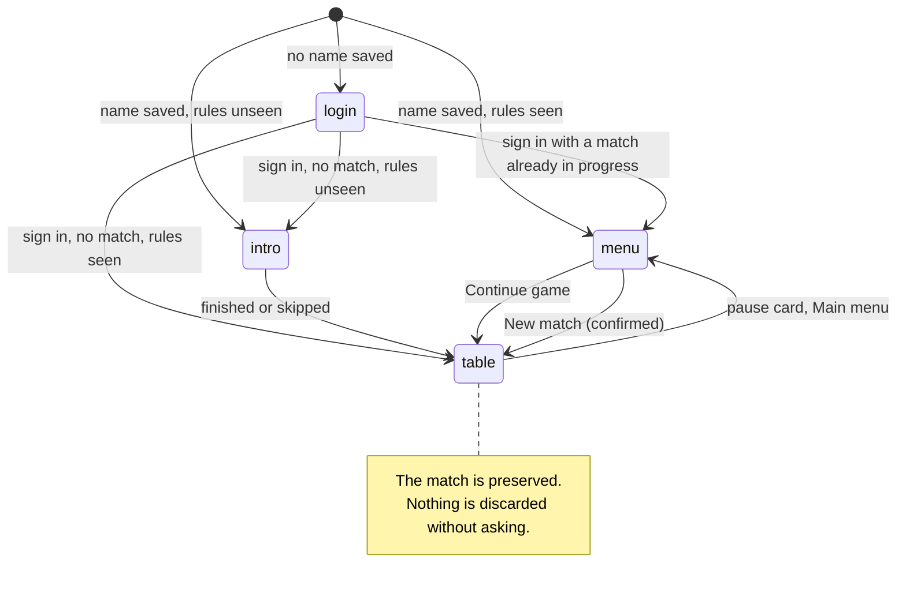
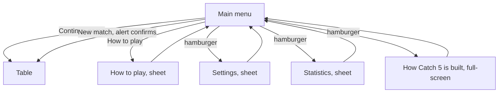
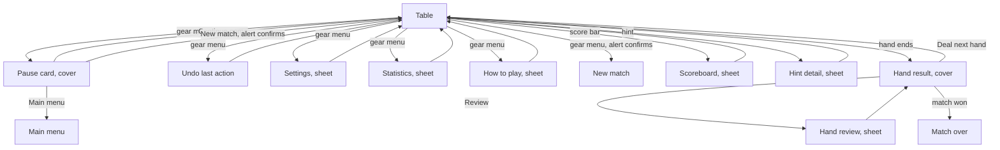

# Screen flow

Where the app's screens are, and every way to get between them. Read from `RootView.swift`,
`MainMenuView.swift`, `TableView.swift` and `TableSurface.swift`, so it describes what the code does
rather than what a design intends. [game-flow.md](game-flow.md) covers the *game's* state machines;
this covers the *screens*.

Three kinds of surface, and the difference matters:

| Kind | Behaviour | Examples |
|---|---|---|
| **Screen** | Replaces everything. `RootView` owns exactly four. | login, intro, menu, table |
| **Sheet** | Slides over, dismissed by the player, the screen beneath continues to exist | settings, statistics, how to play, hand review, scoreboard, hint detail |
| **Cover** | Blocks play. The table underneath is neither tappable nor reachable by VoiceOver, and the scheduler holds | pause card, hand result, match over |

## The four screens

`RootView.initialScreen(for:)` decides the first of these, and
`RootView.destinationAfterSignIn(matchInProgress:hasSeenRules:)` decides where signing in leads. Both
are `nonisolated` and tested directly, so the routing can be checked without building a view.

## What opens from the main menu

Continue game is the primary action whenever a saved match exists; New match takes its place when one
does not. Replacing a match in progress always asks first (spec R32).

## What opens from the table

## Rules the flow obeys

- **A cover holds the game.** While the pause card or a hand result is up, the scheduler does not let
  a computer act, so no move happens behind it. `tablePauseHoldsWhileAnyCoverRemains` checks this.
- **Nothing is thrown away without a question.** Every route that would replace a match in progress
  goes through an alert with a named way to say no (spec R32, decision D57).
- **Leaving the table keeps the match.** Main menu from the pause card preserves everything; Continue
  game returns to the same trick.
- **A sheet never resumes a finished hand** and never adds a second entry to history.
- **Practice is separate from play.** How to play opens the tutorial over whichever screen launched
  it; it never replaces the live match, and its hands never reach statistics.
- **Covers hide what is beneath.** The table is `accessibilityHidden` under a cover, so VoiceOver
  cannot reach controls the eye cannot see either.
