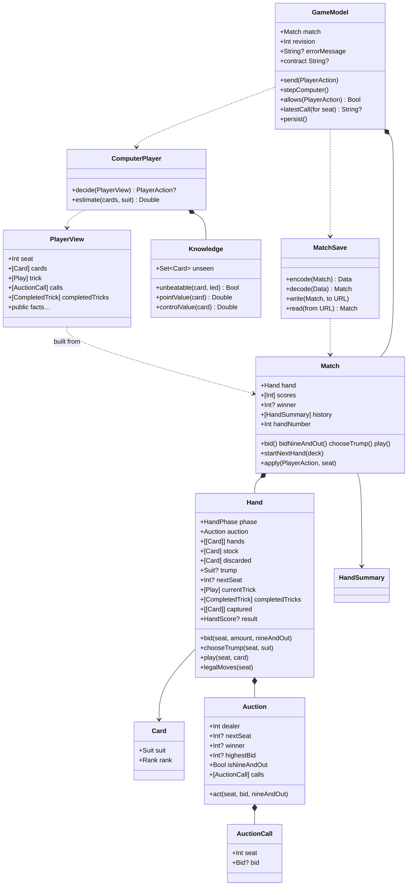

# Types and Functions

One line per public thing, grouped by file, with the test that proves it. Names are exact so you can `grep` for them.

## Class diagram

## Sources/CatchFive/Cards.swift

| Name | Kind | Purpose | Proven by |
|---|---|---|---|
| `Suit` | enum, `CaseIterable` | clubs, diamonds, hearts, spades | used everywhere |
| `Rank` | enum, `Int` raw values 2…14 | two … ace; `rawValue` orders cards | `highestTrumpWins` |
| `Rank.gameValue` | computed property | 10→10, J→1, Q→2, K→3, A→4, else 0 | `cardValuesForGame` |
| `Card` | struct, `Hashable`, `Codable` | one suit and one rank; `name` spells it out ("queen of hearts") for explanations | everywhere |
| `RuleError` | enum | invalidTrick, invalidSeat, outOfTurn, invalidBid, auctionComplete, invalidScoring, forbiddenNineAndOut | error assertions across suites |

## Sources/CatchFive/Tricks.swift

| Name | Purpose | Proven by |
|---|---|---|
| `Play` | one seat's card in a trick | trick tests |
| `legalCards(in:led:)` | if you hold the led suit you must play it; otherwise anything | `mustFollowSuitEvenWithTrump` |
| `trickWinner(_:trump:)` | highest trump, else highest of led suit; rejects malformed tricks | `trumpBeatsLedAce`, `highestTrumpWins`, `malformedTricksAreRejected` |

## Sources/CatchFive/Bidding.swift

| Name | Purpose | Proven by |
|---|---|---|
| `Bid` | `.points(Int)` or `.nineAndOut` | settlement tests |
| `AuctionCall` | one seat's accepted call; `bid == nil` is a pass | `auctionRecordsEverySeatCallInOrder` |
| `Auction` | four-turn bidding round starting left of dealer | all `BiddingTests` |
| `Auction.act(seat:bid:nineAndOut:)` | validates turn, minimum raise, dealer match, forced 2, 9-and-out precedence; records the call | `dealerCanMatchPartnerOrOpponent`, `nonDealerMustRaiseAndInvalidActionDoesNotConsumeTurn`, `dealerMustTakeTwoAfterPasses`, `bidRangeAndTurnOrder`, `nineAndOutOvercallsNineAndDealerCanMatch` |

## Sources/CatchFive/Scoring.swift

| Name | Purpose | Proven by |
|---|---|---|
| `HouseRules` | the house numbers named once: `matchTarget` 25, `bidRange` 2...9, `handPoints` 9; `settle`, the auction, the bid grid and the rules sheet all quote them | `houseRuleNumbersAreTheOnesTheEngineEnforces` |
| `HandScore` | points per team plus which team took High, Low, Jack, Five, Game and the Game values | scoring tests |
| `scoreHand(captured:trump:bidder:)` | pure function from captured cards to `HandScore`; rejects duplicate cards | `relativeHighAndLowBelongToCapturingTeams`, `missingJackAndFiveDoNotScoreAndGameTieGoesToBidder`, `offSuitScoringCardsOnlyCountTowardGame`, `invalidCapturedCardsAreRejected` |
| `Settlement` | new scores and optional winner | |
| `settle(scores:points:bidder:bid:)` | bidder adds points or subtracts bid; defenders add; 25 wins; 9-and-out ends the match either way | `successfulBidScoresAllPointsAndSetLosesBidAmount`, `twentyFiveAndSimultaneousFinish`, `nineAndOutWinsOrLosesImmediately`, `invalidSettlementRejected` |

## Sources/CatchFive/Hand.swift

| Name | Purpose | Proven by |
|---|---|---|
| `HandPhase` | bidding, choosingTrump, playing, finished | phase guards in every test |
| `CompletedTrick` | four plays and the winning seat | `playMustFollowSuitAndWinningPlayerLeadsNext` |
| `HandError` | invalidDeck, wrongPhase, notBidWinner, cardNotHeld, mustFollowSuit | |
| `Hand.init(deck:dealer:)` | requires 52 unique cards; deals two packets of three | `dealSixEachInTwoPacketsStartingLeftOfDealer`, `rejectInvalidDecks` |
| `Hand.bid` | forwards to `Auction`; moves to `choosingTrump` when the dealer has acted | `trumpSelectionRequiresFinishedAuctionAndWinningSeat` |
| `Hand.chooseTrump` | bid winner only; discards non-trumps, refills to six from stock | `refillKeepsTrumpsAndDiscardsOnlyInitialNonTrumps` |
| `Hand.play` | full validation, copy-mutate-commit; fourth card resolves the trick, sixth trick scores | `illegalPlayLeavesStateUnchanged`, `completeHandsConserveCardsAndFinishAfterSixTricks` (208 hands) |
| `Hand.legalMoves(seat:)` | empty unless it is that seat's turn in `playing` | UI greying relies on this through `allows` |

## Sources/CatchFive/Match.swift

| Name | Purpose | Proven by |
|---|---|---|
| `MatchError` | handInProgress, matchFinished | `matchRejectsPrematureRedeal` |
| `HandSummary` | number, dealer, bidder, bid, isNineAndOut, result, running scores; `contractMade` says whether the bidders collected what they promised | `nextHandRotatesDealerAndRetainsScores`, `handSummaryKnowsWhetherTheContractWasMade` |
| `Match.init(deck:dealer:)` | starts hand 1 and remembers the deck for saves | |
| `Match.bid` / `bidNineAndOut` / `chooseTrump` / `play` | wrap `Hand`, refuse after a winner, append to the action log; `play` settles the hand exactly once | `matchScoresOnlyAfterLastCardAndOnlyOnce`, `failedBidMakesNegativeMatchScore`, `negativeTeamCannotDeclareNineAndOut` |
| `Match.startNextHand(deck:)` | only after `finished`; dealer + 1 | `nextHandRotatesDealerAndRetainsScores` |
| `Match.apply(_:seat:)` | one entry point for `PlayerAction` from humans and computers | `computersCompleteShuffledMatchesThroughRealRules` |
| `Match.actionCount`, `rewound(toActionCount:)`, `undoPoint(forSeat:)` | rebuild the match from the same deal with only the first n accepted actions; the action count to rewind to so a seat's latest action this hand is taken back (nil once scored or across a hand boundary). `MatchSave.decode` uses the same `replaying` helper | `rewoundMatchEqualsFreshReplay`, `undoDropsHumanActionAndComputerReplies`, `undoUnavailableAcrossHandBoundaryAndAfterScoring` |

## Sources/CatchFive/ComputerPlayer.swift

| Name | Purpose | Proven by |
|---|---|---|
| `PlayerView` | own cards plus public facts, including every auction call and every completed trick; `init(match:seat:)` copies only what the seat may know | `changingHiddenCardsDoesNotChangeComputerDecision`, `computerSeesPublicAuctionCalls`, `computerSeesCompletedTricksButNotHiddenHands` |
| `PlayerView.init(match:replaying:inCompletedTrick:)` | rebuilds the view a seat had just before an earlier play, from public information and that seat's remaining cards | `replayedViewExplainsEveryComputerPlayExactly` |
| `PlayerAction` | nineAndOut, bid(Int?), chooseTrump(Suit), play(Card) | |
| `Advice` | an action plus its reasoning in plain words | `adviceNamesTheActionAndExplainsIt` |
| `ComputerPlayer.advise(_:)` | the single source of truth: the action this strategy takes from a seat and why; nil unless it is that seat's turn | `adviceExplainsCardPlay` (also checks it agrees with `decide` through a whole match) |
| `ComputerPlayer.decide(_:)` | `advise(_:)?.action` | `computerDoesNotActOutsideItsTurn` |
| `Difficulty`, `ComputerPlayer.decide(_:difficulty:)` | `easy` routes to `EasyPlayer`, `standard` to `decide(_:)`; hints and explanations always use standard | `easyDifficultyPlaysTheFrozenPlayerAndStandardTheCurrentOne` |
| `EasyPlayer` (`Sources/CatchFive/EasyPlayer.swift`) | the "Easy" computer: a frozen copy of the PR #2 player, also the benchmark's fixed opponent, never to be improved | `computerPlayerBeatsFrozenBaseline` |
| `ComputerPlayer.estimate(_:suit:)` | expected hand points if that suit were trump | `estimateRanksControlAndTheFiveAboveScatteredCards` |
| bidding (private `bidAmount`) | bid the minimum needed if it is at most the whole-point estimate; never outbid partner; dealer takes forced 2 | `computerPassesWeakHandButDealerTakesForcedTwo`, `computerRaisesWithStrongSuitAndChoosesIt`, `computerBiddingIsCompetitiveAndUsuallyMakesContract` |
| `ComputerPlayer.Knowledge` | built from a `PlayerView`: the set of unseen cards (other hands or stock), `unbeatable(_:led:)` (no unseen card can beat it), `pointValue(_:)` (five 5, jack 1, certain High 1, certain Low 1, plus 0.06 per Game point) and `controlValue(_:)` (what holding a trump is worth for later tricks; 0.8 extra when unbeatable, 0 on the last trick) | `computerSpendsTheAceToCaptureTheFive`, `computerDumpsTheTrickWhenItIsWorthlessAndNoTrumpIsFree` |
| card play (private `chooseCard`) | scores every legal card: chance our side wins the trick × (points on the table + this card's stake) − chance we lose × this card's stake − control given up; picks the best, ties to least control then lowest rank | `computerFollowsSuitInsteadOfTrumping`, `computerUsesLowestWinningCardAgainstOpponentWhenNothingIsAtStake`, `computerFeedsFiveToPartnerWhenLastToPlay`, `computerPreservesFiveWhenItCannotWin` |
| leads (private `chooseLead`) | an unbeatable trump if held; the best side card when no trumps can be against us; otherwise the cheapest exit, never the five | `computerLeadsHighestTrumpButKeepsTheFiveBack` |

### Test-only strategy fixtures

| Name | Purpose |
|---|---|
| `playSeededMatch`, `mirroredBenchmark`, `BenchmarkResult` (`Tests/CatchFiveTests/StrategyBenchmark.swift`) | play seeded matches between two strategies, each seed twice with teams swapped; `computerPlayerBeatsFrozenBaseline` guards the shipped player's strength against `EasyPlayer` |

## Sources/CatchFive/HandReview.swift

| Name | Purpose | Proven by |
|---|---|---|
| `ReviewError` | `unexplainedPlay`, thrown only if the strategy had no advice for a legal play | |
| `PlayReview`, `TrickReview`, `HandReview(match:)` | every play of the finished hand's tricks next to the standard strategy's advice from the same rebuilt view (D24); `agreement(forSeat:)` counts matches | `reviewReconstructsEveryPlayWithAdvice` |
| `SeatPerformance`, `Match.performance(forSeat:)` | plays agreed and contracts made over the whole match, rebuilt by replaying to each hand boundary; nothing extra is saved | `performanceCountsHumanPlaysAndContractsAcrossHands` |

## Sources/CatchFive/MatchSave.swift

| Name | Purpose | Proven by |
|---|---|---|
| `SaveError` | invalidData, unsupportedVersion | `rejectsBrokenOrUnsupportedSave` |
| `SavedAction` (internal) | Codable mirror of the five actions, each replays through the real `Match` method | `replayRejectsIllegalActionsAndInvalidInitialDeck` |
| `MatchSave.encode` / `decode` | version 1 JSON: initial deck, dealer, actions | `saveRestoresEveryPhaseAndContinuesIdentically`, `saveRestoresHistoryAndNextDealer`, `rejectedActionsNeverEnterSaveAndResavingDoesNotDuplicateActions` |
| `MatchSave.write` / `read` | atomic file replacement; errors surface | `saveRoundTripOnDiskReplacesPreviousSave`, `diskFailuresAreReported` |

## Sources/CatchFiveUI/GameModel.swift

| Name | Purpose | Proven by |
|---|---|---|
| `GameModel` | `@MainActor ObservableObject` owning one `Match`, a `revision` counter, an optional `errorMessage`, and an optional save URL | |
| `isHumanTurn`, `humanCards` | convenience for seat 0 | `humanActionAdvancesComputersAndStopsForHuman` |
| `send(_:)` | human action through `Match.apply`, then persist and bump revision | `acceptedHumanMoveSavesAndInvalidMoveShowsError` |
| `stepComputer()` | one computer action for whichever non-human seat is due | `humanActionAdvancesComputersAndStopsForHuman` |
| `allows(_:)` | dry run on a copy of the match | drives button enabling |
| `validationMessage(for:)`, `refuse(_:)`, `refusal` | the reason the engine would refuse an action right now, in the player's words ("Follow hearts; you still have hearts.", "Wait for Hazel."), or nil when it would accept; validated on a copy so the action count never moves; `refuse` records it for the table's message line and the next accepted action clears it | `validationMessagesExplainRefusalsWithoutChangingTheMatch` |
| `setPlayerName(_:)` (on `Settings`) | the one writer for the player's name: trimmed, mirrored into seat 0, blank input ignored; `signIn` and the Settings sheet both use it, and `signIn` writes settings once | `settingsToleratesValuesItDoesNotRecogniseAndMigratesOnlyPreCastFiles` |
| `resumeContext` | one line for the main menu's saved-match card while a match is in progress: hand number, both scores and the phase ("Hand 4 · Your team 6, their team 12 · trick 3"); nil when there is nothing to resume | `resumeContextDescribesTheSavedMatch` |
| `lastHandOutcome` | the finished hand as a `HandOutcome`, with the scores as they stood before it taken from the previous history entry | `lastHandOutcomeIsBuiltFromTheMatchHistory` |
| `trumpPreview(for:)` | what naming a suit would do to your hand ("keep 4 · draw 2"), only while you are choosing trump; counts your own cards and never the stock's | `trumpPreviewCountsWhatEachSuitKeepsAndDraws` |
| `suitToFollow` | the suit you are obliged to follow right now: the suit led while it is your turn and you still hold it; nil when you lead, cannot follow, or it is not your turn | `statusSaysWhichSuitYouMustFollow` |
| `auctionContext` | the dealer's rights, only when it is the human's turn to bid as dealer: match the high bid, match 9 and out, or the forced 2 after three passes | `dealerGetsBidContextAndNineAndOutStaysEngineChecked` |
| `latestCall(for:)`, `contract`, `seatNames` | wording for the auction display | `modelDescribesAuctionCallsAndContract` |
| `settings`, `seatNames` | player preferences (play speed, seat names, haptics, difficulty, `beginnerMode`), saved to `settings.json` whenever they change; names flow into the contract, explanations, tiles and summary | `seatNamesFlowIntoContractAndExplanations`, `settingsRoundTripThroughDiskAndTolerateMissingKeys` |
| `humanCards` | the hand as shown: trumps first, highest to lowest, then the other suits in a fixed order | `humanCardsSortTrumpFirstThenBySuitAndRank` |
| `notice` | one-line note about something that happened without a tap, such as "You discarded 2 and drew 2."; cleared by the next action | `trumpChoiceReportsDiscards` |
| `message(for:)` | rule errors in a player's words ("You must follow suit…") | `illegalPlayExplainsFollowSuitInPlainWords` |
| `records`, `statistics`, `handReview()`, `finalPerformance` | finished matches from `history.json`, totals over them, the finished hand's review, and the human's record computed once when a match is recorded or restored finished | `finishedMatchIsRecordedExactlyOnce`, `corruptHistoryDoesNotBlockPlay` |
| `describe(_:)` | one sentence for a reviewed play, shared by tap-to-explain and the hand review, labelling Easy seats | `reviewRowsShareExplanationWordingAndLabelEasySeats` |
| `loadDefault(in:)` | loads game, settings and history from a directory; a game, settings or history file that cannot be decoded is set aside as `game-corrupt.json`, `settings-corrupt.json` or `history-corrupt.json` rather than overwritten, and the notice says exactly what happened (including when a file could not be moved and will be replaced); the notice is shown on whichever screen opens; a full match replays in well under 300 ms, so there is no loading state | `corruptHistoryIsSetAsideByLoadDefault`, `corruptGameIsSetAsideAndTheFreshGameSaysSo`, `restoringALongReplayIsFastEnoughToNeedNoLoadingState` |
| `spokenDescription(of:winner:)`, `accessibilityValue(for:)` | VoiceOver wording for a played card ("West played the ten of hearts and took the trick") and for a hand card (playable, not legal now, waiting for your turn) | `spokenDescriptionOfPlayNamesSeatAndCard`, `accessibilityValueReflectsLegality` |
| `matchInProgress` | true once the match has an action and no winner; the menu shows Continue | `matchInProgressIsFalseForFreshAndFinishedMatches` |
| `signIn(name:portrait:difficulty:)` | the login screen's one write: trimmed name into `playerName` and seat 0, plus face and difficulty | `signInTrimsNameAndSetsSeatZero` |
| `seatSummary(for:)` | the VoiceOver sentence for a seat tile: name, direction word, call or card count, dealer, to act | `seatSummaryIncludesSeatWord` |
| `canUndo`, `undo()` | take back the human's latest action this hand and every computer reply after it; saves and bumps `revision` | `undoneMatchSavesAndReloads` |
| `lastHumanAction`, `describe(_ action:)` | the human's latest accepted action and its toast wording ("9♣ played", "Bid 3", "Bid 9 and out"); cleared by undo and new hands; also the trigger for the play and selection haptics | `lastHumanActionDescribesThePlayAndClearsOnUndo` |
| `notice` | the discard-and-draw line after trump is named; it survives the computers' replies and clears when the human next acts, undoes, or a new hand starts | `noticeSurvivesComputerRepliesUntilTheHumanActs` |
| `hint`, `showHint()` | the strategy's advice for seat 0 on request; cleared by the next accepted action | `hintMatchesTheComputerStrategyAndClearsAfterActing` |
| `explanation(for:inLastTrick:)`, `explain(_:inLastTrick:)`, `explanation` | why a card on the table or in the last trick was played; for the human's own card it compares with what the strategy preferred | `explanationsNameTheSeatAndCompareTheHumanToTheStrategy` |
| `nextHand()`, `newGame()`, `dealerDraw`, `dismissDealerDraw()`, `freshMatch()` | fresh shuffled deck via `deck()`; a new game and a fresh install both draw for dealer first and keep the draw until the first action | `newGameDrawsForDealerAndTheMatchUsesIt` |
| `persist()`, `retrySave()`, `saveError`, `loadDefault()` | Application Support/CatchFive/game.json, settings.json and history.json; a failed write lands in `saveError` (separate from the rule error in `errorMessage`) and the accepted move stands; `retrySave()` writes the same in-memory state again and never replays a move; `perform` returns whether the engine accepted the action so feedback does not depend on the save | `saveFailureKeepsTheAcceptedMoveAndRetryWritesTheSameState` |

## Sources/CatchFiveUI views

| Name | Purpose |
|---|---|
| `Settings`, `SettingsStore` | `Settings.swift`: Codable preferences (including `difficulty`, `hasSeenRules`, `playerName`, `playerPortrait`, `hasSignedIn` and `beginnerMode`, on by default and for files from before it existed) with defaults for missing or unrecognised values (a newer build's enum case never signs the player out), a migration of the old West/Partner/East defaults to the cast's names only for files from before sign-in existed, and `delay(leadingTrick:)` for the computer pause per play speed; the store reads and writes JSON atomically | `delayDependsOnPlaySpeedAndLeadPosition`, `settingsRoundTripThroughDiskAndTolerateMissingKeys`, `settingsRoundTripKeepsPlayerNameAndPortrait`, `settingsWithoutPlayerFieldsLoadsSignedOut`, `oldSettingsFileMigratesDefaultSeatNamesToCast`, `beginnerModeIsOnByDefaultAndForOlderSettingsFiles` |
| `Portrait`, `Character`, `Cast` | `Cast.swift`: a face recipe (skin, hair, hair colour, feature, hat, shirt), a named player, and the fixed trio Hazel (West), Otto (Partner), Rue (East) plus four faces for the human; `Cast.seatWords` keeps the direction words for accessibility | `castHasThreeDistinctNamesAndPortraits` |
| `PortraitView` | `PortraitView.swift`: draws a `Portrait` at any size from shapes, colours from `Theme.Portrait`, with eyes, brows and a mouth that follow an `expression` (animated unless Reduce Motion); no gold inside a face | manual |
| `LoginView` | first launch, headed "Set up your player" (a local profile, not an account): name, face, Easy/Standard, one gold New match button and nothing else to tap; calls `signIn` | manual |
| `IntroView` | the new player's one page after login: how a hand goes in five steps (deal, bid, trump, tricks, score), Learn the game opens the tutorial full screen, Deal me in goes to the table | manual |
| `WelcomeCard` | the pause card over the dimmed table, opened by Pause game in the table's menu: Paused, then exactly three actions (spec R32): Continue game in gold (until the match is won), New match (an alert with Cancel if it would throw away bids or plays) and Main menu, which keeps the match and returns to `MainMenuView`; no greeting or summary, those live on the main menu; `MenuButtons` holds the two button styles it shares with the menu | manual |
| `MainMenuView` | the main menu (spec R31): the title, a card with the player's portrait, name, difficulty and `resumeContext`, the Beginner mode toggle bound to `Settings.beginnerMode`, then Continue game in gold while a match is in progress (else New match in gold), New match (confirmed if it would replace a match) and How to play; a bare hamburger at the top right (accessible label Menu, 44 pt hit area) drops down Settings, Statistics and How Catch 5 is built, in that order (spec R29) | manual |
| `RootView` | the app's root: owns the model and the tutorial model (shared with the table so intro lessons count), opens on login, on the intro for a signed-in player who never saw it, or on the main menu, never a popup over the table (`initialScreen(for:)`, spec R32); after sign-in an older install's match in progress is kept and the main menu shows it (`destinationAfterSignIn`); Pause game on the table shows the pause card over the dimmed, accessibility-hidden table, and the card's Main menu returns to the menu with the match preserved; shows restore notices off the table ( the covered table hidden from VoiceOver and the card marked modal, the dim layer darker under Increase Contrast), crossfades between login, intro and table | `rootOpensOnLoginUntilSignedInThenOnTheTable` |
| `TutorialFixtures`, `TutorialBid`, `ScoreCategory` | `Tutorial/TutorialFixtures.swift`: the fixed cards and answer keys for the five lessons | `tricksExerciseLegalMovesMatchEngine`, `tricksExerciseWinnerMatchesEngine`, `scoringExerciseMatchesScoreHand`, `biddingExerciseLegalSetIsFourThroughNinePassAndNineAndOut` |
| `TutorialModel` | `Tutorial/TutorialModel.swift`: current lesson, completed set (handed back for persistence in `Settings.completedLessons`), each exercise's picks and feedback | `completingAllLessonsPersistsAcrossLaunch` |
| `TutorialView`, `SeatTile`, `DealLesson`, `BiddingLesson`, `TrumpLesson`, `TricksLesson`, `ScoringLesson` | the "How to play" sheet from the gear menu, and full screen from the intro (`isIntro`: Skip in the toolbar, Deal me in on the last lesson; seat tiles carry the cast's portraits): header, chapter pills, one lesson at a time, Back / Next, a Full rules button that opens `RulesView` | manual |
| `makeTutorial()` (on `GameModel`) | a `TutorialModel` wired to the settings | |
| `RulesText` | the house rules as sections of verbatim paragraphs from `docs/catch-five-rules.md` (including how the first dealer is drawn), plus "Reading the table" notes about the screen | `rulesSheetContainsEveryHouseRuleParagraph` (reads the doc and fails on any drift) |
| `RulesView` | the rules sheet as a guided walk on the felt: six chapters (The table, Deal and bidding, Play, Scoring, 9 and out, Reading the table) in inlay panels with gold numerals, a chapter rail of 44 pt chips that scrolls to a chapter and lights the one chosen or at the top, chapters matched to `RulesText` sections by title, and a figure per chapter built from the table's pieces (four portraits round an oval with "first to 25", six card backs and the bid ladder, a four-card trick with a Following suit / Trumped toggle and the winner ringed, five tappable point tiles with the Game ledger, a nine-segment gold meter, the screen notes with icons); the verbatim rule text stays visible under every figure, and Deal and bidding, Play and 9 and out each end with a `RuleTrialView`; reached from the tutorial's Full rules button | manual |
| `RuleTrial`, `RuleTrialView` | `RuleTrial.swift`, `RuleTrialView.swift`: "Try it" under three rules. Each trial is a small real position built through the engine with a crafted deck (hearts led and you must follow; you are dealer facing a bid of 3; a failed 9 left you at −9), the choices on offer, and `attempt(_:)`, which lets the engine judge the action on a copy: a refusal in the table's own words, an acceptance played out with the standard strategy and described ("You take the trick with the king of hearts"). Reset restores the position. The panel shows the position, the tappable cards or bid pills, and the verdict; a trial is its own `Match`, so the live game, its save and its scores are untouched | `ruleTrialsAreJudgedByTheEngine`, `ruleTrialsLeaveTheOngoingMatchAndItsSaveAlone` |
| `RulesFigures` | `RulesFigures.swift`: the numbers the rules sheet draws (point tiles and their meanings, the Game ledger from `Rank.gameValue`, the bid ladder and match target from `HouseRules`, two example tricks judged by `trickWinner`) and `caption(trumped:)`, built from the drawn cards | `rulesFiguresMatchTheEngine`, `rulesChaptersMatchTheRuleSectionsByTitle` |
| `needsRulesIntroduction`, `markRulesSeen()` (on `GameModel`) | first-run flag backed by `Settings.hasSeenRules` | `firstLaunchShowsRulesOnce` |
| `MatchRecord`, `Statistics`, `MatchHistoryStore` | `MatchHistory.swift`: one finished match (id, date to the second, scores, hands, difficulty in effect at the finish, human contracts and agreement) decoded with defaults for fields added later; totals; JSON store with ISO 8601 dates and `readSettingAsideCorruption(at:)` | `statisticsAggregateAcrossRecords`, `matchRecordDecodesOlderFilesAndRejectsBadScores` |
| `ReviewView`, `ScoreboardView`, `StatisticsView` | `ReviewView.swift`: the finished hand play by play with disagreements marked by a branch icon and a note that Standard's choice is advice, not proof another play was wrong; every hand of the match (tap the score bar); totals and recent matches (chart button) | manual |
| `MarkdownDocument` | `MarkdownDocument.swift`: the docs' Markdown parsed into blocks the reader draws natively (headings, paragraphs, bullet and numbered lists, pipe tables, fenced code, Mermaid fences as numbered diagrams), with the title, the section list and the diagram count | `markdownParserCoversEveryConstructTheDocsUse`, `everyChapterParsesAndItsDiagramsAreCounted` |
| `ExplainerLibrary`, `ExplainerView`, `DocumentReaderView`, `DiagramView`, `MarkdownText` | `ExplainerView.swift`: "How Catch 5 is built", read from the docs themselves. The library takes the chapters and the Swift vocabulary from `learning-path.md`'s two tables and loads each chapter's Markdown from `App/Explainer/docs` with its diagrams from `App/Explainer/diagrams` (filled by `scripts/export-docs.py --app`, checked in sync by a test). The contents page lists the chapters in reading order with a summary, reading time, section and diagram counts, then the glossary; a chapter renders block by block with a section list on top, links between docs opening in place, and Previous and Next at the bottom. Reached from the welcome card, Settings and the tutorial's More menu | `explainerBundleMatchesTheDocsAndTheirDiagrams` |
| `SettingsView` | sheet from the main menu's hamburger and the table's menu: difficulty, an Assistance section with the Beginner mode toggle, play speed, your name and face, the three opponents' names beside their portraits, haptics toggle, and the "How Catch 5 is built" explainer | manual |
| `WoodGrainView`, `GrainRandom`, `FeltView` | `WoodGrainView.swift`: the oak surface drawn in a `Canvas`, grain running across the screen from a fixed seed (gradient, bands, grain lines, and a `vignette`: radial for full-screen wood on the reading sheets and the tutorial, linear top-to-bottom shade for the header band); the felt gradient of the playing area with a seeded stipple of light and dark flecks for the cloth's nap, `Equatable` so the table's updates never redraw it; no image asset | manual |
| `HeaderBandShape` | the header band's outline: square top, a frown along the bottom whose corners hang `dip` lower than the middle; the oak is clipped to it | `dealtCardsComeFromTheDeckInTheCornerAndTheBandFrowns` |
| `DeckView`, `DiscardPileView`, `PillButtonStyle` | the stock as a stack of card backs with its count in the table's top-right corner, and beneath it the discards face down with their count once trump is named; the auction's solid full-width pill style (dimmed when the rule disallows the action) | manual |
| `HandFanView.dealOrigin(index:count:width:)`, `discardTarget(index:count:width:)` | where a refill card's flight starts (the deck's corner, relative to that card's place in the fan) and where a discard lands (the pile `Theme.Table.discardDrop` below the deck, same corner) | `dealtCardsComeFromTheDeckInTheCornerAndTheBandFrowns`, `discardsFlyToThePileUnderTheDeck` |
| `DynamicTypeSize.boosted(by:)`, `Theme.textBoostSteps` | the size a given number of steps above a Dynamic Type size, stopping at the ends; `TableView` applies two steps to the whole app | `textBoostRaisesTheDefaultTwoStepsAndStopsAtTheLargest` |
| `Theme` | `Theme.swift`: `Theme.Wood` colours, grain direction and parameters, the auction pill height and spacing, card metrics (2:3 ratio, six-percent corner radius, hand 58/62 pt, pile 62 pt, overlap −8 pt leaving a 50 pt strip, the 402 pt width that earns wide cards, the XXXL cap on card scaling), `Theme.Table` seat nudges, the toss limits and the pile footprint, the AX2 cap on table text, motion springs, the trick hold, toast and shake values | `fannedHandCardsKeepAThumbSizedStrip` |
| `ScoreBarView` | the compact bar on its solid header band, three elements and no more (spec R1): the score chip (both scores; opens the scoreboard), the contract chip once bidding has resolved (`ScoreBarView.Contract`: bid and bidder in gold, the trump glyph once named), and the menu (Pause game first, then undo last action, settings, statistics, tutorial, new game); the hand number lives on the scoreboard | manual |
| `TableSurface`, `SeatView`, `Suit.buttonTint` | the table (the hint bulb, tap-to-explain on the pile with its prompt line, and the keep captions under the trump pills appear only while `Settings.beginnerMode` is on; rule refusals and the record of play stay in both modes): partner across the top, West and East at the sides (tiles sized by `TableLayout` so they never collide with the pile; portrait wearing its `SeatMood`, gold ring on the seat to act, VoiceOver label from `seatSummary(for:)`, card-back stack with count, dealer and bidder badges), gold text at the top-left naming trump (suit in its own colour) and the contract once trump is set, with no pill behind it, the deck at the top-right, the pile in the middle with each card nudged toward its seat, tossed with its own turn and drift (`CardToss`), and the winner ringed, status line ("Your turn · follow diamonds" while you must follow) with the hint and the show or hide last-trick controls, commentary; during the auction the dealer context line and the bid grid or the suit pills (full-width, red suits tinted red, each named beneath its glyph with its keep count ("clubs · keep 2"; VoiceOver hears the full keep-and-draw preview), greyed pills carrying their reason as an accessibility hint, 9 and out handing off to the confirmation) stand where the pile will be; one message line under the status (the reason a tap was refused first, then the undo toast, hint or explanation, notice, your call, placeholder; asking for a hint or an explanation clears a standing refusal), the hand-end card as a scrollable overlay whose buttons stack when they do not fit; the whole surface scrolls only when its content cannot fit (accessibility text sizes, the SE at XXXL), reads as one VoiceOver container, leaves the accessibility tree under the finished-hand card, and carries the status line's focus target | manual (see the verification record in [redesign-plan.md](redesign-plan.md)) |
| `HandFanView`, `CardPressStyle`, `ShakeEffect`, `MatchedCard` | the hand, measured with `onGeometryChange` and arranged by `HandLayout` (a fan, or two flat rows when the fan could not keep 44 pt strips), with a gold DEALER badge on its label when you deal: discards fly to the pile under the deck, shrinking to card backs, and refills deal in from the deck when trump is named, overlap that tightens to fit the width, wide cards on screens of 402 pt and up, ±8° rotation and a shallow arc, legal cards lifted on your turn, press-lift, shake on an illegal tap, `matchedGeometryEffect` flight into the pile (`MatchedCard` drops the join under Reduce Motion so the card crossfades instead) | manual |
| `CardBackView` | a face-down card for opponents' seats | manual |
| `TableView` | the gameplay screen (shown by `RootView`, which passes `covered` while the pause card is up; `onLeave` opens the pause card from the menu's Pause game): score bar, table surface, toast slot and hand in a column; one animation per accepted action; the scheduler task, keyed on the revision and `TablePause.isPaused`, that holds a finished trick, collapses it toward the winner and then lets the next computer act, and that stops whenever a sheet, dialog, cover or the reopened trick is showing; the Retry alert for a failed save; after each revision `noteChanges` picks the one haptic through `TableFeedback` and announces the trick winner or the hand outcome to VoiceOver; focus moves to the status line when a cover lifts, a sheet closes or your turn comes; the 9-and-out confirmation, which sends the bid to the engine only when confirmed; refused card taps recorded through `refuse`; the undo toast state (rendered by the surface's message line); the haptic vocabulary; the sheets, the new-game confirmation, the error alert and the background save; text styles throughout, boosted two steps app-wide, with cards capped at XXXL and table text at AX2; the felt background with the oak frown band behind the score bar | manual |
| `HandOutcome` | `HandOutcome.swift`: the finished hand in the player's order, built from the engine's numbers: a headline (Contract made or set, 9 and out made or failed), the bidding team's line (bid, captured, score before → after), the defenders' line, and notes for the rules that decided a close case (a Game tie, a Five or Jack out of play, both teams at 25) | `handOutcomeLeadsWithTheContractAndTheArithmetic`, `handOutcomeExplainsTheEdgeCases` |
| `HandLayout`, `TableLayout` | `HandLayout.swift`: `HandLayout.arrange(count:cardWidth:available:)` decides from the measured width whether the hand fans (every exposed strip at least 44 pt) or falls back to two flat rows, and `height(of:cardWidth:)` gives the room each needs; `TableLayout.sideSeatWidth(available:)` shrinks the side seat tiles (down to 84 pt) before the pile's reservation (`pileReservation`: a nudged card plus air) could touch them | `handLayoutFansOnlyWhenEveryStripIsThumbSized`, `seatRowLeavesRoomForThePileOnEveryVerifiedWidth` |
| `DealerDraw`, `DealerDrawView` | `DealerDraw.swift`, `DealerDrawView.swift`: how the first dealer is chosen. Each seat draws one card from a shuffled deck and the highest deals, equal ranks going by suit (clubs lowest, spades highest); the match then starts from a fresh shuffle with that dealer. The view lays the four cards beside their portraits over the table with the dealer's ringed, one sentence ("Rue draws the king of spades and deals."), and a Deal button; it puts itself away after `Theme.Motion.dealerDrawHold` or at the first action, and pauses play while it shows | `dealerDrawPicksTheHighestCardWithSuitsBreakingTies`, `newGameDrawsForDealerAndTheMatchUsesIt` |
| `CardToss` | `CardToss.swift`: how a played card lands on the pile, a small turn and drift of its own on top of its seat's nudge, as if tossed in by hand; a pure function of the card, the hand and the trick, so it holds still while the trick lies there and differs next time, within `Theme.Table.tossRotationDegrees` and `tossDrift` | `tossedCardsLandDifferentlyButStayPut` |
| `SeatMood`, `Portrait.Expression` | `SeatMood.swift`: a seat's expression from public events only (whose turn, who took the last trick while it still lies on the table, who won the match): thinking, pleased or rueful, triumphant or dismayed, else neutral; never reads a hand | `seatMoodsFollowPublicEventsOnly` |
| `TableFeedback` | `TableFeedback.swift`: one haptic per accepted action; `Snapshot` records what a revision left (seeded from the restored match, so resuming fires nothing), `cue(from:to:)` reads the change between two snapshots and `cue(action:trickWinner:handEnded:matchWinner:)` picks the most consequential outcome (match won or lost, hand ended, trick won or lost, play, call) and each cue maps to its `SensoryFeedback`, with a win and a loss feeling different | `oneFeedbackCuePerActionWithTheOutcomeThatMattersMost` |
| `TablePause` | `TablePause.swift`: the reasons play must wait (scene inactive, pause card, any sheet, any dialog or alert, the reopened last trick, the draw for dealer) and one `isPaused` answer; UI state only, never an action | `tablePauseHoldsWhileAnyCoverRemains` |
| `TableScheduler.plan(hand:collapsedTricks:)` | the scheduler's three decisions as a pure function: hold a trick that has finished but not yet collapsed, treat the coming computer play as a lead (longer pause) only when nothing was held, and wait for the deal animation at the start of play | `schedulerHoldsAFinishedTrickOnceThenTreatsTheNextPlayAsALead` |
| `CardView` | a card face at a given width (48 in the tutorial, 60 in the hand, 56 on the pile) that scales with Dynamic Type, with an optional `ring` drawn at its own scaled radius, with a top-left corner index for fanned hands and rest / playable / dimmed / pile styles (a dimmed card stays solid: a dark veil and drained colour, never see-through; under Increase Contrast the veil lightens and a dashed edge carries the state); `Suit.glyph`, `Suit.ink`, `Card.label` helpers |
| `HandSummaryView` | the hand-end card: the `HandOutcome` headline in gold, the two score lines, then who took High, Low, Jack, Five, Game, then the deciding-rule notes, using the configured seat names |
| colour extensions | `.ivory`, `.felt`, `.gold` |

## Sources/CatchFiveDemo

`main.swift` plays a fixed, deterministic match (`swift run catch-five-demo`) and `ComputerDemo.swift` a shuffled computer match (`--computer`). Both call the real `Match`; they contain no rules of their own.
