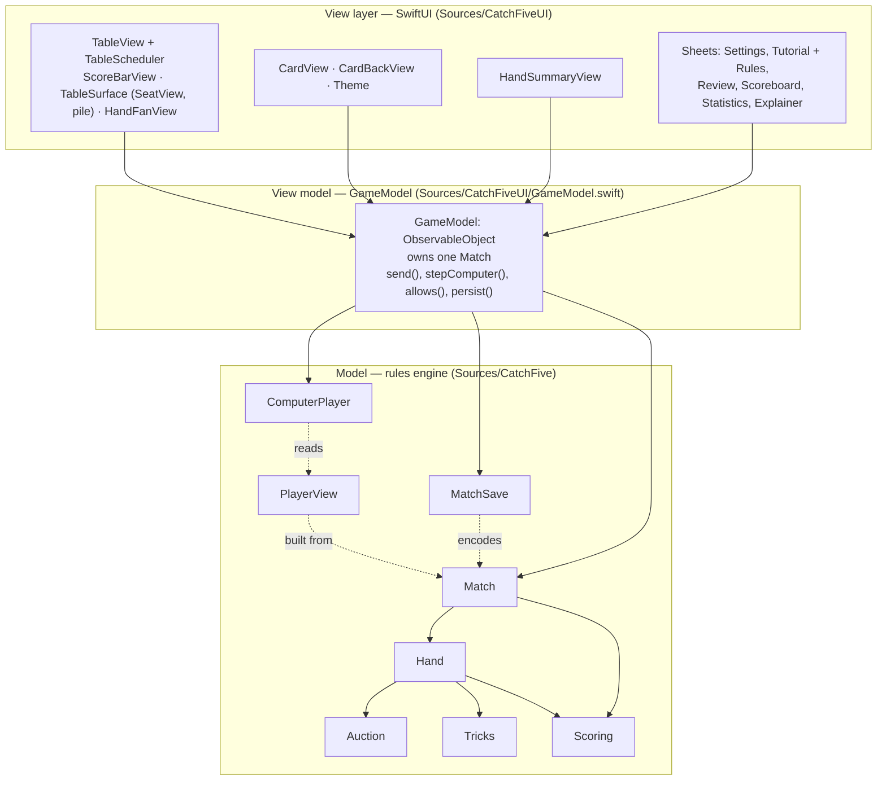
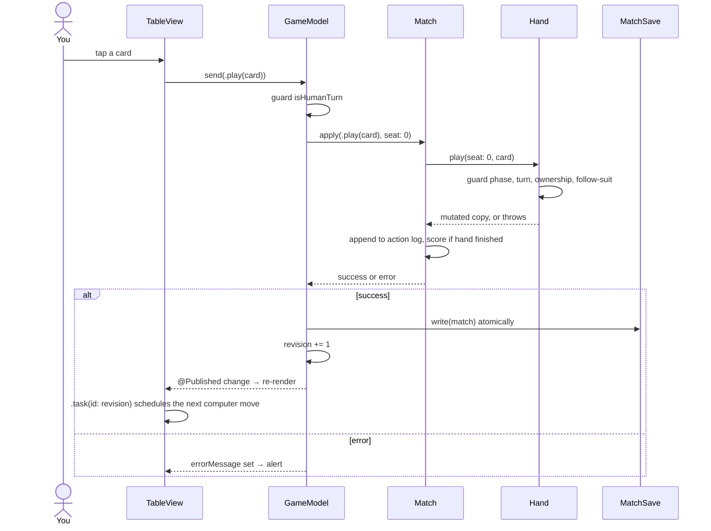
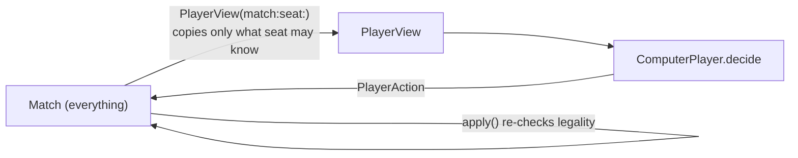

# Architecture

## Three layers, one direction



Dependencies only point downward. The engine module imports nothing but the Swift standard library and Foundation. That is not a style preference; it is what lets all 96 tests run on the Mac in a few seconds with no simulator.

## MVVM, mapped to this repo

MVVM stands for Model, View, ViewModel. It is the pattern SwiftUI is built around.

| Role | Responsibility | Here | Must not do |
|---|---|---|---|
| **Model** | Own the truth and enforce the rules | `Match`, `Hand`, `Auction`, scoring functions | Know about screens, timers, files, or players' intentions |
| **ViewModel** | Translate between model and view. Hold UI-facing state. Trigger side effects (saving, computer turns). | `GameModel` | Contain game rules. It asks the model "is this legal?" rather than deciding |
| **View** | Draw the current state. Send user intent to the view model. | `TableView`, `CardView`, `HandSummaryView` | Hold game state, mutate the model directly, or decide legality |

### How a tap becomes a card on the table



Two details carry the design:

1. **`allows(_:)` is a dry run.** The view greys out illegal cards by copying the `Match` (cheap, it is a struct) and trying the action on the copy. No legality logic exists in the view.
2. **`revision` is a heartbeat.** Every accepted action increments it. `TableView` attaches `.task(id: model.revision)`; SwiftUI cancels the old task and starts a new one whenever the id changes. That task sleeps briefly, then calls `stepComputer()` if a computer is due. The chain continues until it is the human's turn or the hand ends. No timers, no queues.

## The referee pattern

Every state-changing method in the engine follows the same shape:

```swift
public mutating func play(seat: Int, card: Card) throws {
    guard phase == .playing else { throw HandError.wrongPhase }
    guard seat == nextSeat else { throw RuleError.outOfTurn }
    guard let index = hands[seat].firstIndex(of: card) else { throw HandError.cardNotHeld }
    guard legalMoves(seat: seat).contains(card) else { throw HandError.mustFollowSuit }
    var updated = self          // work on a copy
    ...                         // mutate the copy
    if updated.currentTrick.count == 4 { try updated.finishTrick() }
    self = updated              // commit only if nothing threw
}
```

Validate, copy, mutate the copy, commit. Because `Hand` is a struct, a thrown error in `finishTrick()` leaves `self` untouched. The test `illegalPlayLeavesStateUnchanged` exists to prove this.

## The information boundary

Computer players never see the `Match`. They receive a `PlayerView`: their own cards plus public facts (phase, whose turn, dealer, bids, auction calls, trump, cards on the table). The test `changingHiddenCardsDoesNotChangeComputerDecision` swaps an opponent's hidden card and asserts the computer's decision is identical. The same boundary is what a future online mode would send over the network.



The engine does not trust the computer either: its proposed action goes through the same `apply` as a human tap.

## Persistence is a replay log

`MatchSave` does not serialise the board. It stores the initial deck, the initial dealer, and every accepted action. Loading rebuilds the `Match` by replaying those actions through the ordinary rule methods. Consequences:

- A save can never describe an illegal position; replay would throw.
- A rules bug fixed later changes how old saves replay. That is why the archive carries a `version`.
- Saves are small and human-readable JSON.

See [decisions.md](decisions.md) for the trade-off discussion.

## Where the Swift 6 concurrency model shows up

- Engine types are `Sendable` structs and enums. They can cross threads freely.
- `GameModel` is `@MainActor` because it drives UI. Its tests are marked `@MainActor` for the same reason.
- `TableView`'s `.task` is `async`; `Task.sleep` yields without blocking the main thread, so the UI stays responsive while computers "think".
