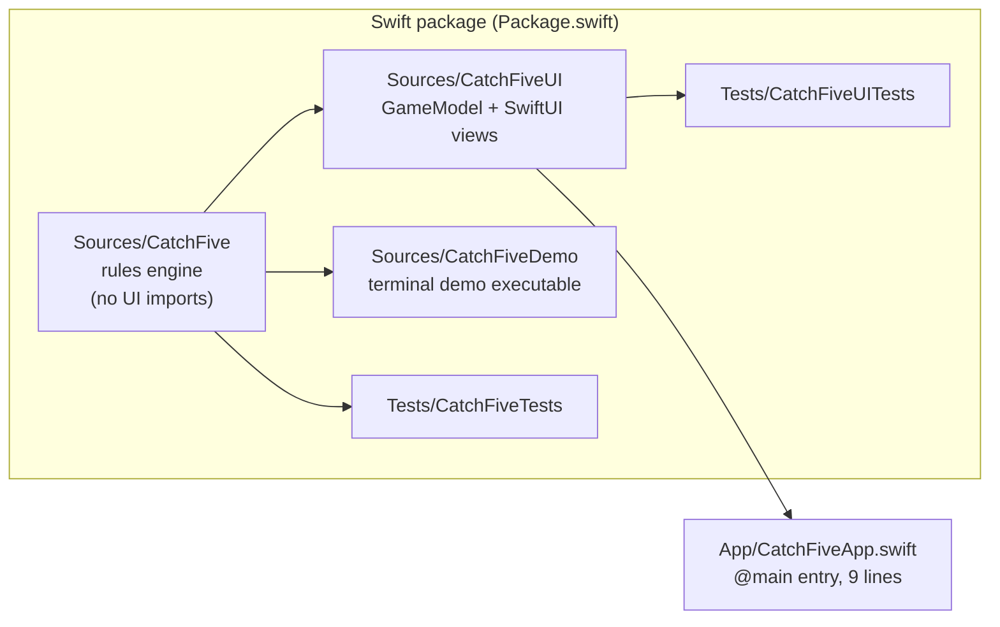
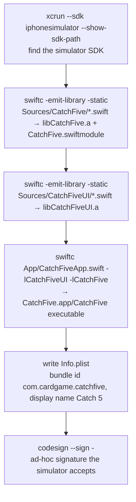
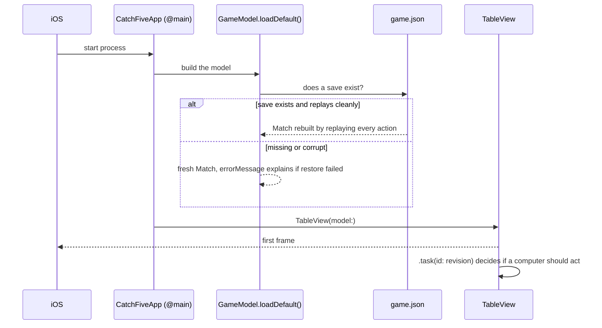
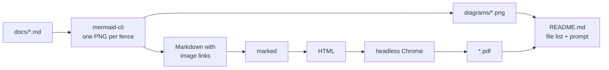

# Build and Run

## What kind of project this is

Catch 5 is a **Swift package** first and an **iOS app** second. A Swift package is a folder with a `Package.swift` manifest and `Sources/` and `Tests/` directories. The Swift toolchain builds and tests it from the command line with no IDE.



`Package.swift` declares five targets. Read it as a dependency list: `CatchFiveUI` depends on `CatchFive`, the app depends on `CatchFiveUI`, and nothing depends on the app. The arrows in the diagram only ever point right; the engine never knows a screen exists.

## The five commands

| Command | What it does | When to use |
|---|---|---|
| `DEVELOPER_DIR=/Applications/Xcode.app/Contents/Developer swift test` | Compiles every target and runs all tests (96 as of this page) | After every change |
| `... swift test --filter <name>` | Runs one test by function name | While working on one rule |
| `... swift run catch-five-demo` | Plays a fixed five-hand match in the terminal and prints every trick | To watch the engine without the app. Add `--computer` for shuffled computer play, `--save-roundtrip` to see save/restore mid-trick |
| `... python3 scripts/build-simulator.py` | Produces `work/simulator-build/CatchFive.app` for the iOS simulator | To run the real app |
| `python3 scripts/export-docs.py` | Renders every explainer page to PDF and every Mermaid diagram to PNG in `work/docs-export/` | To upload the pages to Claude Design or share them outside GitHub |

`DEVELOPER_DIR` points the `swift` command at Xcode's toolchain rather than the command-line-tools copy, which lacks the iOS SDK.

## Why there is a Python build script

Normally `xcodebuild` (or Xcode's Run button) compiles an iOS app. On this Mac the installed Xcode expects an iOS 26.5 platform that is not downloaded, so `xcodebuild` cannot find a destination. The script does the same job by hand.



Each `swiftc` call is the compiler invoked directly, with `-target arm64-apple-ios17.0-simulator` so the binary is built for the simulator, and `-swift-version 6`. The `-I` and `-L` flags tell later steps where to find the `.swiftmodule` and `.a` files from earlier steps.

`project.yml` and `CatchFive.xcodeproj` exist for the day Xcode's simulator platform is installed; `xcodegen` regenerates the project from the YAML. They are not used by the script, but the script does copy two things the store build also uses: the icon, scaled from `App/Assets.xcassets/AppIcon.appiconset/icon-1024.png` (rendered by `swift scripts/make-icon.swift <output>`), and `App/PrivacyInfo.xcprivacy`.

## Toward the App Store

Everything the archive needs is in the repository: the asset catalog with a 1024-pixel alpha-free icon, the privacy manifest (no tracking, no required-reason APIs), and `project.yml` with the bundle id, version 1.0, the card-games category and the icon setting. What this Mac cannot do is archive or sign for devices, because Xcode's iOS platform is not installed. On a Mac that has it:

```bash
xcodegen generate && xcodebuild -scheme CatchFiveApp -destination 'generic/platform=iOS' archive -archivePath work/CatchFive.xcarchive
```

Then upload the archive from Xcode's Organizer to TestFlight.

## Running on the simulator

The simulator named "Catch 5 iPhone" (UDID `02419047-584C-4D69-A0F1-6F33C2C5F0F2`) is the test device. From the terminal:

```bash
xcrun simctl install 02419047-584C-4D69-A0F1-6F33C2C5F0F2 work/simulator-build/CatchFive.app
```

```bash
xcrun simctl launch 02419047-584C-4D69-A0F1-6F33C2C5F0F2 com.cardgame.catchfive
```

The app saves to `Application Support/CatchFive/game.json` inside the simulator's container. Reinstalling keeps that file, so a game in progress survives a rebuild.

## What happens at launch



`@main` marks the one type the OS calls to start the app. The whole `App/CatchFiveApp.swift` file is nine lines because all behaviour lives in the package where it can be tested.

## Sharing the pages outside GitHub

GitHub renders these pages, Mermaid fences included. Claude Design does not: it imports documents (PDF, DOCX, PPTX) and images, not Markdown or Mermaid. `scripts/export-docs.py` closes that gap by rendering every page and diagram from the Markdown source, so there is never a second copy to keep in step.



Run it from the repo root as `python3 scripts/export-docs.py`. With no arguments it exports `learning-path` and every page linked from the reading-order table in [learning-path.md](learning-path.md), in table order, so adding a row to that table is all it takes to export a new page. Name pages to export only those (`python3 scripts/export-docs.py architecture game-flow`), and `--out DIR` changes the folder from the default `work/docs-export/`, which is gitignored.

| Path | What it holds |
|---|---|
| `README.md` | What is in the folder and a paste-ready Claude Design prompt |
| `catch-five-explainer.pdf` | All pages in reading order as one document |
| `<page>.pdf` | One PDF per page, `learning-path.pdf` through `code-map.pdf` |
| `diagrams/<page>-<n>.png` | One PNG per Mermaid block, numbered in page order |
| `_build/` | Intermediates: the rewritten Markdown and the HTML that Chrome printed |

The script is stdlib Python that shells out to three tools already on this Mac, the same approach as `build-simulator.py`. mermaid-cli, run through `npx`, renders each diagram to PNG and rewrites the fence to an image link. marked, also through `npx`, turns the Markdown into HTML. Headless Chrome prints the HTML to PDF; the script finds it from the `CHROME` environment variable first, then puppeteer's cache, then `/Applications`. The first run may download marked. The script fails loudly if a tool is missing or if the PNG count differs from the number of Mermaid fences in the source pages.

To get the pages into Claude Design:

1. Run `python3 scripts/export-docs.py` from the repo root.
2. Open Claude Design.
3. Attach `work/docs-export/catch-five-explainer.pdf` and the PNGs from `diagrams/` you want redrawn, then paste the prompt from `work/docs-export/README.md`.
