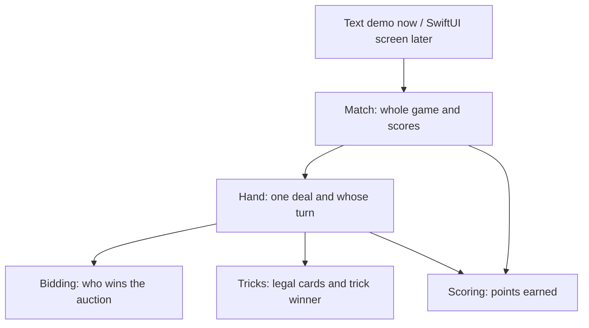

# Catch 5: From Rule to Running Game

## Big Picture

The screen sends an action, such as “Seat 0 plays the queen of clubs.” Match sends it to Hand. Hand checks turn order, card ownership and following suit. The fourth card resolves a trick. The sixth completed trick resolves a hand. Match then updates scores once, saves a hand summary and checks for a winner.

## Source-to-Test Connections

| Source | Direct tests | Whole-game connection |
|---|---|---|
| `Sources/CatchFive/Cards.swift` | `Tests/CatchFiveTests/TrickTests.swift` — cardValuesForGame | Captured values contribute to Game |
| `Sources/CatchFive/Bidding.swift` | `Tests/CatchFiveTests/BiddingTests.swift` | HandTests verifies winning dealer chooses trump |
| `Sources/CatchFive/Tricks.swift` | `Tests/CatchFiveTests/TrickTests.swift` | HandTests enforces following suit and next leader |
| `Sources/CatchFive/Scoring.swift` | `Tests/CatchFiveTests/ScoringTests.swift` | MatchTests checks actual hand and match totals |
| `Sources/CatchFive/Hand.swift` | `Tests/CatchFiveTests/HandTests.swift` | 208 repeatable hands; no duplicate or missing cards |
| `Sources/CatchFive/Match.swift` | `Tests/CatchFiveTests/MatchTests.swift` | Five full hands ending 26–16, then reject further play |
| `Sources/CatchFiveDemo/main.swift` | Run `swift run catch-five-demo` | Calls Match; does not maintain a separate score implementation |

## Follow One Test

`matchScoresOnlyAfterLastCardAndOnlyOnce` is a useful starting point:

1. Create a real Match with a fixed deck.
2. Send real bids and choose trump.
3. Play 23 legal cards; expect scores `[0, 0]` and no history.
4. Play card 24; expect scores `[2, 7]` and one hand summary.
5. Attempt another play; expect rejection and unchanged scores.

A fixed deck makes a failure repeatable. Small rule tests explain exactly which behavior broke; full-game tests catch pieces that work separately but are connected incorrectly.

## What Is Not Built Yet

Strategic computer players, persistent save/resume, and the SwiftUI screen. Normal bidding works end to end. 9-and-out settlement is tested independently; its auction precedence still needs confirmation before connecting it to Match.
