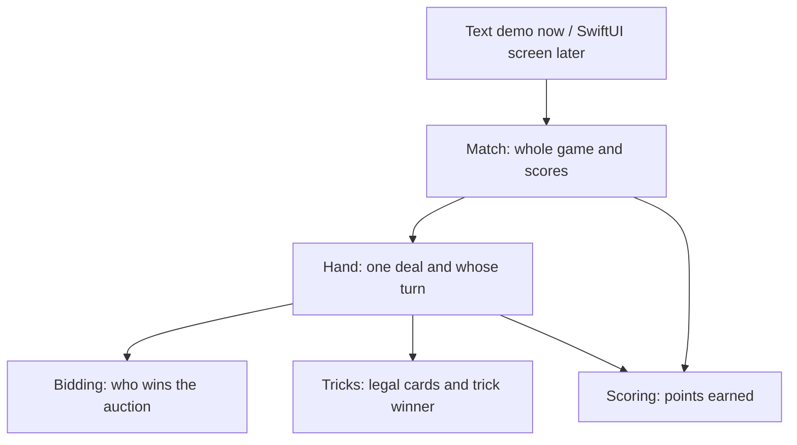

# Catch 5: From Rule to Running Game

## Big Picture



The screen sends an action, such as “Seat 0 plays the queen of clubs.” Match sends it to Hand. Hand checks turn order, card ownership and following suit. The fourth card resolves a trick. The sixth completed trick resolves a hand. Match then updates scores once, saves a hand summary and checks for a winner.

## Source-to-Test Connections

| Source | Direct tests | Whole-game connection |
|---|---|---|
| `Sources/CatchFive/Cards.swift` | `Tests/CatchFiveTests/TrickTests.swift` — cardValuesForGame | Captured values contribute to Game |
| `Sources/CatchFive/Bidding.swift` | `Tests/CatchFiveTests/BiddingTests.swift` | HandTests verifies winning dealer chooses trump |
| `Sources/CatchFive/Tricks.swift` | `Tests/CatchFiveTests/TrickTests.swift` | HandTests enforces following suit and next leader |
| `Sources/CatchFive/Scoring.swift` | `Tests/CatchFiveTests/ScoringTests.swift` | MatchTests checks actual hand and match totals |
| `Sources/CatchFive/Hand.swift` | `Tests/CatchFiveTests/HandTests.swift` | 208 repeatable hands; no duplicate or missing cards |
| `Sources/CatchFive/Match.swift` | `Tests/CatchFiveTests/MatchTests.swift` | Five full hands ending 26–16, then reject further play |
| `Sources/CatchFive/MatchSave.swift` | `Tests/CatchFiveTests/SaveTests.swift` | Resume during bidding, trump selection, a trick, or between hands |
| `Sources/CatchFiveDemo/main.swift` | Run `swift run catch-five-demo` | Calls Match; does not maintain a separate score implementation |

## Follow One Test

`matchScoresOnlyAfterLastCardAndOnlyOnce` is a useful starting point:

1. Create a real Match with a fixed deck.
2. Send real bids and choose trump.
3. Play 23 legal cards; expect scores `[0, 0]` and no history.
4. Play card 24; expect scores `[2, 7]` and one hand summary.
5. Attempt another play; expect rejection and unchanged scores.

A fixed deck makes a failure repeatable. Small rule tests explain exactly which behavior broke; full-game tests catch pieces that work separately but are connected incorrectly.

## What Is Not Built Yet

Strategic computer players and the SwiftUI screen. Engine save/read APIs exist; automatic app lifecycle saving still needs the UI integration. Normal bidding works end to end. 9-and-out settlement is tested independently; its auction precedence still needs confirmation before connecting it to Match.


## Following Functions Without Xcode

Use VS Code or Cursor with the official Swift extension. Open the repository folder containing Package.swift, not an individual file. The Swift extension supplies Go to Definition, Peek Definition, Find All References and test/debugging support.

- **Go to Definition** answers “what does this function actually do?”
- **Find All References** answers “who uses this function?”
- **Outline / Go to Symbol** lists the functions and types in the current file.
- **Debugger Step Into** follows a call while a real scenario runs; **Step Over** runs a call without descending into it. Set a breakpoint in Match.play and debug a Match test.

Start with a scenario, not the alphabetic file list. Trace these exact calls:

```text
MatchTests.matchScoresOnlyAfterLastCardAndOnlyOnce
  -> playCards
    -> Match.play
      -> Hand.play
        -> Hand.legalMoves -> legalCards
        -> Hand.finishTrick (fourth card only)
          -> trickWinner
          -> scoreHand (sixth trick only)
      -> Match.recordHand (finished hand only)
        -> settle
```

Track three things at each call: its inputs, what state it changes, and its result/error. Most of our types are structs (value types); `mutating` means the method changes that value. `private(set)` lets other code read a property but makes its owner responsible for changing it.

## Save/Resume Path

```text
SaveTests.saveRestoresEveryPhaseAndContinuesIdentically
  -> MatchSave.encode -> versioned JSON: initial deck + accepted actions
  -> MatchSave.decode -> new Match
    -> SavedAction.apply -> ordinary bid / chooseTrump / play / startNextHand
  -> continue playing -> same final score
```

Disk connection: MatchSave.write uses atomic file replacement; MatchSave.read loads bytes and passes them to decode. Tests use a temporary directory and check replacing a save as well as reporting missing/unwritable paths.

Only successful actions enter the log. Replay rejects illegal actions and invalid decks. Format version 1 ties a save to the current rules/replay behavior; future incompatible rule changes need an explicit migration or version bump. Replay time grows with the number of actions, which is acceptable for this initial local game but should be measured for unusually long matches.

Run `swift run catch-five-demo --save-roundtrip` to watch the demo resume after three plays and continue to the same 26–16 finish.

Editor references: https://code.visualstudio.com/docs/languages/swift and https://www.swift.org/documentation/articles/getting-started-with-cursor-swift.html.
