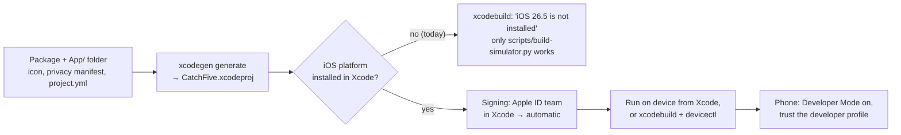

# Installing on your iPhone

What it takes to run Catch 5 on a phone you own, and the one thing this Mac is still missing. Checked on 2026-09-04 against this Mac: Xcode 26.6, the iOS 26.5 SDK present, `xcodegen` installed, an iPhone 16 Pro already paired, and no code-signing identity yet.

## Where things stand



Until the platform is downloaded, `xcodebuild -destination 'generic/platform=iOS'` fails with "iOS 26.5 is not installed. Please download and install the platform from Xcode > Settings > Components." With it installed, the whole path below was run on 2026-09-05 and the app launched on the phone.

## One-time setup

1. **Install the iOS platform.** Open Xcode, then Settings, then Components, and download the iOS 26.5 platform (several gigabytes). Re-run the check afterwards:

```bash
DEVELOPER_DIR=/Applications/Xcode.app/Contents/Developer xcodebuild -project CatchFive.xcodeproj -scheme CatchFiveApp -destination 'generic/platform=iOS' -derivedDataPath work/derived CODE_SIGNING_ALLOWED=NO build
```

   It should end with `BUILD SUCCEEDED`.

2. **Add your Apple ID to Xcode** (Settings, then Accounts). A free Apple ID gives a Personal Team, which can sign apps for your own devices; they expire after seven days and Apple limits a free team to three installed apps at a time. The paid Developer Program (US$99 a year) removes those limits and unlocks TestFlight.

3. **Put your team in the project** so `xcodegen` keeps the setting. The ten-character team id is the `OU` field of your Apple Development certificate (not the value in parentheses in its name, which identifies the certificate itself). From the terminal:

```bash
security find-certificate -c "Apple Development" -p | openssl x509 -noout -subject
```

   It is set in `project.yml` under `settings.base` as `DEVELOPMENT_TEAM` (done on 2026-09-05 for Connor's personal team, `9LDVUD49X7`) and the project regenerated with `xcodegen generate`. `CODE_SIGN_STYLE: Automatic` lets Xcode create the provisioning profile the first time you build.

4. **Prepare and pair the phone.** Settings, then Privacy & Security, then Developer Mode, switch it on and restart. Connect the phone by cable, unlock it, and tap Trust. Then pair it with the Mac's developer tools, either from Xcode's Window, Devices and Simulators, or from the terminal (a prompt appears on the phone):

```bash
xcrun devicectl manage pair --device "Iphone"
```

   Afterwards `xcrun devicectl list devices` shows the phone as "available (paired)". Xcode's "not available because it is unpaired" message means this step is missing.

## Each build

From Xcode: open `CatchFive.xcodeproj`, pick the phone as the run destination, press Run. The first run on a free team asks the phone to trust the developer: Settings, then General, then VPN & Device Management, tap your Apple ID, Trust.

From the terminal, the same thing (this is the sequence that worked on 2026-09-05; the phone's device name is "Iphone", or use its identifier from `devicectl list devices`):

```bash
cd ~/Developer/active/cardgame-io && DEVELOPER_DIR=/Applications/Xcode.app/Contents/Developer xcodebuild -project CatchFive.xcodeproj -scheme CatchFiveApp -destination 'id=DE373CFB-3B3B-5D2C-8ABC-7F1552B74DE2' -derivedDataPath work/derived -allowProvisioningUpdates build
```

```bash
xcrun devicectl device install app --device DE373CFB-3B3B-5D2C-8ABC-7F1552B74DE2 work/derived/Build/Products/Debug-iphoneos/CatchFiveApp.app
```

```bash
xcrun devicectl device process launch --device DE373CFB-3B3B-5D2C-8ABC-7F1552B74DE2 com.cardgame.catchfive
```

`-allowProvisioningUpdates` lets `xcodebuild` create the "iOS Team Provisioning Profile" on first use, signed with the Apple Development certificate.

With a free team, rebuild and reinstall within seven days or the app stops opening; saved games and settings survive a reinstall because they live in the app's own container.

## Before TestFlight

Everything in the repository is ready: the alpha-free icon, the privacy manifest, version 1.0 and the card-games category in `project.yml`. Once the platform is installed and a paid team is set:

```bash
xcodegen generate && DEVELOPER_DIR=/Applications/Xcode.app/Contents/Developer xcodebuild -project CatchFive.xcodeproj -scheme CatchFiveApp -destination 'generic/platform=iOS' archive -archivePath work/CatchFive.xcarchive -allowProvisioningUpdates
```

Then upload from Xcode's Organizer. Take the listing screenshots from the simulator at the largest text size while you are there.

## What stays as it is

`scripts/build-simulator.py` remains the quick path for the simulator on this Mac and needs none of the above. It cannot sign for a device, so it is not part of the phone workflow.
