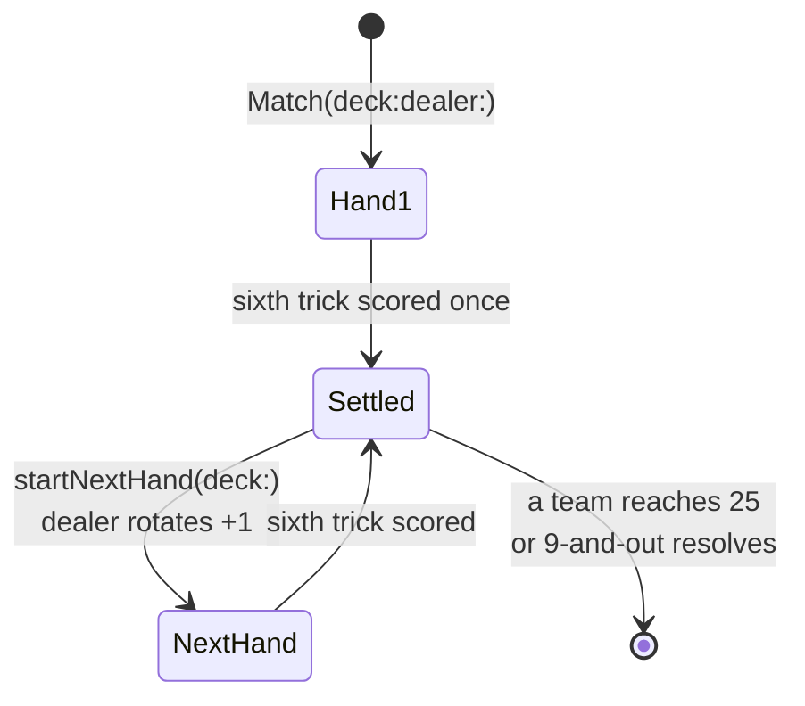
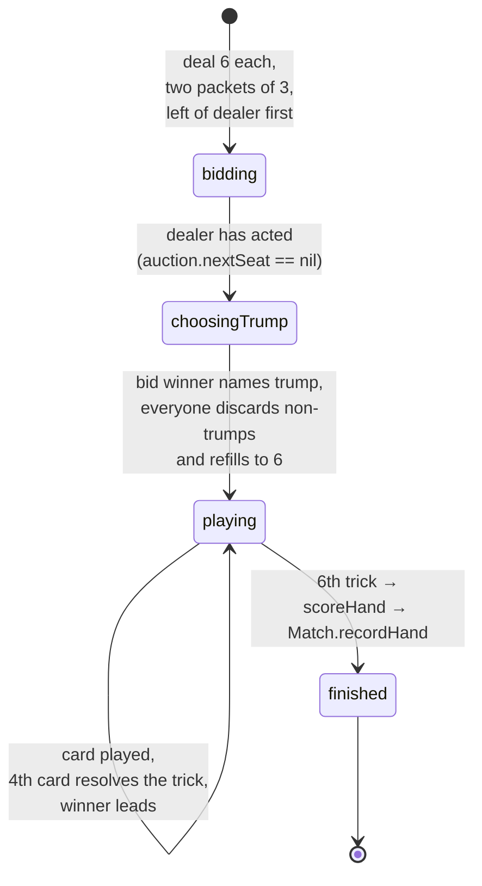
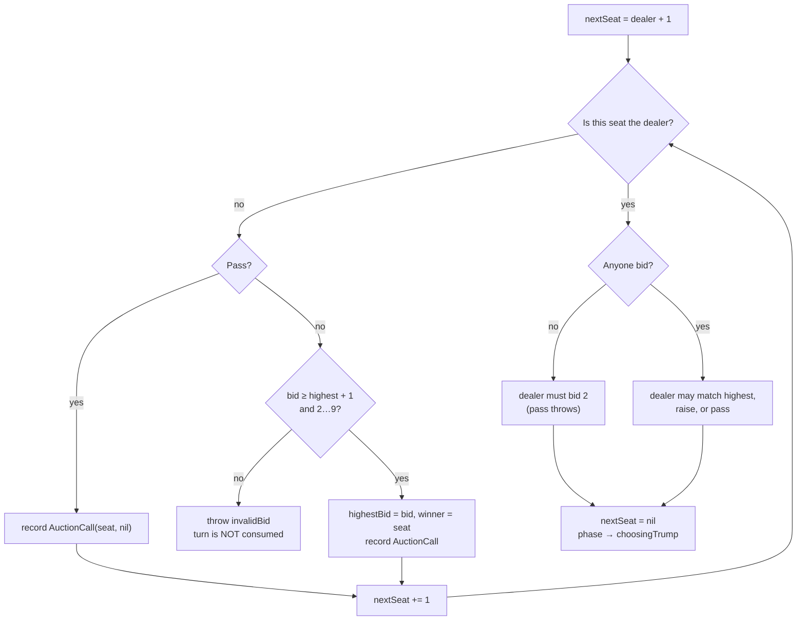
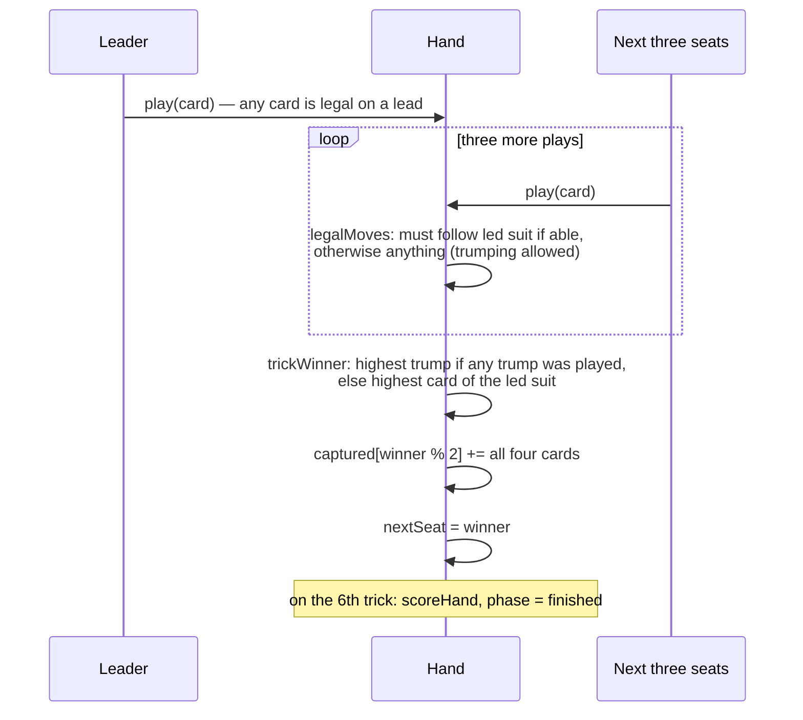
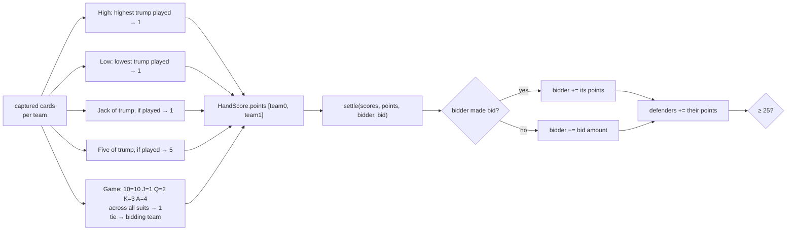
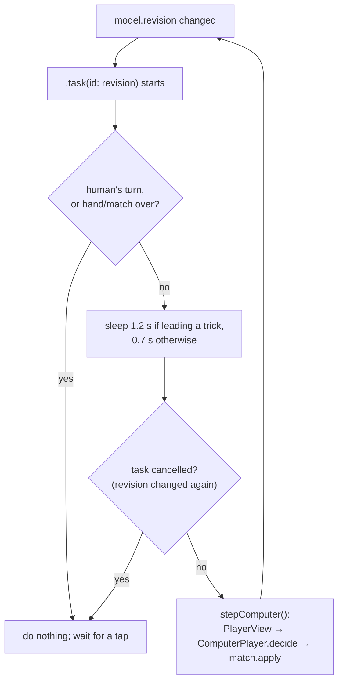
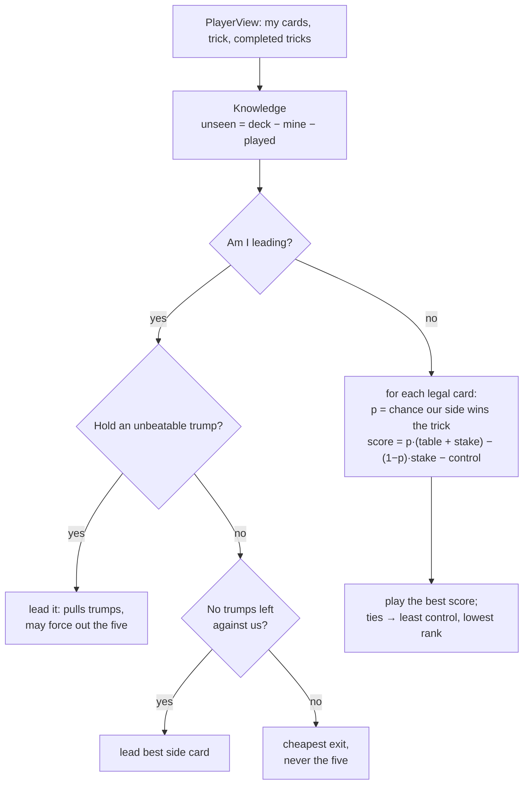

# Game Flow

Seats are 0 (You), 1 (West), 2 (Partner), 3 (East). Team 0 is seats 0 and 2; team 1 is seats 1 and 3. Play moves in ascending seat order, wrapping at 4.

## A match

`Match.winner` becomes non-nil exactly once. After that every action throws `MatchError.matchFinished`. The screen asks for an explicit "Deal next hand" tap so the scoring breakdown can be read first.

## One hand: the four phases

`HandPhase` is the enum with these four cases. Every `Hand` method starts with a guard on `phase`, so calling `play` during `bidding` throws `HandError.wrongPhase` rather than doing something odd.

## The auction, turn by turn

Special bid: `nineAndOut` sets `highestBid = 9` and `isNineAndOut = true`. It outranks a normal 9. Only the dealer may bid against it, and only by matching with their own 9-and-out; that override was confirmed as a house rule on 2026-09-04. Normal bids after a 9-and-out throw.

`Auction.calls` is the ordered list of accepted calls. The table reads it to show "Bid 3" or "Pass" under each seat; computers receive it in `PlayerView.calls`.

## One trick

The screen keeps the last completed trick visible, ringed in gold on the winning card, until the winner leads the next card. Then the old trick fades and the new lead slides in from that seat's edge of the table.

## Scoring at the end of a hand

High and Low are relative to cards actually played. Undealt cards stay in the stock and never count, which is why "Out of play" can appear for Jack or Five in the hand summary.

## Who acts when: the screen's scheduler

Because `stepComputer()` increments `revision`, the next task starts automatically. The human's tap also increments it, which cancels any pending computer sleep, so nothing acts out of turn.

## How a computer chooses a card

The Hint button runs exactly this from your seat and shows the branch it took in words, ringing the suggested card. `stake` is the card's own point value if the other side captures it (a five is 5, a certain Low is 1, a ten is 0.6). `control` is what a trump is worth for later tricks, highest for an unbeatable one and zero on the last trick. `p` is 1 for an unbeatable card, otherwise 0.8 or 0.6 depending on how many seats still play, and when partner is winning it is the chance partner's card holds.

## Saving

Every accepted action calls `persist()`, and `TableView` also calls it whenever the app leaves the foreground (`scenePhase` change). The write is atomic: the old file is replaced only when the new one is complete. `loadDefault()` reads it at launch; on failure the user sees an explanation and a fresh game.
