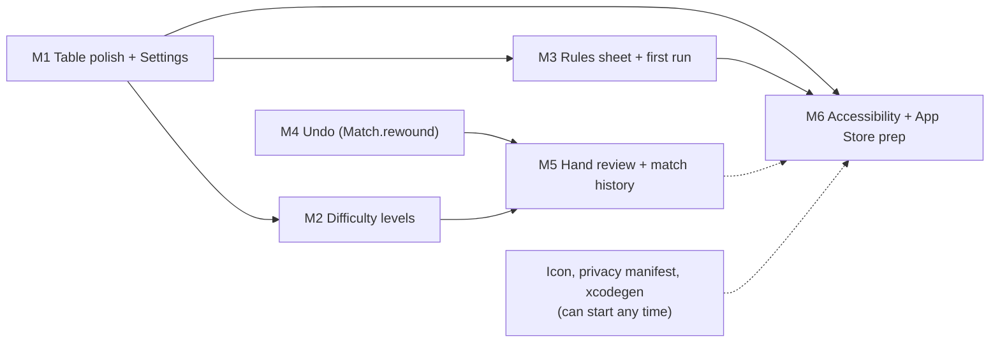

# Roadmap: from playable to shippable

Drafted 2026-09-04 by the planning model from the code and decision log; edit freely. Six milestones toward an enjoyable single-player Catch 5. Strategy strength is parked (D22); every milestone below is product work built on infrastructure that already exists: the replay log, `PlayerView`, `Advice`, and the living docs. Each milestone updates `docs/` in the same commit and adds a numbered decision.

## M1. Table polish and Settings (M)

**Goal:** Make a full match comfortable to play at the reader's own pace.

**Why now:** Every later milestone needs a settings surface and a gear button; these are also the cheapest wins for enjoyment. Gaps found in `TableView.swift`: the human hand is shown in deal order; computer delays are hard-coded (1200/700 ms in `.task`); seat names are duplicated in `TableView.trick`, `HandSummaryView` and `GameModel.seatNames`; errors show raw enum text (`mustFollowSuit`); the discard/refill step after trump is invisible; "Computer's turn" never says who.

**In:** `Settings` (Codable: play speed, seat names, haptics) stored via a small `SettingsStore` in Application Support; `SettingsView` sheet; `GameModel.humanCards` sorted trump-first then suit/rank; `GameModel.delay(before:)` pure function; friendly `HandError` wording; status lines "West is thinking" and "Discarded 3 non-trumps, drew 3"; haptics on trick win and hand end behind `#if canImport(UIKit)`.
**Out:** Sound files (the hand-built bundle has no resource pipeline yet), landscape.

**Files:** `Sources/CatchFiveUI/GameModel.swift`, `TableView.swift`, `HandSummaryView.swift`, new `Settings.swift`, `SettingsView.swift`; `docs/architecture.md`, `docs/game-flow.md` scheduler diagram.
**Tests first:** `humanCardsSortTrumpFirst`, `delayDependsOnPlaySpeedAndLeadPosition`, `settingsRoundTripThroughDisk`, `seatNamesFlowIntoCallsAndContract`, `illegalPlayExplainsFollowSuitInPlainWords`.
**Risks:** Sorting must not break the card-keyed `ForEach` animation (it will not; cards remain unique). Keep `Settings` out of the engine module.

## M2. Difficulty levels (S)

**Goal:** Offer Easy (the frozen PR #2 player) and Standard (the D18 player).

**Why now:** Nearly free: `BaselinePlayer` already exists and measured 34% against the current player, a real gap for newcomers. This is the on-ramp a rules sheet alone cannot provide.

**In:** Move `Tests/CatchFiveTests/BaselinePlayer.swift` to `Sources/CatchFive/EasyPlayer.swift` with its "do not improve" contract intact; the benchmark uses the one copy. `public enum Difficulty: Codable { easy, standard }`; `ComputerPlayer.decide(_:difficulty:)`. Hints always use Standard. Tap-to-explain must say "Easy players do not reason; Standard would have played X because..." for Easy seats. Difficulty lives in `Settings` and is snapshotted into match records (M5).
**Out:** Hard mode (no stronger player exists, see D22).

**Files:** `Sources/CatchFive/ComputerPlayer.swift`, `EasyPlayer.swift`, `Tests/CatchFiveTests/StrategyBenchmark.swift`, `GameModel.swift`; `docs/decisions.md` (amend D17), `docs/testing.md`.
**Tests first:** `easyDifficultyPlaysTheFrozenPlayer`, `hintIgnoresDifficulty`, `explanationForEasySeatIsLabelled`, existing benchmark still passes unchanged.
**Risks:** Someone "fixes" EasyPlayer and silently shifts the benchmark; guard with a doc comment and a decision entry.

## M3. Rules sheet and first run (S)

**Goal:** A new player can learn the house rules inside the app before the first bid.

**Why now:** Shipping requires it; Catch 5's scoring (High/Low relative to cards played, Five worth 5, 9-and-out) is unguessable. An interactive tutorial is deferred because Hint plus M5's review already coach in-game.

**In:** `RulesText.swift` mirroring `docs/catch-five-rules.md` section by section; `RulesView` sheet, opened by a header button and automatically when `Settings.hasSeenRules` is false; a one-line "how to read this table" note.
**Out:** Scripted tutorial hand.

**Files:** new `Sources/CatchFiveUI/RulesText.swift`, `RulesView.swift`; `TableView.swift`; `docs/learning-path.md`.
**Tests first:** `rulesSheetContainsEveryHouseRuleParagraph` (reads `docs/catch-five-rules.md` via `#filePath` so the sheet cannot drift from the rules doc), `firstLaunchShowsRulesOnce`.
**Risks:** None significant.

## M4. Undo the last human action (M)

**Goal:** Take back the last bid, trump choice or card, dropping the computer replies that followed.

**Why now:** The replay log (D5) makes this a rebuild, not a state hack, and the same primitive powers M5. Misplays on a phone are common and currently final.

**In:** Engine: `Match.rewound(toActionCount:)` replays `initialDeck`/`initialDealer` through `actions.prefix(n)`; `Match.undoPoint(forSeat:)` returns the count before the seat's last action in the current hand, nil across a `.nextHand` boundary or once the hand is `.finished`. `GameModel.undo()` uses it, persists, bumps `revision`. Undo button beside Hint.
**Out:** Multi-step undo, undo after the hand summary.

**Files:** `Sources/CatchFive/Match.swift`, `MatchSave.swift` (share replay code), `GameModel.swift`, `TableView.swift`; `docs/game-flow.md`, `docs/decisions.md` (accept that the human has seen the replies; computers are deterministic so unchanged lines replay identically).
**Tests first:** `rewoundMatchEqualsFreshReplay`, `undoDropsHumanActionAndComputerReplies`, `undoUnavailableAcrossHandBoundaryAndAfterScoring`, `undoneMatchSavesAndReloads`.
**Risks:** Replay cost grows with match length; trivial for local play but measure once.

## M5. Hand review, scoreboard and match history (L)

**Goal:** After each hand, show every play with what Standard would have done, and keep statistics across matches.

**Why now:** This is the app's distinctive angle: the explanation machinery (D23, D24) generalised to a whole hand, with the M4 rewind primitive doing the reconstruction. It converts losses into learning, which is what keeps a solo game alive.

**In:** Engine `HandReview(match:)`: rewind to the hand start, replay, and before each play capture that seat's `PlayerView` and `ComputerPlayer.advise`; output `[TrickReview]` with `agreed` flags. `ReviewView` from the hand summary. Scoreboard sheet listing `match.history` mid-match. `MatchRecord` (date, scores, hands, difficulty, human contract rate, hint agreement) appended once to `history.json` when `winner` becomes non-nil; `StatisticsView`; a real match-over card.
**Out:** Replaying archived matches on the table (keep the archive so it can come later).

**Files:** new `Sources/CatchFive/HandReview.swift`, `Sources/CatchFiveUI/MatchHistory.swift`, `ReviewView.swift`, `StatisticsView.swift`; `GameModel.swift`, `HandSummaryView.swift`; `docs/architecture.md`, `types-and-functions.md`.
**Tests first:** `reviewReconstructsEveryPlayWithAdvice`, `reviewAgreementMatchesHintAtEachTurn` (reuse the D24 whole-match test), `finishedMatchIsRecordedExactlyOnce`, `statisticsAggregateAcrossRecords`, `corruptHistoryDoesNotBlockPlay`.
**Risks:** Review prose can get long; cap to one sentence per play. Consolidate with the tap-to-explain code rather than keeping two reconstruction paths.

## M6. Accessibility, Dynamic Type and App Store readiness (M, external blocker)

**Goal:** Pass App Review on iPhone with a first-class accessible table.

**Why now:** Last because it touches every view, but the icon, privacy manifest and xcodegen work can start any time. Fixed sizes today: header 34/9 pt, scores 32 pt, `CardView` 23/27 pt in a 48x72 frame.

**In:** Text styles and `@ScaledMetric` card size; VoiceOver labels "West played 10 of hearts", playable/not-legal values on hand cards, seat tiles as single elements; Reduce Motion disables slide transitions. `Assets.xcassets` icon, `PrivacyInfo.xcprivacy` (UserDefaults or file-based settings need reason CA92.1), version bump, portrait iPhone-first with iPad portrait verified in the existing 640 pt column (`UIDeviceFamily` decision recorded); `project.yml` refreshed. Simulator screenshots for the listing.
**Out:** Landscape/iPad split layout, sound.

**Files:** `TableView.swift`, `CardView.swift`, `HandSummaryView.swift`, `project.yml`, `scripts/build-simulator.py` (copy icon PNGs and `CFBundleIcons` for simulator checks), `docs/build-and-run.md`.
**Tests first:** `spokenDescriptionOfPlayNamesSeatAndCard`, `accessibilityValueReflectsLegality`; the rest is manual simulator checks at the largest text size.
**Risks:** Archiving and TestFlight need the iOS platform in Xcode (Settings > Components) or another Mac; `build-simulator.py` cannot sign for devices. Prepare everything so `xcodegen && xcodebuild archive` works the day the platform is installed.

## Ordering

M1 first because it is cheap, immediately felt, and creates the settings surface M2 and M3 hang from. M2 and M3 together make the game approachable. M4 precedes M5 because both need `Match.rewound`, and undo is the simpler proof of it. M6 is last so it audits finished screens, but its non-code prep runs in parallel.

**Parked:** interactive tutorial, sound assets, landscape, further strategy work.
