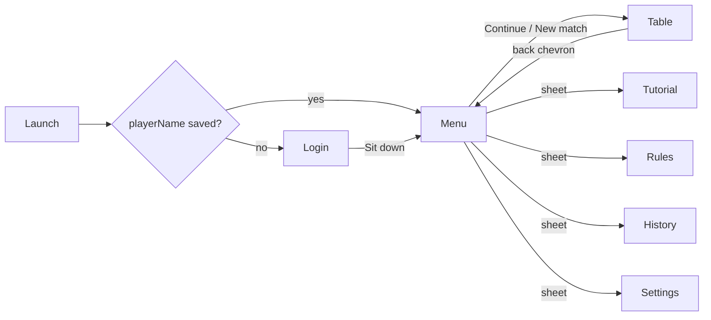

# Cast, Login and Main Menu Implementation Plan

> **For agentic workers:** REQUIRED SUB-SKILL: Use superpowers:subagent-driven-development (recommended) or superpowers:executing-plans to implement this plan task-by-task. Steps use checkbox (`- [ ]`) syntax for tracking.

**Goal:** Name and draw the three computer players, ask the human for a name once, and open the app on a main menu.

**Architecture:** A new `RootView` in `CatchFiveUI` owns the single `GameModel` and switches between login, menu and the existing `TableView`. Characters are value types (`Portrait`, `Character`, `Cast`) drawn by one `PortraitView`; names keep flowing through `Settings.seatNames`, so the rest of the app is untouched. The rules engine in `Sources/CatchFive` does not change.

**Tech Stack:** Swift 6, SwiftUI (iOS 17), Swift Testing, SwiftPM. Tests run with `DEVELOPER_DIR=/Applications/Xcode.app/Contents/Developer swift test`. The simulator build is `python3 scripts/build-simulator.py`.

**Spec:** `docs/superpowers/specs/2026-09-05-cast-and-menu-design.md`

## Global Constraints

- Branch `claude/cast-and-menu`, one PR against `main`. Commit after every task.
- `Sources/CatchFive` is not modified.
- No image assets; portraits are shapes and colours in SwiftUI.
- Gold (`.gold`) is used only for the active-seat ring, the selected portrait ring, and the one prominent button per screen (D33). No gold inside a portrait.
- Every commit that adds, renames or removes a type, function or test updates `docs/types-and-functions.md` and `docs/testing.md` in the same commit (CLAUDE.md rule). Task 12 does the docs in one pass; do not skip it.
- Names: Hazel (seat 1, West), Otto (seat 2, Partner), Rue (seat 3, East). `Settings.defaultSeatNames` becomes `["You", "Hazel", "Otto", "Rue"]`.
- Colour helpers already exist as `.ivory`, `.felt`, `.gold` (`ShapeStyle where Self == Color`, in `CardView.swift`). Test files start with `import CatchFive`, `@testable import CatchFiveUI`, `import Foundation`, `import Testing`; model tests are `@MainActor @Test func`.
- Test commands filter by name: `DEVELOPER_DIR=/Applications/Xcode.app/Contents/Developer swift test --filter <testName>`.

## File map

| File | Responsibility |
|---|---|
| Create `Sources/CatchFiveUI/Cast.swift` | `Portrait`, `Character`, `Cast`: data only |
| Create `Sources/CatchFiveUI/PortraitView.swift` | draws a `Portrait` at a size; `Theme.Portrait` palette |
| Create `Sources/CatchFiveUI/LoginView.swift` | first-run name, portrait and difficulty |
| Create `Sources/CatchFiveUI/MainMenuView.swift` | home screen with the cast arc and buttons |
| Create `Sources/CatchFiveUI/RootView.swift` | owns the model, switches screens, hosts the error alert |
| Modify `Sources/CatchFiveUI/Settings.swift` | `playerName`, `playerPortrait`, `hasSignedIn`, migration |
| Modify `Sources/CatchFiveUI/GameModel.swift` | `matchInProgress`, `signIn`, `seatSummary(for:)` |
| Modify `Sources/CatchFiveUI/TableSurface.swift` | `SeatView` shows the portrait and uses `seatSummary` |
| Modify `Sources/CatchFiveUI/ScoreBarView.swift`, `TableView.swift` | back chevron, no auto-tutorial |
| Modify `Sources/CatchFiveUI/SettingsView.swift` | "You" section |
| Modify `Sources/CatchFiveUI/Tutorial/TutorialView.swift`, `Lessons/DealLesson.swift`, `Lessons/BiddingLesson.swift` | `SeatTile` portrait |
| Modify `App/CatchFiveApp.swift` | `RootView` |
| Modify `Tests/CatchFiveUITests/GameModelTests.swift` | new tests |
| Modify `docs/architecture.md`, `docs/types-and-functions.md`, `docs/testing.md`, `docs/decisions.md` | living docs |

---

### Task 1: Cast data types

**Files:**
- Create: `Sources/CatchFiveUI/Cast.swift`
- Test: `Tests/CatchFiveUITests/GameModelTests.swift`

**Interfaces:**
- Produces: `Portrait` (Codable, Equatable, Hashable, Sendable) with nested enums `Skin`, `Hair`, `HairColor`, `Feature`, `Hat`, `Shirt`; `Character { name: String, portrait: Portrait }`; `Cast.opponents: [Character]` (3), `Cast.playerChoices: [Portrait]` (4), `Cast.defaultPlayerPortrait: Portrait`, `Cast.seatWords: [String]`.

- [ ] **Step 1: Write the failing test** at the end of `Tests/CatchFiveUITests/GameModelTests.swift`

```swift
@Test func castHasThreeDistinctNamesAndPortraits() {
    #expect(Cast.opponents.count == 3)
    #expect(Set(Cast.opponents.map(\.name)).count == 3)
    #expect(Set(Cast.opponents.map(\.portrait)).count == 3)
    #expect(Cast.opponents.map(\.name) == ["Hazel", "Otto", "Rue"])
    #expect(Cast.playerChoices.count == 4)
    #expect(Set(Cast.playerChoices).count == 4)
    #expect(Cast.defaultPlayerPortrait == Cast.playerChoices[0])
    #expect(Cast.seatWords == ["You", "West", "Partner", "East"])
}
```

- [ ] **Step 2: Run it to verify it fails**

Run: `DEVELOPER_DIR=/Applications/Xcode.app/Contents/Developer swift test --filter castHasThreeDistinctNamesAndPortraits`
Expected: compile error, `cannot find 'Cast' in scope`.

- [ ] **Step 3: Create `Sources/CatchFiveUI/Cast.swift`**

```swift
import Foundation

/// A drawable face: a recipe, not an image. `PortraitView` renders it at any size.
public struct Portrait: Codable, Equatable, Hashable, Sendable {
    public enum Skin: String, Codable, CaseIterable, Sendable { case light, tan, brown, deep }
    public enum Hair: String, Codable, CaseIterable, Sendable { case short, bob, curly, bald }
    public enum HairColor: String, Codable, CaseIterable, Sendable { case black, brown, blond, silver, red }
    public enum Feature: String, Codable, CaseIterable, Sendable { case none, glasses, moustache, freckles }
    public enum Hat: String, Codable, CaseIterable, Sendable { case none, beanie, cap, flower }
    public enum Shirt: String, Codable, CaseIterable, Sendable { case plum, olive, teal, rust, navy, mustard }

    public var skin: Skin
    public var hair: Hair
    public var hairColor: HairColor
    public var feature: Feature
    public var hat: Hat
    public var shirt: Shirt

    public init(skin: Skin, hair: Hair, hairColor: HairColor, feature: Feature = .none, hat: Hat = .none, shirt: Shirt) {
        self.skin = skin
        self.hair = hair
        self.hairColor = hairColor
        self.feature = feature
        self.hat = hat
        self.shirt = shirt
    }
}

/// A named player at the table.
public struct Character: Equatable, Sendable {
    public let name: String
    public let portrait: Portrait

    public init(name: String, portrait: Portrait) {
        self.name = name
        self.portrait = portrait
    }
}

/// The fixed cast. Seats 1, 2 and 3 are always Hazel, Otto and Rue; the human picks a face at login.
public enum Cast {
    /// Index 0 is seat 1 (West), 1 is seat 2 (Partner), 2 is seat 3 (East).
    public static let opponents: [Character] = [
        Character(name: "Hazel", portrait: Portrait(skin: .light, hair: .bob, hairColor: .silver, feature: .glasses, shirt: .plum)),
        Character(name: "Otto", portrait: Portrait(skin: .tan, hair: .short, hairColor: .brown, feature: .moustache, hat: .cap, shirt: .olive)),
        Character(name: "Rue", portrait: Portrait(skin: .brown, hair: .curly, hairColor: .red, feature: .freckles, hat: .beanie, shirt: .teal)),
    ]

    /// Faces the human can choose from at login and in Settings.
    public static let playerChoices: [Portrait] = [
        Portrait(skin: .tan, hair: .short, hairColor: .black, shirt: .navy),
        Portrait(skin: .deep, hair: .curly, hairColor: .black, shirt: .mustard),
        Portrait(skin: .light, hair: .bob, hairColor: .blond, hat: .flower, shirt: .rust),
        Portrait(skin: .brown, hair: .bald, hairColor: .black, feature: .glasses, shirt: .teal),
    ]

    public static let defaultPlayerPortrait = playerChoices[0]

    /// Direction words for accessibility and lesson text, indexed by seat.
    public static let seatWords = ["You", "West", "Partner", "East"]

    /// The opponent seated at `seat` (1 to 3), or nil for the human.
    public static func opponent(at seat: Int) -> Character? {
        (1...3).contains(seat) ? opponents[seat - 1] : nil
    }
}
```

- [ ] **Step 4: Run the test to verify it passes**

Run: `DEVELOPER_DIR=/Applications/Xcode.app/Contents/Developer swift test --filter castHasThreeDistinctNamesAndPortraits`
Expected: PASS.

- [ ] **Step 5: Commit**

```bash
git add Sources/CatchFiveUI/Cast.swift Tests/CatchFiveUITests/GameModelTests.swift
git commit -m "Add the fixed cast and portrait recipes"
```

---

### Task 2: Settings fields and seat-name migration

**Files:**
- Modify: `Sources/CatchFiveUI/Settings.swift`
- Test: `Tests/CatchFiveUITests/GameModelTests.swift`

**Interfaces:**
- Consumes: `Cast.opponents`, `Cast.defaultPlayerPortrait`, `Portrait`.
- Produces: `Settings.playerName: String?`, `Settings.playerPortrait: Portrait`, `Settings.hasSignedIn: Bool`, `Settings.defaultSeatNames == ["You", "Hazel", "Otto", "Rue"]`, `Settings.legacySeatNames == ["You", "West", "Partner", "East"]`, init parameters `playerName:` and `playerPortrait:`.

- [ ] **Step 1: Write the failing tests** at the end of `GameModelTests.swift`

```swift
@Test func settingsRoundTripKeepsPlayerNameAndPortrait() throws {
    let url = FileManager.default.temporaryDirectory.appendingPathComponent(UUID().uuidString)
    defer { try? FileManager.default.removeItem(at: url) }
    var settings = Settings()
    #expect(!settings.hasSignedIn)
    settings.playerName = "Connor"
    settings.playerPortrait = Cast.playerChoices[2]
    try SettingsStore.write(settings, to: url)
    let read = try SettingsStore.read(from: url)
    #expect(read == settings)
    #expect(read.hasSignedIn && read.playerName == "Connor" && read.playerPortrait == Cast.playerChoices[2])
}

@Test func settingsWithoutPlayerFieldsLoadsSignedOut() throws {
    let url = FileManager.default.temporaryDirectory.appendingPathComponent(UUID().uuidString)
    defer { try? FileManager.default.removeItem(at: url) }
    try Data("{\"playSpeed\":\"relaxed\"}".utf8).write(to: url)
    let settings = try SettingsStore.read(from: url)
    #expect(settings.playerName == nil && !settings.hasSignedIn)
    #expect(settings.playerPortrait == Cast.defaultPlayerPortrait)
    #expect(settings.seatNames == ["You", "Hazel", "Otto", "Rue"])
}

@Test func oldSettingsFileMigratesDefaultSeatNamesToCast() throws {
    let url = FileManager.default.temporaryDirectory.appendingPathComponent(UUID().uuidString)
    defer { try? FileManager.default.removeItem(at: url) }
    try Data("{\"seatNames\":[\"You\",\"West\",\"Mum\",\"East\"]}".utf8).write(to: url)
    let settings = try SettingsStore.read(from: url)
    #expect(settings.seatNames == ["You", "Hazel", "Mum", "Rue"])
}
```

- [ ] **Step 2: Run them to verify they fail**

Run: `DEVELOPER_DIR=/Applications/Xcode.app/Contents/Developer swift test --filter "settingsRoundTripKeepsPlayerNameAndPortrait|settingsWithoutPlayerFieldsLoadsSignedOut|oldSettingsFileMigratesDefaultSeatNamesToCast"`
Expected: compile error, `value of type 'Settings' has no member 'playerName'`.

- [ ] **Step 3: Edit `Settings.swift`**

Replace the stored properties, the defaults, the memberwise init and the decoder so the struct reads:

```swift
public struct Settings: Codable, Equatable, Sendable {
    public enum PlaySpeed: String, Codable, CaseIterable, Sendable {
        case relaxed, normal, quick
    }

    public var playSpeed: PlaySpeed
    /// Seat 0 is the human; the others default to the cast (Hazel, Otto, Rue).
    public var seatNames: [String]
    public var haptics: Bool
    public var difficulty: Difficulty
    /// The tutorial opens by itself until the player has dismissed it once.
    public var hasSeenRules: Bool
    /// Tutorial lessons (0 to 4) whose exercise has been solved.
    public var completedLessons: Set<Int>
    /// Nil until the login screen has been completed once.
    public var playerName: String?
    /// The face the human chose at login.
    public var playerPortrait: Portrait

    public static let defaultSeatNames = ["You"] + Cast.opponents.map(\.name)
    /// The defaults before the cast existed; files still carrying them migrate on load.
    public static let legacySeatNames = ["You", "West", "Partner", "East"]

    public var hasSignedIn: Bool { playerName != nil }

    public init(playSpeed: PlaySpeed = .normal, seatNames: [String] = Settings.defaultSeatNames,
                haptics: Bool = true, difficulty: Difficulty = .standard, hasSeenRules: Bool = false,
                completedLessons: Set<Int> = [], playerName: String? = nil,
                playerPortrait: Portrait = Cast.defaultPlayerPortrait) {
        self.playSpeed = playSpeed
        self.seatNames = seatNames
        self.haptics = haptics
        self.difficulty = difficulty
        self.hasSeenRules = hasSeenRules
        self.completedLessons = completedLessons
        self.playerName = playerName
        self.playerPortrait = playerPortrait
    }

    // Missing keys fall back to defaults so an older settings file keeps loading.
    public init(from decoder: Decoder) throws {
        let container = try decoder.container(keyedBy: CodingKeys.self)
        playSpeed = try container.decodeIfPresent(PlaySpeed.self, forKey: .playSpeed) ?? .normal
        let names = try container.decodeIfPresent([String].self, forKey: .seatNames) ?? Settings.defaultSeatNames
        seatNames = names.count == 4 ? Settings.migrated(names) : Settings.defaultSeatNames
        haptics = try container.decodeIfPresent(Bool.self, forKey: .haptics) ?? true
        difficulty = try container.decodeIfPresent(Difficulty.self, forKey: .difficulty) ?? .standard
        hasSeenRules = try container.decodeIfPresent(Bool.self, forKey: .hasSeenRules) ?? false
        completedLessons = try container.decodeIfPresent(Set<Int>.self, forKey: .completedLessons) ?? []
        playerName = try container.decodeIfPresent(String.self, forKey: .playerName)
        playerPortrait = try container.decodeIfPresent(Portrait.self, forKey: .playerPortrait) ?? Cast.defaultPlayerPortrait
    }

    /// Seats 1 to 3 that still carry the old direction names take the cast's names; custom names are kept.
    static func migrated(_ names: [String]) -> [String] {
        var result = names
        for seat in 1...3 where names[seat] == legacySeatNames[seat] {
            result[seat] = defaultSeatNames[seat]
        }
        return result
    }
```

Leave `delay(leadingTrick:)` and `SettingsStore` as they are.

- [ ] **Step 4: Run the new tests and the existing settings tests**

Run: `DEVELOPER_DIR=/Applications/Xcode.app/Contents/Developer swift test --filter "settings|Settings"`
Expected: all PASS, including the existing `settingsRoundTripThroughDiskAndTolerateMissingKeys` (its partial file yields `defaultSeatNames`, which are now the cast names, so it still passes).

- [ ] **Step 5: Run the whole suite** to catch anything that assumed "West", "Partner" or "East" as a default.

Run: `DEVELOPER_DIR=/Applications/Xcode.app/Contents/Developer swift test 2>&1 | tail -5`
Expected: all tests pass. If a test asserts the literal "West" for a default name, change the assertion to `Settings.defaultSeatNames[1]`.

- [ ] **Step 6: Commit**

```bash
git add Sources/CatchFiveUI/Settings.swift Tests/CatchFiveUITests/GameModelTests.swift
git commit -m "Settings: player name and portrait, cast names as seat defaults"
```

---

### Task 3: GameModel additions

**Files:**
- Modify: `Sources/CatchFiveUI/GameModel.swift`
- Test: `Tests/CatchFiveUITests/GameModelTests.swift`

**Interfaces:**
- Consumes: `Settings.playerName`, `Settings.playerPortrait`, `Cast.seatWords`, `Match.actionCount`, `Match.winner`, existing `finishMatch(_:)` test helper at line ~222 of the test file.
- Produces: `GameModel.matchInProgress: Bool`, `GameModel.signIn(name:portrait:difficulty:)`, `GameModel.seatSummary(for seat: Int) -> String`.

- [ ] **Step 1: Write the failing tests** at the end of `GameModelTests.swift`

```swift
@MainActor @Test func matchInProgressIsFalseForFreshAndFinishedMatches() throws {
    let model = GameModel(match: try Match(deck: GameModel.deck(), dealer: 3))
    #expect(!model.matchInProgress)
    model.send(.bid(nil))
    #expect(model.matchInProgress)
    try finishMatch(model)
    #expect(model.match.winner != nil)
    #expect(!model.matchInProgress)
    model.newGame()
    #expect(!model.matchInProgress)
}

@MainActor @Test func signInTrimsNameAndSetsSeatZero() throws {
    let model = GameModel(match: try Match(deck: GameModel.deck(), dealer: 3))
    #expect(!model.settings.hasSignedIn)
    model.signIn(name: "  Connor ", portrait: Cast.playerChoices[3], difficulty: .easy)
    #expect(model.settings.playerName == "Connor")
    #expect(model.seatNames[0] == "Connor")
    #expect(model.settings.playerPortrait == Cast.playerChoices[3])
    #expect(model.settings.difficulty == .easy)
    #expect(model.settings.hasSignedIn)
}

@MainActor @Test func seatSummaryIncludesSeatWord() throws {
    let model = GameModel(match: try Match(deck: GameModel.deck(), dealer: 3))
    #expect(model.seatSummary(for: 1).hasPrefix("Hazel, West, "))
    #expect(model.seatSummary(for: 3).hasSuffix("dealer"))
    #expect(model.seatSummary(for: 0).hasPrefix("You, "))
    #expect(model.seatSummary(for: 0).hasSuffix("to act"))
}
```

- [ ] **Step 2: Run them to verify they fail**

Run: `DEVELOPER_DIR=/Applications/Xcode.app/Contents/Developer swift test --filter "matchInProgressIsFalseForFreshAndFinishedMatches|signInTrimsNameAndSetsSeatZero|seatSummaryIncludesSeatWord"`
Expected: compile error, `has no member 'matchInProgress'`.

- [ ] **Step 3: Add to `GameModel`** directly after `public var seatNames: [String] { settings.seatNames }` (line ~63)

```swift
    /// True once something has happened this match and nobody has won yet; drives the menu's Continue button.
    public var matchInProgress: Bool { match.actionCount > 0 && match.winner == nil }

    /// The login screen's one write: the trimmed name becomes seat 0's name as well.
    public func signIn(name: String, portrait: Portrait, difficulty: Difficulty) {
        let trimmed = name.trimmingCharacters(in: .whitespacesAndNewlines)
        guard !trimmed.isEmpty else { return }
        settings.playerName = trimmed
        settings.seatNames[0] = trimmed
        settings.playerPortrait = portrait
        settings.difficulty = difficulty
    }

    /// One VoiceOver sentence for a seat tile: name, direction, call or card count, dealer, to act.
    public func seatSummary(for seat: Int) -> String {
        let hand = match.hand
        var parts = [seatNames[seat]]
        if seat != 0 { parts.append(Cast.seatWords[seat]) }
        if hand.phase == .bidding { parts.append(latestCall(for: seat) ?? "waiting") }
        else if hand.auction.winner == seat { parts.append("bidder, \(hand.hands[seat].count) cards") }
        else { parts.append("\(hand.hands[seat].count) cards") }
        if hand.auction.dealer == seat { parts.append("dealer") }
        if hand.nextSeat == seat, match.winner == nil { parts.append("to act") }
        return parts.joined(separator: ", ")
    }
```

Note `seatSummary(for: 0)` yields "You, waiting, to act" on a fresh match with dealer 3 (seat 0 bids first), which the test checks by prefix and suffix.

- [ ] **Step 4: Run the tests**

Run: `DEVELOPER_DIR=/Applications/Xcode.app/Contents/Developer swift test --filter "matchInProgressIsFalseForFreshAndFinishedMatches|signInTrimsNameAndSetsSeatZero|seatSummaryIncludesSeatWord"`
Expected: PASS.

- [ ] **Step 5: Commit**

```bash
git add Sources/CatchFiveUI/GameModel.swift Tests/CatchFiveUITests/GameModelTests.swift
git commit -m "GameModel: matchInProgress, signIn and seatSummary"
```

---

### Task 4: PortraitView

**Files:**
- Create: `Sources/CatchFiveUI/PortraitView.swift`
- Modify: `Sources/CatchFiveUI/Theme.swift` (add `Theme.Portrait`)

**Interfaces:**
- Consumes: `Portrait`.
- Produces: `PortraitView(portrait: Portrait, size: Double)`, a `size × size` circular view, accessibility hidden. `Theme.Portrait.color(_:)` overloads for each enum.

There is no unit test for drawing; the check is that the package builds and the simulator shows the faces in Task 9. Keep every shape a plain `Shape` or `Path` so this file compiles on macOS in `swift test`.

- [ ] **Step 1: Add the palette to `Theme.swift`** inside `public enum Theme`, after `Motion`

```swift
    /// Colours for drawn faces, chosen to sit with felt and ivory. No gold here (D33).
    public enum Portrait {
        public static func color(_ skin: CatchFiveUI.Portrait.Skin) -> Color {
            switch skin {
            case .light: Color(red: 0.96, green: 0.85, blue: 0.74)
            case .tan: Color(red: 0.85, green: 0.68, blue: 0.52)
            case .brown: Color(red: 0.62, green: 0.44, blue: 0.30)
            case .deep: Color(red: 0.38, green: 0.25, blue: 0.17)
            }
        }
        public static func color(_ hair: CatchFiveUI.Portrait.HairColor) -> Color {
            switch hair {
            case .black: Color(red: 0.12, green: 0.10, blue: 0.10)
            case .brown: Color(red: 0.40, green: 0.26, blue: 0.16)
            case .blond: Color(red: 0.88, green: 0.76, blue: 0.50)
            case .silver: Color(red: 0.80, green: 0.80, blue: 0.82)
            case .red: Color(red: 0.70, green: 0.30, blue: 0.16)
            }
        }
        public static func color(_ shirt: CatchFiveUI.Portrait.Shirt) -> Color {
            switch shirt {
            case .plum: Color(red: 0.42, green: 0.20, blue: 0.36)
            case .olive: Color(red: 0.40, green: 0.44, blue: 0.22)
            case .teal: Color(red: 0.16, green: 0.42, blue: 0.44)
            case .rust: Color(red: 0.62, green: 0.30, blue: 0.18)
            case .navy: Color(red: 0.16, green: 0.22, blue: 0.40)
            case .mustard: Color(red: 0.72, green: 0.58, blue: 0.22)
            }
        }
        /// Hats and glasses frames.
        public static let accessory = Color(red: 0.20, green: 0.20, blue: 0.22)
        public static let disc = Color(red: 0.10, green: 0.24, blue: 0.20)
    }
```

- [ ] **Step 2: Create `Sources/CatchFiveUI/PortraitView.swift`**

```swift
import SwiftUI

/// A face drawn from a `Portrait` recipe: shoulders, head, hair, one feature, one hat, inside an ivory-ringed disc.
/// Every measurement is a fraction of `size`, so the same view serves 28 pt seat tiles and 72 pt pickers.
struct PortraitView: View {
    let portrait: Portrait
    let size: Double

    var body: some View {
        ZStack {
            Circle().fill(Theme.Portrait.disc)
            shoulders
            hairBack
            head
            feature
            hairFront
            hat
        }
        .frame(width: size, height: size)
        .clipShape(Circle())
        .overlay(Circle().stroke(Color.ivory.opacity(0.7), lineWidth: max(1, size * 0.03)))
        .accessibilityHidden(true)
    }

    // MARK: Parts

    private var shoulders: some View {
        RoundedRectangle(cornerRadius: size * 0.22, style: .continuous)
            .fill(Theme.Portrait.color(portrait.shirt))
            .frame(width: size * 0.78, height: size * 0.5)
            .offset(y: size * 0.5)
    }

    private var head: some View {
        Ellipse()
            .fill(Theme.Portrait.color(portrait.skin))
            .frame(width: size * 0.46, height: size * 0.54)
            .offset(y: -size * 0.02)
    }

    /// Hair drawn behind the head: the bob's sides and the curly mass.
    @ViewBuilder private var hairBack: some View {
        let color = Theme.Portrait.color(portrait.hairColor)
        switch portrait.hair {
        case .bob:
            RoundedRectangle(cornerRadius: size * 0.16, style: .continuous)
                .fill(color).frame(width: size * 0.56, height: size * 0.6).offset(y: -size * 0.02)
        case .curly:
            Circle().fill(color).frame(width: size * 0.6, height: size * 0.6).offset(y: -size * 0.06)
        case .short, .bald:
            EmptyView()
        }
    }

    /// Hair drawn over the head: the short cut's cap.
    @ViewBuilder private var hairFront: some View {
        if portrait.hair == .short {
            Ellipse()
                .fill(Theme.Portrait.color(portrait.hairColor))
                .frame(width: size * 0.48, height: size * 0.24)
                .offset(y: -size * 0.24)
                .clipShape(Rectangle().offset(y: -size * 0.02))
        }
    }

    @ViewBuilder private var feature: some View {
        switch portrait.feature {
        case .none:
            EmptyView()
        case .glasses:
            HStack(spacing: size * 0.02) {
                Circle().stroke(Theme.Portrait.accessory, lineWidth: max(1, size * 0.025)).frame(width: size * 0.15, height: size * 0.15)
                Circle().stroke(Theme.Portrait.accessory, lineWidth: max(1, size * 0.025)).frame(width: size * 0.15, height: size * 0.15)
            }.offset(y: -size * 0.03)
        case .moustache:
            Capsule().fill(Theme.Portrait.color(portrait.hairColor))
                .frame(width: size * 0.2, height: size * 0.06).offset(y: size * 0.1)
        case .freckles:
            HStack(spacing: size * 0.04) {
                ForEach(0..<3, id: \.self) { _ in
                    Circle().fill(Theme.Portrait.accessory.opacity(0.5)).frame(width: size * 0.03, height: size * 0.03)
                }
            }.offset(y: size * 0.05)
        }
    }

    @ViewBuilder private var hat: some View {
        switch portrait.hat {
        case .none:
            EmptyView()
        case .beanie:
            RoundedRectangle(cornerRadius: size * 0.14, style: .continuous)
                .fill(Theme.Portrait.accessory)
                .frame(width: size * 0.5, height: size * 0.26).offset(y: -size * 0.26)
        case .cap:
            ZStack {
                Ellipse().fill(Theme.Portrait.accessory).frame(width: size * 0.5, height: size * 0.22).offset(y: -size * 0.26)
                Capsule().fill(Theme.Portrait.accessory).frame(width: size * 0.62, height: size * 0.07).offset(y: -size * 0.18)
            }
        case .flower:
            Image(systemName: "leaf.fill")
                .resizable().scaledToFit()
                .foregroundStyle(Theme.Portrait.color(.rust))
                .frame(width: size * 0.16, height: size * 0.16)
                .rotationEffect(.degrees(-30))
                .offset(x: size * 0.18, y: -size * 0.24)
        }
    }
}
```

- [ ] **Step 3: Build the package**

Run: `DEVELOPER_DIR=/Applications/Xcode.app/Contents/Developer swift build 2>&1 | tail -3`
Expected: `Build complete!` with no errors. If `Theme.Portrait` shadows the `Portrait` struct inside `Theme.swift`, the `CatchFiveUI.Portrait.Skin` qualifications above resolve it.

- [ ] **Step 4: Commit**

```bash
git add Sources/CatchFiveUI/PortraitView.swift Sources/CatchFiveUI/Theme.swift
git commit -m "PortraitView draws a face from a Portrait recipe"
```

---

### Task 5: Portraits on the table and in the tutorial

**Files:**
- Modify: `Sources/CatchFiveUI/TableSurface.swift` (`SeatView`, lines ~274-322)
- Modify: `Sources/CatchFiveUI/Tutorial/TutorialView.swift` (`SeatTile`, lines ~121-141)
- Modify: `Sources/CatchFiveUI/Tutorial/Lessons/DealLesson.swift`, `Lessons/BiddingLesson.swift`

**Interfaces:**
- Consumes: `PortraitView`, `Cast.opponent(at:)`, `Cast.seatWords`, `GameModel.seatSummary(for:)`, `Settings.playerPortrait`.
- Produces: `SeatTile(name:detail:badge:ring:portrait:action:)` with `portrait: Portrait? = nil`.

- [ ] **Step 1: Rewrite `SeatView.body` and delete its private `summary`**

```swift
    var body: some View {
        HStack(spacing: 8) {
            PortraitView(portrait: portrait, size: Theme.Table.portraitSize)
            VStack(spacing: 4) {
                Text(model.seatNames[seat]).font(.subheadline.weight(.semibold)).lineLimit(1)
                if hand.phase == .bidding {
                    Text(model.latestCall(for: seat) ?? "Waiting").font(.caption).opacity(0.75)
                } else {
                    ZStack {
                        ForEach(0..<min(3, max(1, hand.hands[seat].count)), id: \.self) { index in
                            CardBackView(width: Theme.Table.seatBackWidth)
                                .offset(x: Double(index) * 4 - 4)
                        }
                        if hand.hands[seat].isEmpty { Color.clear.frame(width: Theme.Table.seatBackWidth, height: Theme.Table.seatBackWidth * Theme.Card.ratio) }
                        Text(hand.hands[seat].count, format: .number).font(.caption2.weight(.bold).monospacedDigit())
                            .padding(.horizontal, 5).padding(.vertical, 1)
                            .background(.black.opacity(0.55), in: Capsule())
                            .offset(x: 14, y: 12)
                    }.frame(height: 40).dynamicTypeSize(...Theme.Card.maximumTypeSize)
                }
                VStack(spacing: 0) {
                    if hand.auction.dealer == seat { Text("DEALER").font(.system(.caption2, design: .monospaced)).foregroundStyle(.gold) }
                    if hand.auction.winner == seat, hand.phase != .bidding { Text("BIDDER").font(.system(.caption2, design: .monospaced)).opacity(0.7) }
                }
            }
        }
        .padding(.horizontal, 10).padding(.vertical, 6)
        .frame(minWidth: 84)
        .background(.white.opacity(0.04), in: RoundedRectangle(cornerRadius: 12, style: .continuous))
        .overlay(RoundedRectangle(cornerRadius: 12, style: .continuous).stroke(.gold, lineWidth: active ? 2 : 0))
        .accessibilityElement(children: .ignore)
        .accessibilityLabel(model.seatSummary(for: seat))
    }

    private var portrait: Portrait { Cast.opponent(at: seat)?.portrait ?? model.settings.playerPortrait }
```

Add to `Theme.Table` in `Theme.swift`: `public static let portraitSize = 28.0`.

- [ ] **Step 2: Give `SeatTile` a portrait**

In `TutorialView.swift` change `SeatTile` to:

```swift
struct SeatTile: View {
    let name: String
    let detail: String
    var badge: String? = nil
    var ring: Color? = nil
    var portrait: Portrait? = nil
    let action: () -> Void
    var body: some View {
        Button(action: action) {
            HStack(spacing: 8) {
                if let portrait { PortraitView(portrait: portrait, size: Theme.Table.portraitSize) }
                VStack(spacing: 6) {
                    Text(name).font(.subheadline.weight(.semibold))
                    Text(detail).font(.caption2).opacity(0.65)
                    if let badge { Text(badge).font(.system(.caption2, design: .monospaced)).foregroundStyle(.gold) }
                }
            }
            .padding(12).frame(minWidth: 80, minHeight: 44)
            .background(.white.opacity(0.04), in: RoundedRectangle(cornerRadius: 12))
            .overlay(RoundedRectangle(cornerRadius: 12).stroke(ring ?? .clear, lineWidth: 3))
        }.buttonStyle(.plain).foregroundStyle(.ivory)
    }
}
```

- [ ] **Step 3: Pass portraits from the lessons**

`DealLesson.tile(_:)` becomes:

```swift
    private func tile(_ seat: Int) -> some View {
        let ring: Color? = model.dealPick == seat ? (seat == TutorialFixtures.firstDealt ? .correctRing : .incorrectRing) : nil
        let detail = seat == 0 ? "that's you" : "\(Cast.seatWords[seat]) · 6 cards"
        return SeatTile(name: names[seat], detail: detail,
                        badge: seat == TutorialFixtures.dealer ? "DEALER" : nil, ring: ring,
                        portrait: Cast.opponent(at: seat)?.portrait) { model.pickSeat(seat) }
    }
```

`BiddingLesson`'s three tiles become:

```swift
                SeatTile(name: Cast.opponents[0].name, detail: "West · Bid 2", portrait: Cast.opponents[0].portrait) {}
                Spacer()
                SeatTile(name: Cast.opponents[1].name, detail: "Partner · Bid 3", portrait: Cast.opponents[1].portrait) {}
                Spacer()
                SeatTile(name: Cast.opponents[2].name, detail: "East · Waiting", badge: "DEALER", portrait: Cast.opponents[2].portrait) {}
```

- [ ] **Step 4: Build and run the full suite**

Run: `DEVELOPER_DIR=/Applications/Xcode.app/Contents/Developer swift test 2>&1 | tail -3`
Expected: all tests pass (the tutorial fixture tests do not read tile text).

- [ ] **Step 5: Commit**

```bash
git add Sources/CatchFiveUI/TableSurface.swift Sources/CatchFiveUI/Theme.swift Sources/CatchFiveUI/Tutorial
git commit -m "Seat tiles show the cast's portraits on the table and in lessons"
```

---

### Task 6: Back chevron on the table, no auto-tutorial

**Files:**
- Modify: `Sources/CatchFiveUI/ScoreBarView.swift` (lines ~5-40)
- Modify: `Sources/CatchFiveUI/TableView.swift` (init, `layout`, `withSheets`)
- Modify: `App/CatchFiveApp.swift` (temporary, so the app still compiles until Task 9)

**Interfaces:**
- Produces: `ScoreBarView` gains `let onLeave: () -> Void`; `TableView.init(model: GameModel, onLeave: @escaping () -> Void)`.

- [ ] **Step 1: Add `onLeave` to `ScoreBarView`**

Add `let onLeave: () -> Void` after `let onNewGame: () -> Void`. Replace the title `HStack`'s first child so the row reads:

```swift
            HStack(alignment: .firstTextBaseline) {
                Button(action: onLeave) {
                    Image(systemName: "chevron.left").font(.title3).frame(width: 44, height: 44, alignment: .leading)
                }
                .tint(.ivory.opacity(0.7))
                .accessibilityLabel("Back to menu")
                Text("CATCH 5").font(.system(.title3, design: .serif).weight(.bold))
                Spacer()
                Menu { ... unchanged ... }
```

- [ ] **Step 2: Thread it through `TableView`**

Add `private let onLeave: () -> Void` and change the init:

```swift
    public init(model: GameModel, onLeave: @escaping () -> Void = {}) {
        _model = StateObject(wrappedValue: model)
        _tutorial = StateObject(wrappedValue: model.makeTutorial())
        self.onLeave = onLeave
    }
```

Pass `onLeave: onLeave` to `ScoreBarView` after `onNewGame:`. Remove the line `.onAppear { if model.needsRulesIntroduction { showTutorial = true } }` from `withSheets`.

- [ ] **Step 3: Build**

Run: `DEVELOPER_DIR=/Applications/Xcode.app/Contents/Developer swift build 2>&1 | tail -3`
Expected: `Build complete!`. `App/CatchFiveApp.swift` still compiles because `onLeave` defaults to `{}`.

- [ ] **Step 4: Run the suite**

Run: `DEVELOPER_DIR=/Applications/Xcode.app/Contents/Developer swift test 2>&1 | tail -3`
Expected: all pass. `firstLaunchShowsRulesOnce` tests `needsRulesIntroduction` on the model, not the view, so it is unaffected.

- [ ] **Step 5: Commit**

```bash
git add Sources/CatchFiveUI/ScoreBarView.swift Sources/CatchFiveUI/TableView.swift
git commit -m "Table gets a back-to-menu chevron and stops auto-opening the tutorial"
```

---

### Task 7: LoginView

**Files:**
- Create: `Sources/CatchFiveUI/LoginView.swift`

**Interfaces:**
- Consumes: `GameModel.signIn(name:portrait:difficulty:)`, `Cast.playerChoices`, `PortraitView`, `Theme.Card.dimmedOpacity`, `Theme.Motion.press`.
- Produces: `LoginView(model: GameModel, onDone: @escaping () -> Void)`.

- [ ] **Step 1: Create the view**

```swift
import CatchFive
import SwiftUI

/// The one-time name prompt. Nothing here talks to a network; "Sit down" writes Settings and moves on.
struct LoginView: View {
    @ObservedObject var model: GameModel
    let onDone: () -> Void
    @State private var name = ""
    @State private var portrait = Cast.defaultPlayerPortrait
    @State private var difficulty = Difficulty.standard
    @FocusState private var nameFocused: Bool

    private var trimmed: String { name.trimmingCharacters(in: .whitespacesAndNewlines) }

    var body: some View {
        ScrollView {
            VStack(spacing: 28) {
                VStack(spacing: 4) {
                    Text("CATCH 5").font(.system(.largeTitle, design: .serif).weight(.bold))
                    Text("PULL UP A CHAIR").font(.system(.caption2, design: .monospaced).weight(.medium)).tracking(1).opacity(0.7)
                }
                .padding(.top, 40)

                VStack(alignment: .leading, spacing: 8) {
                    Text("What should we call you?").font(.headline)
                    TextField("Your name", text: $name)
                        .textContentType(.name)
                        .textInputAutocapitalization(.words)
                        .autocorrectionDisabled()
                        .focused($nameFocused)
                        .submitLabel(.done)
                        .onSubmit { if !trimmed.isEmpty { sitDown() } }
                        .onChange(of: name) { _, new in if new.count > 24 { name = String(new.prefix(24)) } }
                        .padding(12)
                        .background(.white.opacity(0.06), in: RoundedRectangle(cornerRadius: 12, style: .continuous))
                        .accessibilityLabel("Your name")
                }

                VStack(alignment: .leading, spacing: 8) {
                    Text("Pick a face").font(.headline)
                    HStack(spacing: 16) {
                        ForEach(Array(Cast.playerChoices.enumerated()), id: \.offset) { index, choice in
                            Button { withAnimation(Theme.Motion.press) { portrait = choice } } label: {
                                PortraitView(portrait: choice, size: 72)
                                    .opacity(portrait == choice ? 1 : Theme.Card.dimmedOpacity)
                                    .overlay(Circle().stroke(.gold, lineWidth: portrait == choice ? 3 : 0))
                            }
                            .buttonStyle(.plain)
                            .accessibilityLabel("Face \(index + 1)")
                            .accessibilityAddTraits(portrait == choice ? .isSelected : [])
                        }
                    }.frame(maxWidth: .infinity)
                }

                VStack(alignment: .leading, spacing: 8) {
                    Text("Computer strength").font(.headline)
                    Picker("Computer strength", selection: $difficulty) {
                        Text("Easy").tag(Difficulty.easy)
                        Text("Standard").tag(Difficulty.standard)
                    }.pickerStyle(.segmented)
                    Text("Easy players use the original strategy and lose about two matches in three to Standard. Hints always use Standard.")
                        .font(.footnote).opacity(0.7)
                }

                Button(action: sitDown) {
                    Text("Sit down").font(.headline).frame(maxWidth: .infinity).frame(minHeight: 50)
                }
                .buttonStyle(.borderedProminent).tint(.gold).foregroundStyle(.black)
                .disabled(trimmed.isEmpty)
                .padding(.top, 8)
            }
            .padding(24).frame(maxWidth: 480).frame(maxWidth: .infinity)
        }
        .scrollDismissesKeyboard(.interactively)
        .foregroundStyle(.ivory)
        .background(LinearGradient(colors: [.felt, .black], startPoint: .topLeading, endPoint: .bottomTrailing).ignoresSafeArea())
        .preferredColorScheme(.dark)
        .onAppear { difficulty = model.settings.difficulty; nameFocused = true }
    }

    private func sitDown() {
        model.signIn(name: trimmed, portrait: portrait, difficulty: difficulty)
        onDone()
    }
}
```

- [ ] **Step 2: Build**

Run: `DEVELOPER_DIR=/Applications/Xcode.app/Contents/Developer swift build 2>&1 | tail -3`
Expected: `Build complete!`. `textInputAutocapitalization` and `scrollDismissesKeyboard` are iOS-only; if the macOS build fails on them, wrap those two modifiers in `#if os(iOS)` the way `TableView` guards `ExplainerView` with `#if canImport(UIKit)`.

- [ ] **Step 3: Commit**

```bash
git add Sources/CatchFiveUI/LoginView.swift
git commit -m "LoginView: name, face and difficulty on first launch"
```

---

### Task 8: MainMenuView

**Files:**
- Create: `Sources/CatchFiveUI/MainMenuView.swift`

**Interfaces:**
- Consumes: `GameModel.matchInProgress`, `newGame()`, `markRulesSeen()`, `makeTutorial()`, `settings.playerName`, `settings.playerPortrait`, `settings.hasSeenRules`, `statistics`, `records`; views `TutorialView(model:onDismiss:)`, `RulesView(onDismiss:)`, `StatisticsView(stats:records:onDismiss:)`, `SettingsView(settings:)`, `PortraitView`.
- Produces: `MainMenuView(model: GameModel, onPlay: @escaping () -> Void)`. `onPlay` is called after any needed `newGame()`.

- [ ] **Step 1: Create the view**

```swift
import CatchFive
import SwiftUI

/// The home screen: who you are, who you are playing, and everything the app can do.
struct MainMenuView: View {
    @ObservedObject var model: GameModel
    let onPlay: () -> Void
    @StateObject private var tutorial: TutorialModel
    @State private var confirmNewMatch = false
    @State private var showTutorial = false
    @State private var showRules = false
    @State private var showHistory = false
    @State private var showSettings = false

    init(model: GameModel, onPlay: @escaping () -> Void) {
        self.model = model
        self.onPlay = onPlay
        _tutorial = StateObject(wrappedValue: model.makeTutorial())
    }

    var body: some View {
        ScrollView {
            VStack(spacing: 28) {
                welcome
                castArc
                if !model.settings.hasSeenRules {
                    Text("New here? Start with the tutorial.").font(.footnote).opacity(0.75)
                }
                buttons
            }
            .padding(24).frame(maxWidth: 480).frame(maxWidth: .infinity)
        }
        .foregroundStyle(.ivory)
        .background(LinearGradient(colors: [.felt, .black], startPoint: .topLeading, endPoint: .bottomTrailing).ignoresSafeArea())
        .preferredColorScheme(.dark)
        .sheet(isPresented: $showTutorial, onDismiss: { model.markRulesSeen() }) { TutorialView(model: tutorial) { showTutorial = false } }
        .sheet(isPresented: $showRules) { RulesView { showRules = false } }
        .sheet(isPresented: $showHistory) { StatisticsView(stats: model.statistics, records: model.records) { showHistory = false } }
        .sheet(isPresented: $showSettings) { SettingsView(settings: $model.settings) }
        .confirmationDialog("Start over? This replaces your saved game.", isPresented: $confirmNewMatch) {
            Button("Start new match", role: .destructive) { model.newGame(); onPlay() }
        }
    }

    private var welcome: some View {
        HStack(spacing: 14) {
            PortraitView(portrait: model.settings.playerPortrait, size: 56)
            VStack(alignment: .leading, spacing: 2) {
                Text("CATCH 5").font(.system(.caption2, design: .monospaced).weight(.medium)).tracking(1).opacity(0.7)
                Text("Welcome back, \(model.settings.playerName ?? "friend")")
                    .font(.system(.title2, design: .serif).weight(.semibold)).lineLimit(2)
            }
            Spacer(minLength: 0)
        }
        .padding(.top, 24)
        .accessibilityElement(children: .combine)
    }

    /// The three opponents in a shallow arc, partner raised in the middle.
    private var castArc: some View {
        HStack(alignment: .top, spacing: 20) {
            ForEach(Array(Cast.opponents.enumerated()), id: \.offset) { index, character in
                VStack(spacing: 6) {
                    PortraitView(portrait: character.portrait, size: 56)
                    Text(model.seatNames[index + 1]).font(.subheadline.weight(.semibold))
                    Text(Cast.seatWords[index + 1]).font(.caption2).opacity(0.6)
                }
                .offset(y: index == 1 ? -14 : 0)
                .accessibilityElement(children: .combine)
            }
        }
        .padding(.vertical, 12)
    }

    private var buttons: some View {
        VStack(spacing: 12) {
            if model.matchInProgress {
                prominent("Continue", action: onPlay)
                plain("New match") { confirmNewMatch = true }
            } else {
                prominent("New match") {
                    if model.match.winner != nil { model.newGame() }
                    onPlay()
                }
            }
            plain("Tutorial") { showTutorial = true }
            plain("Rules") { showRules = true }
            plain("Match history") { showHistory = true }
            plain("Settings") { showSettings = true }
        }
    }

    private func prominent(_ label: String, action: @escaping () -> Void) -> some View {
        Button(action: action) { Text(label).font(.headline).frame(maxWidth: .infinity).frame(minHeight: 50) }
            .buttonStyle(.borderedProminent).tint(.gold).foregroundStyle(.black)
    }

    private func plain(_ label: String, action: @escaping () -> Void) -> some View {
        Button(action: action) { Text(label).frame(maxWidth: .infinity).frame(minHeight: 44) }
            .buttonStyle(.bordered).tint(.ivory.opacity(0.8))
    }
}
```

- [ ] **Step 2: Build**

Run: `DEVELOPER_DIR=/Applications/Xcode.app/Contents/Developer swift build 2>&1 | tail -3`
Expected: `Build complete!`. If Swift 6 complains that `model` is assigned in `init` before `_tutorial`, assign `_tutorial` first (the order of the three assignments does not matter otherwise).

- [ ] **Step 3: Commit**

```bash
git add Sources/CatchFiveUI/MainMenuView.swift
git commit -m "MainMenuView: welcome, the cast and every entry point"
```

---

### Task 9: RootView and the app entry

**Files:**
- Create: `Sources/CatchFiveUI/RootView.swift`
- Modify: `App/CatchFiveApp.swift`

**Interfaces:**
- Consumes: `LoginView`, `MainMenuView`, `TableView(model:onLeave:)`, `GameModel.loadDefault()`, `settings.hasSignedIn`, `errorMessage`.
- Produces: `public struct RootView: View` with `public init(model: GameModel)`.

- [ ] **Step 1: Create `RootView.swift`**

```swift
import SwiftUI

/// Owns the one `GameModel` and shows login until a name is saved, then the menu, then the table.
public struct RootView: View {
    enum Screen { case login, menu, table }

    @StateObject private var model: GameModel
    @State private var screen: Screen
    @Environment(\.accessibilityReduceMotion) private var reduceMotion

    public init(model: GameModel) {
        _model = StateObject(wrappedValue: model)
        _screen = State(initialValue: model.settings.hasSignedIn ? .menu : .login)
    }

    public var body: some View {
        ZStack {
            LinearGradient(colors: [.felt, .black], startPoint: .topLeading, endPoint: .bottomTrailing).ignoresSafeArea()
            switch screen {
            case .login:
                LoginView(model: model) { show(.menu) }.transition(.opacity)
            case .menu:
                MainMenuView(model: model) { show(.table) }.transition(.opacity)
            case .table:
                TableView(model: model) { show(.menu) }.transition(.opacity)
            }
        }
        .preferredColorScheme(.dark)
    }

    private func show(_ next: Screen) {
        withAnimation(reduceMotion ? Theme.Motion.reduced : Theme.Motion.overlay) { screen = next }
    }
}
```

`TableView` already hosts the `errorMessage` alert; the menu's `newGame()` cannot fail in practice (the generated deck is always valid), so the alert stays where it is.

- [ ] **Step 2: Point the app at it**

`App/CatchFiveApp.swift`:

```swift
import SwiftUI
import CatchFiveUI

@main
struct CatchFiveApp: App {
    var body: some Scene {
        WindowGroup { RootView(model: GameModel.loadDefault()) }
    }
}
```

- [ ] **Step 3: Build the package and the full suite**

Run: `DEVELOPER_DIR=/Applications/Xcode.app/Contents/Developer swift test 2>&1 | tail -3`
Expected: all tests pass.

- [ ] **Step 4: Build for the simulator and look at each screen**

Run:

```bash
DEVELOPER_DIR=/Applications/Xcode.app/Contents/Developer python3 scripts/build-simulator.py
xcrun simctl uninstall 02419047-584C-4D69-A0F1-6F33C2C5F0F2 com.cardgame.catchfive
xcrun simctl install 02419047-584C-4D69-A0F1-6F33C2C5F0F2 work/simulator-build/CatchFive.app
xcrun simctl launch 02419047-584C-4D69-A0F1-6F33C2C5F0F2 com.cardgame.catchfive
xcrun simctl io 02419047-584C-4D69-A0F1-6F33C2C5F0F2 screenshot work/docs-export/login.png
```

Uninstalling first clears the old settings so the login screen shows. Then, in the simulator: type a name, pick the third face, tap Sit down, screenshot the menu (`menu.png`), tap New match, screenshot the table (`table-cast.png`), tap the chevron, confirm the menu now shows Continue in gold. Read the three PNGs with the Read tool and check: four faces are distinguishable at 72 pt; Hazel, Otto and Rue read at 28 pt beside their names; the seat tiles at the sides do not push the pile off centre on the 393 pt Catch 5 iPhone.

Expected: all three screens render; no layout overflow. If the side seats crowd the pile, reduce `Theme.Table.portraitSize` to 24 and rebuild.

- [ ] **Step 5: Commit**

```bash
git add Sources/CatchFiveUI/RootView.swift App/CatchFiveApp.swift
git commit -m "RootView opens on login, then the menu, then the table"
```

---

### Task 10: Settings sheet "You" section

**Files:**
- Modify: `Sources/CatchFiveUI/SettingsView.swift` (the `Form` sections)

**Interfaces:**
- Consumes: `Settings.playerName`, `playerPortrait`, `Cast.playerChoices`, `PortraitView`.

- [ ] **Step 1: Add a "You" section above "Names" and trim "Names" to seats 1 to 3**

```swift
                Section("You") {
                    TextField("Your name", text: Binding(
                        get: { settings.playerName ?? settings.seatNames[0] },
                        set: { new in
                            let trimmed = new.trimmingCharacters(in: .whitespaces)
                            guard !trimmed.isEmpty else { return }
                            settings.playerName = trimmed
                            settings.seatNames[0] = trimmed
                        }))
                    HStack(spacing: 16) {
                        ForEach(Array(Cast.playerChoices.enumerated()), id: \.offset) { index, choice in
                            Button { settings.playerPortrait = choice } label: {
                                PortraitView(portrait: choice, size: 44)
                                    .opacity(settings.playerPortrait == choice ? 1 : Theme.Card.dimmedOpacity)
                                    .overlay(Circle().stroke(.gold, lineWidth: settings.playerPortrait == choice ? 3 : 0))
                            }
                            .buttonStyle(.plain)
                            .accessibilityLabel("Face \(index + 1)")
                            .accessibilityAddTraits(settings.playerPortrait == choice ? .isSelected : [])
                        }
                    }.frame(maxWidth: .infinity)
                }
                Section("Opponents") {
                    ForEach(1..<4, id: \.self) { seat in
                        HStack(spacing: 12) {
                            if let character = Cast.opponent(at: seat) { PortraitView(portrait: character.portrait, size: 28) }
                            TextField(Settings.defaultSeatNames[seat], text: Binding(
                                get: { settings.seatNames[seat] },
                                set: { settings.seatNames[seat] = $0.trimmingCharacters(in: .whitespaces).isEmpty ? Settings.defaultSeatNames[seat] : $0 }))
                        }
                    }
                }
```

This replaces the old `Section("Names")` block entirely.

- [ ] **Step 2: Build, then reinstall on the simulator and open Settings from the menu**

Run: `DEVELOPER_DIR=/Applications/Xcode.app/Contents/Developer python3 scripts/build-simulator.py && xcrun simctl install 02419047-584C-4D69-A0F1-6F33C2C5F0F2 work/simulator-build/CatchFive.app && xcrun simctl launch 02419047-584C-4D69-A0F1-6F33C2C5F0F2 com.cardgame.catchfive`
Expected: the sheet shows You (name and four faces) and Opponents (three rows with portraits). Changing the face updates the menu's welcome portrait on Done.

- [ ] **Step 3: Commit**

```bash
git add Sources/CatchFiveUI/SettingsView.swift
git commit -m "Settings: your name and face, opponents with portraits"
```

---

### Task 11: Dynamic Type and Reduce Motion check

**Files:** none new. This task verifies the spec's screenshot pass.

- [ ] **Step 1: XXXL screenshots**

```bash
xcrun simctl ui 02419047-584C-4D69-A0F1-6F33C2C5F0F2 content_size extra-extra-extra-large
xcrun simctl launch 02419047-584C-4D69-A0F1-6F33C2C5F0F2 com.cardgame.catchfive
xcrun simctl io 02419047-584C-4D69-A0F1-6F33C2C5F0F2 screenshot work/docs-export/menu-xxxl.png
```

Tap Continue, then `screenshot work/docs-export/table-xxxl.png`. Read both PNGs. Expected: the menu scrolls rather than clips; the seat tiles keep the pile visible (the table already scrolls at AX sizes per D34). Then restore: `xcrun simctl ui 02419047-584C-4D69-A0F1-6F33C2C5F0F2 content_size medium`.

- [ ] **Step 2: Reduce Motion**

Settings app in the simulator, Accessibility, Motion, Reduce Motion on. Relaunch Catch 5, go menu to table and back. Expected: crossfades are the short ease, nothing jumps. Turn Reduce Motion off again.

- [ ] **Step 3: Fix anything found, then commit** (skip if nothing changed)

```bash
git add -A Sources
git commit -m "Layout fixes from the accessibility screenshot pass"
```

---

### Task 12: Living documentation and decision D35

**Files:**
- Modify: `docs/architecture.md`, `docs/types-and-functions.md`, `docs/testing.md`, `docs/decisions.md`

- [ ] **Step 1: `docs/architecture.md`**

Under "Three layers, one direction", after the existing layer description, add a subsection:

```markdown
### Screens

`RootView` owns the one `GameModel` and shows a screen by two facts: has a name been saved (`Settings.playerName`), and did the player tap into a match this session. The table is unchanged; the login and menu are thin views over the same model.


```

Wherever the page says the app launches into `TableView`, change it to `RootView`.

- [ ] **Step 2: `docs/types-and-functions.md`**

In the `GameModel.swift` table add rows:

```markdown
| `matchInProgress` | true once the match has an action and no winner; the menu shows Continue | `matchInProgressIsFalseForFreshAndFinishedMatches` |
| `signIn(name:portrait:difficulty:)` | the login screen's one write: trimmed name into `playerName` and seat 0, plus face and difficulty | `signInTrimsNameAndSetsSeatZero` |
| `seatSummary(for:)` | the VoiceOver sentence for a seat tile: name, direction word, call or card count, dealer, to act | `seatSummaryIncludesSeatWord` |
```

In the views table, update the `Settings` row to mention `playerName`, `playerPortrait`, `hasSignedIn` and the West/Partner/East migration (`settingsRoundTripKeepsPlayerNameAndPortrait`, `settingsWithoutPlayerFieldsLoadsSignedOut`, `oldSettingsFileMigratesDefaultSeatNamesToCast`), the `SettingsView` row (You section with face picker, Opponents with portraits), the `ScoreBarView` row (back chevron), the `TableView` row (`onLeave`, no auto-tutorial), `SeatView` (portrait, `seatSummary`), `SeatTile` (optional portrait), and add:

```markdown
| `Portrait`, `Character`, `Cast` | `Cast.swift`: a face recipe (skin, hair, hair colour, feature, hat, shirt), a named player, and the fixed trio Hazel (West), Otto (Partner), Rue (East) plus four faces for the human; `Cast.seatWords` keeps the direction words for accessibility | `castHasThreeDistinctNamesAndPortraits` |
| `PortraitView` | `PortraitView.swift`: draws a `Portrait` at any size from shapes, colours from `Theme.Portrait`; no gold inside a face | manual |
| `LoginView` | first launch: name, face, Easy/Standard, one gold Sit down button; calls `signIn` | manual |
| `MainMenuView` | home: welcome with your face, the cast in an arc, Continue (only mid-match) or New match, Tutorial, Rules, Match history, Settings | manual |
| `RootView` | the app's root: owns the model and crossfades between login, menu and table | manual |
```

- [ ] **Step 3: `docs/testing.md`**

Under "The pyramid here" (or wherever view-model tests are listed), add one sentence: "The cast, login and menu are covered at the model layer: `Settings` migration and round trip, `matchInProgress`, `signIn` and `seatSummary`; the screens themselves are checked by the simulator screenshot pass."

- [ ] **Step 4: `docs/decisions.md`**, append:

```markdown
## D35. A fixed cast, a one-time name prompt and a menu-first launch (PR #22, 2026-09-05)

**Chosen:** Three named opponents, Hazel, Otto and Rue, always fill West, Partner and East, drawn in SwiftUI from a `Portrait` recipe rather than image assets. The human types a name once on a login screen and picks one of four faces; the name becomes seat 0's name in `Settings.seatNames`, so the rest of the app is unchanged. The app opens on a main menu with Continue, New match, Tutorial, Rules, Match history and Settings; the table gains a back chevron and no longer opens the tutorial by itself. Old settings files that still carry West, Partner and East migrate to the cast's names; custom names are kept.

**Over:** A roster with random seating (the player never learns who is who); choosing opponents at login (more screens for no gameplay gain); image assets (an art pipeline the hand-built simulator bundle does not have); a NavigationStack that creates the model on demand (the menu needs settings and history before a match exists).

**Why:** Names and faces make turn order readable at a glance and give the score bar's team labels a person to point at. Keeping names in `Settings.seatNames` means the contract line, explanations, review and scoreboard needed no changes. The recipe approach keeps portraits crisp at 28 pt and 72 pt, tints nothing gold (D33), and compiles on macOS for `swift test`. Menu-first gives the tutorial, rules and history a home that does not compete with the table.
```

Use the real PR number once the PR exists (Task 13); leave `#22` if it matches.

- [ ] **Step 5: Commit**

```bash
git add docs/architecture.md docs/types-and-functions.md docs/testing.md docs/decisions.md
git commit -m "docs: cast, login and menu; decision D35"
```

---

### Task 13: Final verification and PR

- [ ] **Step 1: Full suite**

Run: `DEVELOPER_DIR=/Applications/Xcode.app/Contents/Developer swift test 2>&1 | tail -3`
Expected: every test passes; the count is the previous total plus seven new tests.

- [ ] **Step 2: Simulator smoke run** from a clean install (uninstall, build, install, launch as in Task 9 step 4): login, menu, New match, play one bid, back, Continue shows, Settings shows You and Opponents.

- [ ] **Step 3: Push and open the PR**

```bash
git push -u origin claude/cast-and-menu
gh pr create --title "Cast of characters, login screen and main menu" --body "$(cat <<'EOF'
## Summary
- Three named, drawn opponents (Hazel, Otto, Rue) at the table, in lessons and on the menu
- One-time login: name, face, Easy/Standard
- Main menu with Continue, New match, Tutorial, Rules, Match history, Settings; back chevron on the table
- Settings: You section with face picker; seat-name migration for older files
- Docs: architecture screen flow, types, testing, D35

Spec: docs/superpowers/specs/2026-09-05-cast-and-menu-design.md

## Test plan
- [ ] `swift test` passes (seven new tests)
- [ ] Clean install shows login; second launch shows menu
- [ ] Continue appears only mid-match; New match confirms when it would replace one
- [ ] XXXL and Reduce Motion screenshots reviewed

🤖 Generated with [Claude Code](https://claude.com/claude-code)

https://claude.ai/code/session_01W57hSs6KVouJqLBF2iAftf
EOF
)"
```

If PR #21 (walnut table) has merged by then, merge `main` into the branch first and resolve `SeatView` and `SeatTile` by keeping both the portrait `HStack` from this branch and the wood styling from #21.
