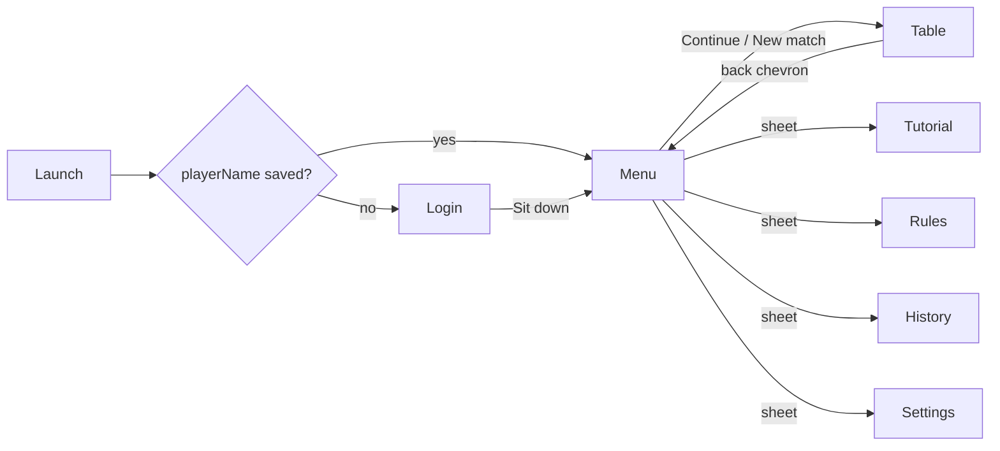

# Cast, login and main menu: design

**Status:** approved in conversation 2026-09-05, awaiting spec review.
**Branch:** `claude/cast-and-menu`, one PR against `main`.

## Goal

Give the three computer seats names and faces, ask the player for their own name once, and open the app on a main menu instead of straight onto the table. The table's layout, the rules engine and the save format do not change.

## Non-goals

- Accounts, sign-in with a service, network of any kind. "Login" here means a one-time name prompt.
- Image assets. Portraits are drawn in SwiftUI from a recipe.
- A roster larger than the fixed trio, or choosing opponents.
- Any change to `Sources/CatchFive`.

## Screens and navigation

`App/CatchFiveApp.swift` shows `RootView` instead of `TableView`. `RootView` owns the single `GameModel`, loaded from disk with `GameModel.loadDefault()` exactly as today, and holds `@State private var screen: Screen` where `Screen` is `.login`, `.menu` or `.table`. The initial screen is `.login` when `settings.playerName` is nil and `.menu` otherwise. The screen is not persisted; every launch after the first opens on the menu.



Transitions between the three screens are an opacity crossfade (`Theme.Motion.overlay`, or `Theme.Motion.reduced` under Reduce Motion) over the same felt gradient, so the background reads as one surface.

### Login (`LoginView`)

Shown while `playerName` is nil. Contents, top to bottom:

1. "CATCH 5" in the serif title treatment used by `ScoreBarView`.
2. "What should we call you?" and a text field, placeholder "Your name", `.textContentType(.name)`, autocapitalised words, 24-character limit.
3. A horizontal row of the four `Cast.playerChoices` portraits at 72 pt; the selected one carries the gold ring, the others are dimmed to `Theme.Card.dimmedOpacity`.
4. A segmented Easy/Standard picker with the same footer text as `SettingsView`.
5. One solid gold button, "Sit down", disabled until the trimmed name is non-empty.

Tapping "Sit down" calls `model.signIn(name:portrait:difficulty:)`, which trims the name, writes `playerName`, `playerPortrait`, `difficulty` and `seatNames[0]` to `settings` (which persists itself), and the root switches to `.menu`.

### Main menu (`MainMenuView`)

1. The player's portrait at 56 pt beside "Welcome back, NAME" (serif, title2).
2. The three opponents in a shallow arc, Hazel left, Otto centre and slightly higher, Rue right, each a 56 pt portrait over its name. This introduces the cast before the first deal.
3. While `settings.hasSeenRules` is false, a one-line hint under the arc: "New here? Start with the tutorial."
4. Buttons, in this order. Exactly one is the solid gold button; the rest use the understated ivory style from `TableSurface.actionButton`.
   - **Continue**, shown only when `model.matchInProgress`; gold when shown. Switches to `.table`.
   - **New match**; gold when Continue is hidden. When a match is in progress it first shows the same confirmation dialog the table uses ("Start over? This replaces your saved game."), then calls `model.newGame()` and switches to `.table`. When the current match is finished or untouched it calls `newGame()` only if the match is finished, then switches.
   - **Tutorial**: `TutorialView` sheet, `onDismiss` calls `model.markRulesSeen()`.
   - **Rules**: `RulesView` sheet.
   - **Match history**: `StatisticsView` sheet (statistics and records).
   - **Settings**: `SettingsView` sheet.

### Table

`TableView` keeps its layout. `ScoreBarView` gains `onLeave: () -> Void` and draws a `chevron.left` control at the far left of the title row, labelled "Back to menu". `TableView` gains `onLeave` in its initialiser and passes it through. The game already persists after every action and on scene phase change, so leaving loses nothing.

The `.onAppear { if model.needsRulesIntroduction { showTutorial = true } }` line is removed from `TableView`; the login screen is now the first-run gate and the menu carries the tutorial hint.

## Cast and portraits (`Cast.swift`, `PortraitView.swift`)

```swift
public struct Portrait: Codable, Equatable, Hashable, Sendable {
    public enum Skin: String, Codable, CaseIterable, Sendable { case light, tan, brown, deep }
    public enum Hair: String, Codable, CaseIterable, Sendable { case short, bob, curly, bald }
    public enum HairColor: String, Codable, CaseIterable, Sendable { case black, brown, blond, silver, red }
    public enum Feature: String, Codable, CaseIterable, Sendable { case none, glasses, moustache, freckles }
    public enum Hat: String, Codable, CaseIterable, Sendable { case none, beanie, cap, flower }
    public enum Shirt: String, Codable, CaseIterable, Sendable { case plum, olive, teal, rust, navy, mustard }
    public var skin: Skin, hair: Hair, hairColor: HairColor, feature: Feature, hat: Hat, shirt: Shirt
}

public struct Character: Equatable, Sendable {
    public let name: String
    public let portrait: Portrait
}

public enum Cast {
    /// Seats 1, 2, 3: West, Partner, East.
    public static let opponents: [Character]  // Hazel, Otto, Rue
    public static let playerChoices: [Portrait] // four
    public static let defaultPlayerPortrait: Portrait // playerChoices[0]
    /// Seat words for accessibility and status lines: ["You", "West", "Partner", "East"].
    public static let seatWords: [String]
}
```

The trio:

| Seat | Name | Portrait |
|---|---|---|
| 1, West | Hazel | silver bob, round glasses, plum shirt, no hat |
| 2, Partner | Otto | brown short hair, moustache, flat cap, olive shirt |
| 3, East | Rue | red curly hair, freckles, beanie, teal shirt |

Names live in one place, `Cast.opponents`, and flow into `Settings.defaultSeatNames`, which becomes `["You", "Hazel", "Otto", "Rue"]`.

`PortraitView(portrait:size:)` draws a circular ivory-bordered disc containing, back to front: the shirt as a rounded shoulder shape clipped to the disc, the head as an ellipse in the skin tone, the hair shape behind and over the head depending on style, the feature (two `circle` strokes for glasses, a small rounded capsule for the moustache, three dots for freckles), and the hat on top. Everything is `Shape` and `Path` in `Color`; the only symbol is `SF Symbols` `leaf.fill` for the flower hat. Colours come from a small palette in `Theme.Portrait` so they sit with felt and ivory. No gold inside a portrait: the active-seat ring around it is the only gold, as D33 requires. `PortraitView` sets `.accessibilityHidden(true)`; the enclosing tile provides the name.

## Settings and model

`Settings` gains:

- `playerName: String?`, nil until login. Decoder: `decodeIfPresent`, default nil.
- `playerPortrait: Portrait`, default `Cast.defaultPlayerPortrait`. Decoder: `decodeIfPresent`, default that.
- `hasSignedIn: Bool { playerName != nil }`.
- Migration in the decoder: any seat 1 to 3 whose stored name equals the old default for that seat ("West", "Partner", "East") becomes the cast name. Custom names are kept. Seat 0 keeps whatever is stored (it becomes the player name at login).

`GameModel` gains:

- `matchInProgress: Bool { match.actionCount > 0 && match.winner == nil }`.
- `signIn(name:portrait:difficulty:)` as described under Login. It is the one place that writes `playerName`.
- `seatNames` is unchanged and continues to read `settings.seatNames`, so the typed name reaches the score bar, status lines, review and scoreboard without further edits.
- `seatSummary(for seat: Int) -> String`: the accessibility sentence `SeatView` builds privately today (name, call or card count, dealer) moves here, gains the seat word from `Cast.seatWords` after the name, and becomes testable.

`SettingsView` gains a "You" section above "Names" with the player's name field and the four-portrait picker, and the "Names" section drops to seats 1 to 3 with the cast names as placeholders.

## Table and tutorial integration

- `SeatView` shows `PortraitView` at 28 pt to the left of the name and status column. The three card backs, the count badge, DEALER and BIDDER labels and the gold turn ring are unchanged. The accessibility label comes from `model.seatSummary(for:)`, so a VoiceOver user still hears direction.
- `TableSurface` status lines keep using `model.seatNames`, so "Hazel is thinking" reads naturally.
- Tutorial `SeatTile` gains `var portrait: Portrait? = nil` and draws it the same way when present; lessons pass the cast portraits for seats 1 to 3.

## Error handling

- A blank or whitespace name cannot be submitted; the button is disabled rather than showing an error.
- A corrupt settings file already falls back to `Settings()`, which now means the login screen shows again. That is acceptable: the player types a name once more and nothing else is lost.
- `newGame()` errors surface through the existing `errorMessage` alert, which `RootView` hosts at its level so it shows on any screen.

## Testing

Tests first, in `Tests/CatchFiveUITests` unless noted.

| Test | Proves |
|---|---|
| `settingsRoundTripKeepsPlayerNameAndPortrait` | New fields survive `SettingsStore` write and read. |
| `oldSettingsFileMigratesDefaultSeatNamesToCast` | A file with West/Partner/East loads as Hazel/Otto/Rue; a custom name is kept. |
| `settingsWithoutPlayerFieldsLoadsSignedOut` | Missing keys give nil name and the default portrait. |
| `matchInProgressIsFalseForFreshAndFinishedMatches` | Fresh, mid-auction, mid-play and finished matches classify correctly. |
| `signInTrimsNameAndSetsSeatZero` | `signIn` trims, stores and updates `seatNames[0]` and difficulty. |
| `castHasThreeDistinctNamesAndPortraits` | The trio is well formed and matches `defaultSeatNames`. |
| `seatSummaryIncludesSeatWord` | `GameModel.seatSummary(for:)` returns "Hazel, West, …" so VoiceOver keeps direction. |

The existing 101 tests must still pass. The simulator screenshot pass from `docs/redesign-plan.md` is repeated for login, menu and a seat tile at default and XXXL sizes.

## Documentation, same PR

- `docs/architecture.md`: the screen flow diagram above and `RootView` in the layer table.
- `docs/types-and-functions.md`: `RootView`, `LoginView`, `MainMenuView`, `Portrait`, `Character`, `Cast`, `PortraitView`, the new `Settings` fields, `GameModel.matchInProgress` and `signIn`.
- `docs/testing.md`: the tests above.
- `docs/decisions.md`: D35, "A fixed cast, a one-time name prompt and a menu-first launch".
- `docs/learning-path.md`: no new page.

## Risks

- PR #21 (walnut table) edits `TableSurface.swift`, `TableView.swift`, `Theme.swift` and `TutorialView.swift`. Expect a small merge in `SeatView` and `SeatTile` whichever lands second.
- `SeatView` grows by 28 pt plus spacing in width; the side seats sit inside `Theme.Table.sideNudge` and the pile margins, so check the 375 pt layout in the screenshot pass.
