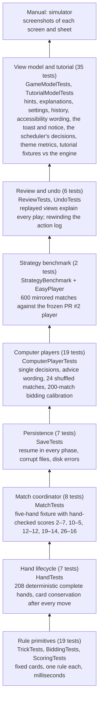
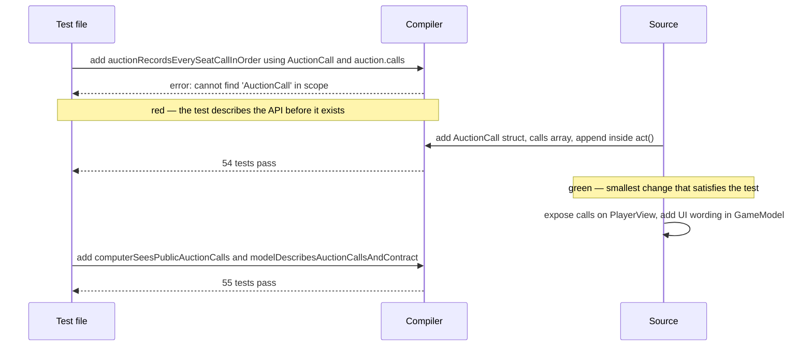

# Testing

## Swift Testing in one minute

The repo uses Apple's `Testing` framework (not the older XCTest). A test is a free function:

```swift
import Testing
@testable import CatchFive   // @testable exposes internal names

@Test func dealerMustTakeTwoAfterPasses() throws {
    var auction = try Auction(dealer: 3)
    for seat in 0..<3 { try auction.act(seat: seat, bid: nil) }
    #expect(throws: RuleError.invalidBid) { try auction.act(seat: 3, bid: nil) }
    try auction.act(seat: 3, bid: 2)
    #expect(auction.winner == 3)
}
```

- `@Test` registers the function. The name is the specification; read it as a sentence.
- `#expect(condition)` records a failure and keeps going, so one run reports every broken assertion.
- `#expect(throws:)` asserts that a specific error is thrown.
- `try #require(optional)` unwraps or fails the test immediately; it replaces force-unwrapping.
- `@MainActor @Test` is needed for tests that touch `GameModel`.

Run everything, or one test:

```bash
DEVELOPER_DIR=/Applications/Xcode.app/Contents/Developer swift test
```

```bash
DEVELOPER_DIR=/Applications/Xcode.app/Contents/Developer swift test --filter computerBidding
```

`--filter` matches a substring of the test name.

## The pyramid here



Total: 103 automated tests, about 3.5 s (the strategy benchmark is most of that). Every layer above the first uses the real code beneath it; nothing is mocked. If `trickWinner` broke, the failure would show up in one small trick test *and* in the 208-hand simulation, and the small one tells you exactly what changed.

## Two kinds of test, deliberately

| Kind | Example | Purpose |
|---|---|---|
| **Example-based** | `computerFeedsFiveToPartnerWhenLastToPlay` builds a three-card trick and asserts the exact card played | Explain one rule to a reader; pinpoint a regression |
| **Simulation / property** | `completeHandsConserveCardsAndFinishAfterSixTricks` plays 208 hands (every dealer × every trump × many decks) and asserts the 52 cards are always accounted for | Catch interactions no example anticipated |

The seeded random generator `RepeatableRandom` (a linear congruential generator in `ComputerPlayerTests`) makes the shuffled simulations reproducible: the same seed always yields the same deck order, so a failure can be re-run.

## How a feature was built test-first

The auction call history added on 2026-09-04 followed the cycle every earlier milestone used:



The compile error *is* the first failing test. Only then does the implementation start.

## Calibration tests

`computerBiddingIsCompetitiveAndUsuallyMakesContract` is different from the others: it asserts statistics, not exact values. Over 200 seeded matches it requires that bidders make their contract at least 70% of the time and that no more than 45% of hands end as a forced dealer 2. Those thresholds sit below the measured figures (about 78% and 33%) so normal tuning passes, but a change that makes the computers reckless or timid fails.

The numbers came from a throwaway harness that printed, for each estimated-points bucket, the average points actually made. The table it produced (estimate 4 → 4.85 average, 5 → 5.6, 6 → 6.4) is what justified using the estimate as a bid cap. See [decisions.md](decisions.md).

## Benchmarks: measuring strength, not just legality

`Sources/CatchFive/EasyPlayer.swift` is a frozen copy of the computer player as merged in PR #2; it doubles as the "Easy" difficulty and is never improved. `StrategyBenchmark.swift` plays every seed twice with the teams swapped (`mirroredBenchmark`), so seat and dealer advantages cancel, and reports the candidate's win rate and average score margin. `benchmarkHarnessIsFairWhenBothSidesUseTheSameStrategy` checks that identical strategies come out exactly 50/50 with zero margin. `computerPlayerBeatsFrozenBaseline` then requires the shipped player to win at least 58% of 600 matches with a margin of at least two points; the 2026-09-04 player measured 66% and +5.5.

The same harness is how strategy ideas are judged during development: freeze the current player as a reference copy in the test target, change `ComputerPlayer`, and compare. Parameter values in the play policy (control weights, hold chances, bid margin) were chosen by running a grid of variants through it, each on 1200 matches, and keeping the best. See [decisions.md](decisions.md) D17 to D20.

## What is not automated

- Visual layout and animation. Checked by building with `scripts/build-simulator.py`, launching on the "Catch 5 iPhone" (393 pt, the iPhone 16 family, the only device the layout is verified on since D35) simulator and taking screenshots of each phase; the "Catch 5 SE" simulator and the XXXL and AX5 text sizes were used once for the redesign's review pass and are optional now; `xcrun simctl ui <udid> content_size <size>` sets the size and a saved game copied into the app container sets the phase. The record is in [redesign-plan.md](redesign-plan.md).
- Save/restore across app relaunch. Verified manually by killing and relaunching the app mid-trick; the engine side of the same path is covered by `SaveTests`.
- VoiceOver and Dynamic Type at the largest sizes, and haptics: the wording is unit-tested, the experience is checked by hand.
- Card motion (flights, the trick hold and collapse, press-lift, shake) and Reduce Motion fallbacks: checked on the simulator and on the phone.

## Continuous integration

`.github/workflows/tests.yml` runs two jobs on a macOS runner for every pull request and push to `main`: `swift test` (with the `.build` folder cached between runs) and `scripts/build-simulator.py`, which proves the app bundle still links and carries its icon, manifest and explainer pages. A newer push cancels the run in progress. A red job blocks a merge even when nobody runs the suite locally.

## Reading a failure

Swift Testing prints the file, line, and the expression with its actual values:

```
✘ Test computerRaisesWithStrongSuitAndChoosesIt() recorded an issue at ComputerPlayerTests.swift:22:5:
  Expectation failed: (ComputerPlayer.decide(...) → .bid(3)) == (.bid(4))
```

The left side is what the code did, the right side what the test expected. Open the test by name in [types-and-functions.md](types-and-functions.md) to find which source function it guards.
