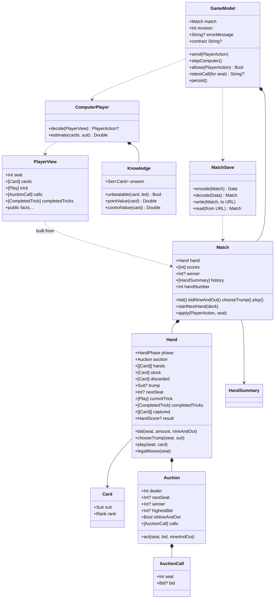

# Types and Functions

One line per public thing, grouped by file, with the test that proves it. Names are exact so you can `grep` for them.

## Class diagram

## Sources/CatchFive/Cards.swift

| Name | Kind | Purpose | Proven by |
|---|---|---|---|
| `Suit` | enum, `CaseIterable` | clubs, diamonds, hearts, spades | used everywhere |
| `Rank` | enum, `Int` raw values 2…14 | two … ace; `rawValue` orders cards | `highestTrumpWins` |
| `Rank.gameValue` | computed property | 10→10, J→1, Q→2, K→3, A→4, else 0 | `cardValuesForGame` |
| `Card` | struct, `Hashable`, `Codable` | one suit and one rank; `name` spells it out ("queen of hearts") for explanations | everywhere |
| `RuleError` | enum | invalidTrick, invalidSeat, outOfTurn, invalidBid, auctionComplete, invalidScoring, forbiddenNineAndOut | error assertions across suites |

## Sources/CatchFive/Tricks.swift

| Name | Purpose | Proven by |
|---|---|---|
| `Play` | one seat's card in a trick | trick tests |
| `legalCards(in:led:)` | if you hold the led suit you must play it; otherwise anything | `mustFollowSuitEvenWithTrump` |
| `trickWinner(_:trump:)` | highest trump, else highest of led suit; rejects malformed tricks | `trumpBeatsLedAce`, `highestTrumpWins`, `malformedTricksAreRejected` |

## Sources/CatchFive/Bidding.swift

| Name | Purpose | Proven by |
|---|---|---|
| `Bid` | `.points(Int)` or `.nineAndOut` | settlement tests |
| `AuctionCall` | one seat's accepted call; `bid == nil` is a pass | `auctionRecordsEverySeatCallInOrder` |
| `Auction` | four-turn bidding round starting left of dealer | all `BiddingTests` |
| `Auction.act(seat:bid:nineAndOut:)` | validates turn, minimum raise, dealer match, forced 2, 9-and-out precedence; records the call | `dealerCanMatchPartnerOrOpponent`, `nonDealerMustRaiseAndInvalidActionDoesNotConsumeTurn`, `dealerMustTakeTwoAfterPasses`, `bidRangeAndTurnOrder`, `nineAndOutOvercallsNineAndDealerCanMatch` |

## Sources/CatchFive/Scoring.swift

| Name | Purpose | Proven by |
|---|---|---|
| `HandScore` | points per team plus which team took High, Low, Jack, Five, Game and the Game values | scoring tests |
| `scoreHand(captured:trump:bidder:)` | pure function from captured cards to `HandScore`; rejects duplicate cards | `relativeHighAndLowBelongToCapturingTeams`, `missingJackAndFiveDoNotScoreAndGameTieGoesToBidder`, `offSuitScoringCardsOnlyCountTowardGame`, `invalidCapturedCardsAreRejected` |
| `Settlement` | new scores and optional winner | |
| `settle(scores:points:bidder:bid:)` | bidder adds points or subtracts bid; defenders add; 25 wins; 9-and-out ends the match either way | `successfulBidScoresAllPointsAndSetLosesBidAmount`, `twentyFiveAndSimultaneousFinish`, `nineAndOutWinsOrLosesImmediately`, `invalidSettlementRejected` |

## Sources/CatchFive/Hand.swift

| Name | Purpose | Proven by |
|---|---|---|
| `HandPhase` | bidding, choosingTrump, playing, finished | phase guards in every test |
| `CompletedTrick` | four plays and the winning seat | `playMustFollowSuitAndWinningPlayerLeadsNext` |
| `HandError` | invalidDeck, wrongPhase, notBidWinner, cardNotHeld, mustFollowSuit | |
| `Hand.init(deck:dealer:)` | requires 52 unique cards; deals two packets of three | `dealSixEachInTwoPacketsStartingLeftOfDealer`, `rejectInvalidDecks` |
| `Hand.bid` | forwards to `Auction`; moves to `choosingTrump` when the dealer has acted | `trumpSelectionRequiresFinishedAuctionAndWinningSeat` |
| `Hand.chooseTrump` | bid winner only; discards non-trumps, refills to six from stock | `refillKeepsTrumpsAndDiscardsOnlyInitialNonTrumps` |
| `Hand.play` | full validation, copy-mutate-commit; fourth card resolves the trick, sixth trick scores | `illegalPlayLeavesStateUnchanged`, `completeHandsConserveCardsAndFinishAfterSixTricks` (208 hands) |
| `Hand.legalMoves(seat:)` | empty unless it is that seat's turn in `playing` | UI greying relies on this through `allows` |

## Sources/CatchFive/Match.swift

| Name | Purpose | Proven by |
|---|---|---|
| `MatchError` | handInProgress, matchFinished | `matchRejectsPrematureRedeal` |
| `HandSummary` | number, dealer, bidder, bid, isNineAndOut, result, running scores | `nextHandRotatesDealerAndRetainsScores` |
| `Match.init(deck:dealer:)` | starts hand 1 and remembers the deck for saves | |
| `Match.bid` / `bidNineAndOut` / `chooseTrump` / `play` | wrap `Hand`, refuse after a winner, append to the action log; `play` settles the hand exactly once | `matchScoresOnlyAfterLastCardAndOnlyOnce`, `failedBidMakesNegativeMatchScore`, `negativeTeamCannotDeclareNineAndOut` |
| `Match.startNextHand(deck:)` | only after `finished`; dealer + 1 | `nextHandRotatesDealerAndRetainsScores` |
| `Match.apply(_:seat:)` | one entry point for `PlayerAction` from humans and computers | `computersCompleteShuffledMatchesThroughRealRules` |
| `Match.actionCount`, `rewound(toActionCount:)`, `undoPoint(forSeat:)` | rebuild the match from the same deal with only the first n accepted actions; the action count to rewind to so a seat's latest action this hand is taken back (nil once scored or across a hand boundary). `MatchSave.decode` uses the same `replaying` helper | `rewoundMatchEqualsFreshReplay`, `undoDropsHumanActionAndComputerReplies`, `undoUnavailableAcrossHandBoundaryAndAfterScoring` |

## Sources/CatchFive/ComputerPlayer.swift

| Name | Purpose | Proven by |
|---|---|---|
| `PlayerView` | own cards plus public facts, including every auction call and every completed trick; `init(match:seat:)` copies only what the seat may know | `changingHiddenCardsDoesNotChangeComputerDecision`, `computerSeesPublicAuctionCalls`, `computerSeesCompletedTricksButNotHiddenHands` |
| `PlayerView.init(match:replaying:inCompletedTrick:)` | rebuilds the view a seat had just before an earlier play, from public information and that seat's remaining cards | `replayedViewExplainsEveryComputerPlayExactly` |
| `PlayerAction` | nineAndOut, bid(Int?), chooseTrump(Suit), play(Card) | |
| `Advice` | an action plus its reasoning in plain words | `adviceNamesTheActionAndExplainsIt` |
| `ComputerPlayer.advise(_:)` | the single source of truth: the action this strategy takes from a seat and why; nil unless it is that seat's turn | `adviceExplainsCardPlay` (also checks it agrees with `decide` through a whole match) |
| `ComputerPlayer.decide(_:)` | `advise(_:)?.action` | `computerDoesNotActOutsideItsTurn` |
| `Difficulty`, `ComputerPlayer.decide(_:difficulty:)` | `easy` routes to `EasyPlayer`, `standard` to `decide(_:)`; hints and explanations always use standard | `easyDifficultyPlaysTheFrozenPlayerAndStandardTheCurrentOne` |
| `EasyPlayer` (`Sources/CatchFive/EasyPlayer.swift`) | the "Easy" computer: a frozen copy of the PR #2 player, also the benchmark's fixed opponent, never to be improved | `computerPlayerBeatsFrozenBaseline` |
| `ComputerPlayer.estimate(_:suit:)` | expected hand points if that suit were trump | `estimateRanksControlAndTheFiveAboveScatteredCards` |
| bidding (private `bidAmount`) | bid the minimum needed if it is at most the whole-point estimate; never outbid partner; dealer takes forced 2 | `computerPassesWeakHandButDealerTakesForcedTwo`, `computerRaisesWithStrongSuitAndChoosesIt`, `computerBiddingIsCompetitiveAndUsuallyMakesContract` |
| `ComputerPlayer.Knowledge` | built from a `PlayerView`: the set of unseen cards (other hands or stock), `unbeatable(_:led:)` (no unseen card can beat it), `pointValue(_:)` (five 5, jack 1, certain High 1, certain Low 1, plus 0.06 per Game point) and `controlValue(_:)` (what holding a trump is worth for later tricks; 0.8 extra when unbeatable, 0 on the last trick) | `computerSpendsTheAceToCaptureTheFive`, `computerDumpsTheTrickWhenItIsWorthlessAndNoTrumpIsFree` |
| card play (private `chooseCard`) | scores every legal card: chance our side wins the trick × (points on the table + this card's stake) − chance we lose × this card's stake − control given up; picks the best, ties to least control then lowest rank | `computerFollowsSuitInsteadOfTrumping`, `computerUsesLowestWinningCardAgainstOpponentWhenNothingIsAtStake`, `computerFeedsFiveToPartnerWhenLastToPlay`, `computerPreservesFiveWhenItCannotWin` |
| leads (private `chooseLead`) | an unbeatable trump if held; the best side card when no trumps can be against us; otherwise the cheapest exit, never the five | `computerLeadsHighestTrumpButKeepsTheFiveBack` |

### Test-only strategy fixtures

| Name | Purpose |
|---|---|
| `playSeededMatch`, `mirroredBenchmark`, `BenchmarkResult` (`Tests/CatchFiveTests/StrategyBenchmark.swift`) | play seeded matches between two strategies, each seed twice with teams swapped; `computerPlayerBeatsFrozenBaseline` guards the shipped player's strength against `EasyPlayer` |

## Sources/CatchFive/HandReview.swift

| Name | Purpose | Proven by |
|---|---|---|
| `PlayReview`, `TrickReview`, `HandReview(match:)` | every play of the finished hand's tricks next to the standard strategy's advice from the same rebuilt view (D24); `agreement(forSeat:)` counts matches | `reviewReconstructsEveryPlayWithAdvice` |
| `SeatPerformance`, `Match.performance(forSeat:)` | plays agreed and contracts made over the whole match, rebuilt by replaying to each hand boundary; nothing extra is saved | `performanceCountsHumanPlaysAndContractsAcrossHands` |

## Sources/CatchFive/MatchSave.swift

| Name | Purpose | Proven by |
|---|---|---|
| `SaveError` | invalidData, unsupportedVersion | `rejectsBrokenOrUnsupportedSave` |
| `SavedAction` (internal) | Codable mirror of the five actions, each replays through the real `Match` method | `replayRejectsIllegalActionsAndInvalidInitialDeck` |
| `MatchSave.encode` / `decode` | version 1 JSON: initial deck, dealer, actions | `saveRestoresEveryPhaseAndContinuesIdentically`, `saveRestoresHistoryAndNextDealer`, `rejectedActionsNeverEnterSaveAndResavingDoesNotDuplicateActions` |
| `MatchSave.write` / `read` | atomic file replacement; errors surface | `saveRoundTripOnDiskReplacesPreviousSave`, `diskFailuresAreReported` |

## Sources/CatchFiveUI/GameModel.swift

| Name | Purpose | Proven by |
|---|---|---|
| `GameModel` | `@MainActor ObservableObject` owning one `Match`, a `revision` counter, an optional `errorMessage`, and an optional save URL | |
| `isHumanTurn`, `humanCards` | convenience for seat 0 | `humanActionAdvancesComputersAndStopsForHuman` |
| `send(_:)` | human action through `Match.apply`, then persist and bump revision | `acceptedHumanMoveSavesAndInvalidMoveShowsError` |
| `stepComputer()` | one computer action for whichever non-human seat is due | `humanActionAdvancesComputersAndStopsForHuman` |
| `allows(_:)` | dry run on a copy of the match | drives button enabling |
| `latestCall(for:)`, `contract`, `seatNames` | wording for the auction display | `modelDescribesAuctionCallsAndContract` |
| `settings`, `seatNames` | player preferences (play speed, seat names, haptics), saved to `settings.json` whenever they change; names flow into the contract, explanations, tiles and summary | `seatNamesFlowIntoContractAndExplanations`, `settingsRoundTripThroughDiskAndTolerateMissingKeys` |
| `humanCards` | the hand as shown: trumps first, highest to lowest, then the other suits in a fixed order | `humanCardsSortTrumpFirstThenBySuitAndRank` |
| `notice` | one-line note about something that happened without a tap, such as "You discarded 2 and drew 2."; cleared by the next action | `trumpChoiceReportsDiscards` |
| `message(for:)` | rule errors in a player's words ("You must follow suit…") | `illegalPlayExplainsFollowSuitInPlainWords` |
| `records`, `statistics`, `handReview()`, `performance()` | finished matches from `history.json`, totals over them, the finished hand's review and the human's record so far; a match is recorded exactly once when its winner is decided | `finishedMatchIsRecordedExactlyOnce`, `corruptHistoryDoesNotBlockPlay` |
| `spokenDescription(of:winner:)`, `accessibilityValue(for:)` | VoiceOver wording for a played card ("West played the ten of hearts and took the trick") and for a hand card (playable, not legal now, waiting for your turn) | `spokenDescriptionOfPlayNamesSeatAndCard`, `accessibilityValueReflectsLegality` |
| `canUndo`, `undo()` | take back the human's latest action this hand and every computer reply after it; saves and bumps `revision` | `undoneMatchSavesAndReloads` |
| `hint`, `showHint()` | the strategy's advice for seat 0 on request; cleared by the next accepted action | `hintMatchesTheComputerStrategyAndClearsAfterActing` |
| `explanation(for:inLastTrick:)`, `explain(_:inLastTrick:)`, `explanation` | why a card on the table or in the last trick was played; for the human's own card it compares with what the strategy preferred | `explanationsNameTheSeatAndCompareTheHumanToTheStrategy` |
| `nextHand()`, `newGame()` | fresh shuffled deck via `deck()` | |
| `persist()`, `loadDefault()` | Application Support/CatchFive/game.json | manual simulator check |

## Sources/CatchFiveUI views

| Name | Purpose |
|---|---|
| `Settings`, `SettingsStore` | `Settings.swift`: Codable preferences (including `difficulty` and `hasSeenRules`) with defaults for missing keys, and `delay(leadingTrick:)` for the computer pause per play speed; the store reads and writes JSON atomically | `delayDependsOnPlaySpeedAndLeadPosition`, `settingsRoundTripThroughDiskAndTolerateMissingKeys` |
| `RulesText` | the house rules as sections of verbatim paragraphs from `docs/catch-five-rules.md`, plus "Reading the table" notes about the screen | `rulesSheetContainsEveryHouseRuleParagraph` (reads the doc and fails on any drift) |
| `RulesView` | the rules sheet, from the book button and automatically on first launch | manual |
| `needsRulesIntroduction`, `markRulesSeen()` (on `GameModel`) | first-run flag backed by `Settings.hasSeenRules` | `firstLaunchShowsRulesOnce` |
| `MatchRecord`, `Statistics`, `MatchHistoryStore` | `MatchHistory.swift`: one finished match (date, scores, hands, difficulty, human contracts and agreement); totals; JSON store with ISO 8601 dates | `statisticsAggregateAcrossRecords` |
| `ReviewView`, `ScoreboardView`, `StatisticsView` | `ReviewView.swift`: the finished hand play by play with disagreements in gold; every hand of the match (tap the score bar); totals and recent matches (chart button) | manual |
| `SettingsView` | sheet from the gear button: difficulty, play speed, four seat names, haptics toggle | manual |
| `TableView` | the whole screen (text styles throughout, seat tiles and scores read as single VoiceOver elements, played cards announce seat and card, hand cards announce legality, Reduce Motion replaces slides with fades): header, scores and contract, three opponent tiles, status line naming who is thinking, discard notice, Hint and Undo buttons and advice panel on your turn (the suggested card is ringed in gold), trick area where tapping any played card explains it, a match-over card with the human's record, Review hand and Deal next hand buttons, hand, phase-specific controls, new-game confirmation, error alert, computer scheduler task, background save |
| `CardView` | a card face that scales with Dynamic Type (`@ScaledMetric`, 48×72 at the default size) with an accessibility label; `Suit.glyph`, `Suit.ink`, `Card.label` helpers |
| `HandSummaryView` | who took High, Low, Jack, Five, Game for the last hand and what was bid, using the configured seat names |
| colour extensions | `.ivory`, `.felt`, `.gold` |

## Sources/CatchFiveDemo

`main.swift` plays a fixed, deterministic match (`swift run catch-five-demo`) and `ComputerDemo.swift` a shuffled computer match (`--computer`). Both call the real `Match`; they contain no rules of their own.
