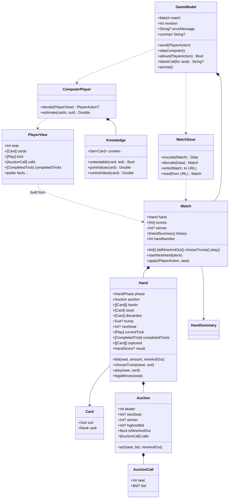

# Types and Functions

One line per public thing, grouped by file, with the test that proves it. Names are exact so you can `grep` for them.

## Class diagram

## Sources/CatchFive/Cards.swift

| Name | Kind | Purpose | Proven by |
|---|---|---|---|
| `Suit` | enum, `CaseIterable` | clubs, diamonds, hearts, spades | used everywhere |
| `Rank` | enum, `Int` raw values 2…14 | two … ace; `rawValue` orders cards | `highestTrumpWins` |
| `Rank.gameValue` | computed property | 10→10, J→1, Q→2, K→3, A→4, else 0 | `cardValuesForGame` |
| `Card` | struct, `Hashable`, `Codable` | one suit and one rank; `name` spells it out ("queen of hearts") for explanations | everywhere |
| `RuleError` | enum | invalidTrick, invalidSeat, outOfTurn, invalidBid, auctionComplete, invalidScoring, forbiddenNineAndOut | error assertions across suites |

## Sources/CatchFive/Tricks.swift

| Name | Purpose | Proven by |
|---|---|---|
| `Play` | one seat's card in a trick | trick tests |
| `legalCards(in:led:)` | if you hold the led suit you must play it; otherwise anything | `mustFollowSuitEvenWithTrump` |
| `trickWinner(_:trump:)` | highest trump, else highest of led suit; rejects malformed tricks | `trumpBeatsLedAce`, `highestTrumpWins`, `malformedTricksAreRejected` |

## Sources/CatchFive/Bidding.swift

| Name | Purpose | Proven by |
|---|---|---|
| `Bid` | `.points(Int)` or `.nineAndOut` | settlement tests |
| `AuctionCall` | one seat's accepted call; `bid == nil` is a pass | `auctionRecordsEverySeatCallInOrder` |
| `Auction` | four-turn bidding round starting left of dealer | all `BiddingTests` |
| `Auction.act(seat:bid:nineAndOut:)` | validates turn, minimum raise, dealer match, forced 2, 9-and-out precedence; records the call | `dealerCanMatchPartnerOrOpponent`, `nonDealerMustRaiseAndInvalidActionDoesNotConsumeTurn`, `dealerMustTakeTwoAfterPasses`, `bidRangeAndTurnOrder`, `nineAndOutOvercallsNineAndDealerCanMatch` |

## Sources/CatchFive/Scoring.swift

| Name | Purpose | Proven by |
|---|---|---|
| `HandScore` | points per team plus which team took High, Low, Jack, Five, Game and the Game values | scoring tests |
| `scoreHand(captured:trump:bidder:)` | pure function from captured cards to `HandScore`; rejects duplicate cards | `relativeHighAndLowBelongToCapturingTeams`, `missingJackAndFiveDoNotScoreAndGameTieGoesToBidder`, `offSuitScoringCardsOnlyCountTowardGame`, `invalidCapturedCardsAreRejected` |
| `Settlement` | new scores and optional winner | |
| `settle(scores:points:bidder:bid:)` | bidder adds points or subtracts bid; defenders add; 25 wins; 9-and-out ends the match either way | `successfulBidScoresAllPointsAndSetLosesBidAmount`, `twentyFiveAndSimultaneousFinish`, `nineAndOutWinsOrLosesImmediately`, `invalidSettlementRejected` |

## Sources/CatchFive/Hand.swift

| Name | Purpose | Proven by |
|---|---|---|
| `HandPhase` | bidding, choosingTrump, playing, finished | phase guards in every test |
| `CompletedTrick` | four plays and the winning seat | `playMustFollowSuitAndWinningPlayerLeadsNext` |
| `HandError` | invalidDeck, wrongPhase, notBidWinner, cardNotHeld, mustFollowSuit | |
| `Hand.init(deck:dealer:)` | requires 52 unique cards; deals two packets of three | `dealSixEachInTwoPacketsStartingLeftOfDealer`, `rejectInvalidDecks` |
| `Hand.bid` | forwards to `Auction`; moves to `choosingTrump` when the dealer has acted | `trumpSelectionRequiresFinishedAuctionAndWinningSeat` |
| `Hand.chooseTrump` | bid winner only; discards non-trumps, refills to six from stock | `refillKeepsTrumpsAndDiscardsOnlyInitialNonTrumps` |
| `Hand.play` | full validation, copy-mutate-commit; fourth card resolves the trick, sixth trick scores | `illegalPlayLeavesStateUnchanged`, `completeHandsConserveCardsAndFinishAfterSixTricks` (208 hands) |
| `Hand.legalMoves(seat:)` | empty unless it is that seat's turn in `playing` | UI greying relies on this through `allows` |

## Sources/CatchFive/Match.swift

| Name | Purpose | Proven by |
|---|---|---|
| `MatchError` | handInProgress, matchFinished | `matchRejectsPrematureRedeal` |
| `HandSummary` | number, dealer, bidder, bid, isNineAndOut, result, running scores; `contractMade` says whether the bidders collected what they promised | `nextHandRotatesDealerAndRetainsScores`, `handSummaryKnowsWhetherTheContractWasMade` |
| `Match.init(deck:dealer:)` | starts hand 1 and remembers the deck for saves | |
| `Match.bid` / `bidNineAndOut` / `chooseTrump` / `play` | wrap `Hand`, refuse after a winner, append to the action log; `play` settles the hand exactly once | `matchScoresOnlyAfterLastCardAndOnlyOnce`, `failedBidMakesNegativeMatchScore`, `negativeTeamCannotDeclareNineAndOut` |
| `Match.startNextHand(deck:)` | only after `finished`; dealer + 1 | `nextHandRotatesDealerAndRetainsScores` |
| `Match.apply(_:seat:)` | one entry point for `PlayerAction` from humans and computers | `computersCompleteShuffledMatchesThroughRealRules` |
| `Match.actionCount`, `rewound(toActionCount:)`, `undoPoint(forSeat:)` | rebuild the match from the same deal with only the first n accepted actions; the action count to rewind to so a seat's latest action this hand is taken back (nil once scored or across a hand boundary). `MatchSave.decode` uses the same `replaying` helper | `rewoundMatchEqualsFreshReplay`, `undoDropsHumanActionAndComputerReplies`, `undoUnavailableAcrossHandBoundaryAndAfterScoring` |

## Sources/CatchFive/ComputerPlayer.swift

| Name | Purpose | Proven by |
|---|---|---|
| `PlayerView` | own cards plus public facts, including every auction call and every completed trick; `init(match:seat:)` copies only what the seat may know | `changingHiddenCardsDoesNotChangeComputerDecision`, `computerSeesPublicAuctionCalls`, `computerSeesCompletedTricksButNotHiddenHands` |
| `PlayerView.init(match:replaying:inCompletedTrick:)` | rebuilds the view a seat had just before an earlier play, from public information and that seat's remaining cards | `replayedViewExplainsEveryComputerPlayExactly` |
| `PlayerAction` | nineAndOut, bid(Int?), chooseTrump(Suit), play(Card) | |
| `Advice` | an action plus its reasoning in plain words | `adviceNamesTheActionAndExplainsIt` |
| `ComputerPlayer.advise(_:)` | the single source of truth: the action this strategy takes from a seat and why; nil unless it is that seat's turn | `adviceExplainsCardPlay` (also checks it agrees with `decide` through a whole match) |
| `ComputerPlayer.decide(_:)` | `advise(_:)?.action` | `computerDoesNotActOutsideItsTurn` |
| `Difficulty`, `ComputerPlayer.decide(_:difficulty:)` | `easy` routes to `EasyPlayer`, `standard` to `decide(_:)`; hints and explanations always use standard | `easyDifficultyPlaysTheFrozenPlayerAndStandardTheCurrentOne` |
| `EasyPlayer` (`Sources/CatchFive/EasyPlayer.swift`) | the "Easy" computer: a frozen copy of the PR #2 player, also the benchmark's fixed opponent, never to be improved | `computerPlayerBeatsFrozenBaseline` |
| `ComputerPlayer.estimate(_:suit:)` | expected hand points if that suit were trump | `estimateRanksControlAndTheFiveAboveScatteredCards` |
| bidding (private `bidAmount`) | bid the minimum needed if it is at most the whole-point estimate; never outbid partner; dealer takes forced 2 | `computerPassesWeakHandButDealerTakesForcedTwo`, `computerRaisesWithStrongSuitAndChoosesIt`, `computerBiddingIsCompetitiveAndUsuallyMakesContract` |
| `ComputerPlayer.Knowledge` | built from a `PlayerView`: the set of unseen cards (other hands or stock), `unbeatable(_:led:)` (no unseen card can beat it), `pointValue(_:)` (five 5, jack 1, certain High 1, certain Low 1, plus 0.06 per Game point) and `controlValue(_:)` (what holding a trump is worth for later tricks; 0.8 extra when unbeatable, 0 on the last trick) | `computerSpendsTheAceToCaptureTheFive`, `computerDumpsTheTrickWhenItIsWorthlessAndNoTrumpIsFree` |
| card play (private `chooseCard`) | scores every legal card: chance our side wins the trick × (points on the table + this card's stake) − chance we lose × this card's stake − control given up; picks the best, ties to least control then lowest rank | `computerFollowsSuitInsteadOfTrumping`, `computerUsesLowestWinningCardAgainstOpponentWhenNothingIsAtStake`, `computerFeedsFiveToPartnerWhenLastToPlay`, `computerPreservesFiveWhenItCannotWin` |
| leads (private `chooseLead`) | an unbeatable trump if held; the best side card when no trumps can be against us; otherwise the cheapest exit, never the five | `computerLeadsHighestTrumpButKeepsTheFiveBack` |

### Test-only strategy fixtures

| Name | Purpose |
|---|---|
| `playSeededMatch`, `mirroredBenchmark`, `BenchmarkResult` (`Tests/CatchFiveTests/StrategyBenchmark.swift`) | play seeded matches between two strategies, each seed twice with teams swapped; `computerPlayerBeatsFrozenBaseline` guards the shipped player's strength against `EasyPlayer` |

## Sources/CatchFive/HandReview.swift

| Name | Purpose | Proven by |
|---|---|---|
| `ReviewError` | `unexplainedPlay`, thrown only if the strategy had no advice for a legal play | |
| `PlayReview`, `TrickReview`, `HandReview(match:)` | every play of the finished hand's tricks next to the standard strategy's advice from the same rebuilt view (D24); `agreement(forSeat:)` counts matches | `reviewReconstructsEveryPlayWithAdvice` |
| `SeatPerformance`, `Match.performance(forSeat:)` | plays agreed and contracts made over the whole match, rebuilt by replaying to each hand boundary; nothing extra is saved | `performanceCountsHumanPlaysAndContractsAcrossHands` |

## Sources/CatchFive/MatchSave.swift

| Name | Purpose | Proven by |
|---|---|---|
| `SaveError` | invalidData, unsupportedVersion | `rejectsBrokenOrUnsupportedSave` |
| `SavedAction` (internal) | Codable mirror of the five actions, each replays through the real `Match` method | `replayRejectsIllegalActionsAndInvalidInitialDeck` |
| `MatchSave.encode` / `decode` | version 1 JSON: initial deck, dealer, actions | `saveRestoresEveryPhaseAndContinuesIdentically`, `saveRestoresHistoryAndNextDealer`, `rejectedActionsNeverEnterSaveAndResavingDoesNotDuplicateActions` |
| `MatchSave.write` / `read` | atomic file replacement; errors surface | `saveRoundTripOnDiskReplacesPreviousSave`, `diskFailuresAreReported` |

## Sources/CatchFiveUI/GameModel.swift

| Name | Purpose | Proven by |
|---|---|---|
| `GameModel` | `@MainActor ObservableObject` owning one `Match`, a `revision` counter, an optional `errorMessage`, and an optional save URL | |
| `isHumanTurn`, `humanCards` | convenience for seat 0 | `humanActionAdvancesComputersAndStopsForHuman` |
| `send(_:)` | human action through `Match.apply`, then persist and bump revision | `acceptedHumanMoveSavesAndInvalidMoveShowsError` |
| `stepComputer()` | one computer action for whichever non-human seat is due | `humanActionAdvancesComputersAndStopsForHuman` |
| `allows(_:)` | dry run on a copy of the match | drives button enabling |
| `latestCall(for:)`, `contract`, `seatNames` | wording for the auction display | `modelDescribesAuctionCallsAndContract` |
| `settings`, `seatNames` | player preferences (play speed, seat names, haptics), saved to `settings.json` whenever they change; names flow into the contract, explanations, tiles and summary | `seatNamesFlowIntoContractAndExplanations`, `settingsRoundTripThroughDiskAndTolerateMissingKeys` |
| `humanCards` | the hand as shown: trumps first, highest to lowest, then the other suits in a fixed order | `humanCardsSortTrumpFirstThenBySuitAndRank` |
| `notice` | one-line note about something that happened without a tap, such as "You discarded 2 and drew 2."; cleared by the next action | `trumpChoiceReportsDiscards` |
| `message(for:)` | rule errors in a player's words ("You must follow suit…") | `illegalPlayExplainsFollowSuitInPlainWords` |
| `records`, `statistics`, `handReview()`, `finalPerformance` | finished matches from `history.json`, totals over them, the finished hand's review, and the human's record computed once when a match is recorded or restored finished | `finishedMatchIsRecordedExactlyOnce`, `corruptHistoryDoesNotBlockPlay` |
| `describe(_:)` | one sentence for a reviewed play, shared by tap-to-explain and the hand review, labelling Easy seats | `reviewRowsShareExplanationWordingAndLabelEasySeats` |
| `loadDefault(in:)` | loads game, settings and history from a directory; a history that cannot be decoded is set aside as `history-corrupt.json` | `corruptHistoryIsSetAsideByLoadDefault` |
| `spokenDescription(of:winner:)`, `accessibilityValue(for:)` | VoiceOver wording for a played card ("West played the ten of hearts and took the trick") and for a hand card (playable, not legal now, waiting for your turn) | `spokenDescriptionOfPlayNamesSeatAndCard`, `accessibilityValueReflectsLegality` |
| `canUndo`, `undo()` | take back the human's latest action this hand and every computer reply after it; saves and bumps `revision` | `undoneMatchSavesAndReloads` |
| `lastHumanAction`, `describe(_ action:)` | the human's latest accepted action and its toast wording ("9♣ played", "Bid 3", "Bid 9 and out"); cleared by undo and new hands; also the trigger for the play and selection haptics | `lastHumanActionDescribesThePlayAndClearsOnUndo` |
| `notice` | the discard-and-draw line after trump is named; it survives the computers' replies and clears when the human next acts, undoes, or a new hand starts | `noticeSurvivesComputerRepliesUntilTheHumanActs` |
| `hint`, `showHint()` | the strategy's advice for seat 0 on request; cleared by the next accepted action | `hintMatchesTheComputerStrategyAndClearsAfterActing` |
| `explanation(for:inLastTrick:)`, `explain(_:inLastTrick:)`, `explanation` | why a card on the table or in the last trick was played; for the human's own card it compares with what the strategy preferred | `explanationsNameTheSeatAndCompareTheHumanToTheStrategy` |
| `nextHand()`, `newGame()` | fresh shuffled deck via `deck()` | |
| `persist()`, `loadDefault()` | Application Support/CatchFive/game.json | manual simulator check |

## Sources/CatchFiveUI views

| Name | Purpose |
|---|---|
| `Settings`, `SettingsStore` | `Settings.swift`: Codable preferences (including `difficulty` and `hasSeenRules`) with defaults for missing keys, and `delay(leadingTrick:)` for the computer pause per play speed; the store reads and writes JSON atomically | `delayDependsOnPlaySpeedAndLeadPosition`, `settingsRoundTripThroughDiskAndTolerateMissingKeys` |
| `TutorialFixtures`, `TutorialBid`, `ScoreCategory` | `Tutorial/TutorialFixtures.swift`: the fixed cards and answer keys for the five lessons | `tricksExerciseLegalMovesMatchEngine`, `tricksExerciseWinnerMatchesEngine`, `scoringExerciseMatchesScoreHand`, `biddingExerciseLegalSetIsFourThroughNinePassAndNineAndOut` |
| `TutorialModel` | `Tutorial/TutorialModel.swift`: current lesson, completed set (handed back for persistence in `Settings.completedLessons`), each exercise's picks and feedback | `completingAllLessonsPersistsAcrossLaunch` |
| `TutorialView`, `DealLesson`, `BiddingLesson`, `TrumpLesson`, `TricksLesson`, `ScoringLesson` | the "How to play" sheet from the book button and on first launch: header, chapter pills, one lesson at a time, Back / Next, a Full rules button that opens `RulesView` | manual |
| `makeTutorial()` (on `GameModel`) | a `TutorialModel` wired to the settings | |
| `RulesText` | the house rules as sections of verbatim paragraphs from `docs/catch-five-rules.md`, plus "Reading the table" notes about the screen | `rulesSheetContainsEveryHouseRuleParagraph` (reads the doc and fails on any drift) |
| `RulesView` | the rules sheet, reached from the tutorial's Full rules button | manual |
| `needsRulesIntroduction`, `markRulesSeen()` (on `GameModel`) | first-run flag backed by `Settings.hasSeenRules` | `firstLaunchShowsRulesOnce` |
| `MatchRecord`, `Statistics`, `MatchHistoryStore` | `MatchHistory.swift`: one finished match (id, date to the second, scores, hands, difficulty in effect at the finish, human contracts and agreement) decoded with defaults for fields added later; totals; JSON store with ISO 8601 dates and `readSettingAsideCorruption(at:)` | `statisticsAggregateAcrossRecords`, `matchRecordDecodesOlderFilesAndRejectsBadScores` |
| `ReviewView`, `ScoreboardView`, `StatisticsView` | `ReviewView.swift`: the finished hand play by play with disagreements marked by a branch icon; every hand of the match (tap the score bar); totals and recent matches (chart button) | manual |
| `ExplainerLibrary`, `ExplainerView` | `ExplainerView.swift`: the ten explainer pages bundled under `App/Explainer`, shown offline in a web view with Back; links stay inside the folder, anything else opens in Safari. Reached from Settings and the tutorial's More menu | `explainerPagesAreBundledTogether` |
| `SettingsView` | sheet from the gear button: difficulty, play speed, four seat names, haptics toggle, and the "How Catch 5 is built" explainer | manual |
| `WoodGrainView`, `GrainRandom`, `FeltView` | `WoodGrainView.swift`: the oak surface drawn in a `Canvas`, grain running across the screen from a fixed seed (gradient, bands, grain lines, vignette), used for the header band, the reading sheets and the tutorial; the felt gradient of the playing area; no image asset | manual |
| `HeaderBandShape` | the header band's outline: square top, a frown along the bottom whose corners hang `dip` lower than the middle; the oak is clipped to it | `dealtCardsComeFromTheDeckInTheCornerAndTheBandFrowns` |
| `DeckView`, `PillButtonStyle` | the stock as a stack of card backs with its count in the table's top-right corner; the auction's solid full-width pill style (dimmed when the rule disallows the action) | manual |
| `HandFanView.dealOrigin(index:count:width:)` | where a refill card's flight starts: the deck's corner, relative to that card's place in the fan | `dealtCardsComeFromTheDeckInTheCornerAndTheBandFrowns` |
| `DynamicTypeSize.boosted(by:)`, `Theme.textBoostSteps` | the size a given number of steps above a Dynamic Type size, stopping at the ends; `TableView` applies two steps to the whole app | `textBoostRaisesTheDefaultTwoStepsAndStopsAtTheLargest` |
| `Theme` | `Theme.swift`: `Theme.Wood` colours, grain direction and parameters, the auction pill height and spacing, card metrics (2:3 ratio, six-percent corner radius, hand 60/64 pt, pile 56 pt, overlap −16 pt leaving a 44 pt strip, the 402 pt width that earns wide cards, the XXXL cap on card scaling), `Theme.Table` seat nudges and the pile footprint, the AX2 cap on table text, motion springs, the trick hold, toast and shake values | `fannedHandCardsKeepAThumbSizedStrip` |
| `ScoreBarView` | the compact bar on its solid header band: title with the hand number, the gear menu (undo last action, settings, statistics, tutorial, new game), both scores; the scores open the scoreboard | manual |
| `TableSurface`, `SeatView`, `Suit.buttonTint` | the table: partner across the top, West and East at the sides (gold ring on the seat to act, card-back stack with count, dealer and bidder badges), a gold pill at the top-left naming trump (suit in its own colour) and the contract once trump is set, the deck at the top-right, the pile in the middle with each card nudged toward its seat and the winner ringed, status line with the hint and last-trick controls, commentary; during the auction the bid grid or the suit buttons (full-width 52 pt pills, red suits tinted red) stand where the pile will be; one message line under the status (undo toast, hint or explanation, notice, your call, placeholder), the hand-end card as a scrollable overlay whose buttons stack when they do not fit; the whole surface scrolls only when its content cannot fit (accessibility text sizes, the SE at XXXL) and reads as one VoiceOver container | manual (see the verification record in [redesign-plan.md](redesign-plan.md)) |
| `HandFanView`, `CardPressStyle`, `ShakeEffect`, `MatchedCard` | the fanned hand with a gold DEALER badge on its label when you deal: discards rise and fade and refills deal in from the deck when trump is named, overlap that tightens to fit the width, wide cards on screens of 402 pt and up, ±8° rotation and a shallow arc, legal cards lifted on your turn, press-lift, shake on an illegal tap, `matchedGeometryEffect` flight into the pile (`MatchedCard` drops the join under Reduce Motion so the card crossfades instead) | manual |
| `CardBackView` | a face-down card for opponents' seats | manual |
| `TableView` | the root: score bar, table surface, toast slot and hand in a column; one animation per accepted action; the scheduler task that holds a finished trick, collapses it toward the winner and then lets the next computer act; the undo toast state (rendered by the surface's message line); the haptic vocabulary; the sheets, the new-game confirmation, the error alert and the background save; text styles throughout, boosted two steps app-wide, with cards capped at XXXL and table text at AX2; the felt background with the oak frown band behind the score bar | manual |
| `TableScheduler.plan(hand:collapsedTricks:)` | the scheduler's three decisions as a pure function: hold a trick that has finished but not yet collapsed, treat the coming computer play as a lead (longer pause) only when nothing was held, and wait for the deal animation at the start of play | `schedulerHoldsAFinishedTrickOnceThenTreatsTheNextPlayAsALead` |
| `CardView` | a card face at a given width (48 in the tutorial, 60 in the hand, 56 on the pile) that scales with Dynamic Type, with a top-left corner index for fanned hands and rest / playable / dimmed / pile styles; `Suit.glyph`, `Suit.ink`, `Card.label` helpers |
| `HandSummaryView` | who took High, Low, Jack, Five, Game for the last hand and what was bid, using the configured seat names |
| colour extensions | `.ivory`, `.felt`, `.gold` |

## Sources/CatchFiveDemo

`main.swift` plays a fixed, deterministic match (`swift run catch-five-demo`) and `ComputerDemo.swift` a shuffled computer match (`--computer`). Both call the real `Match`; they contain no rules of their own.
